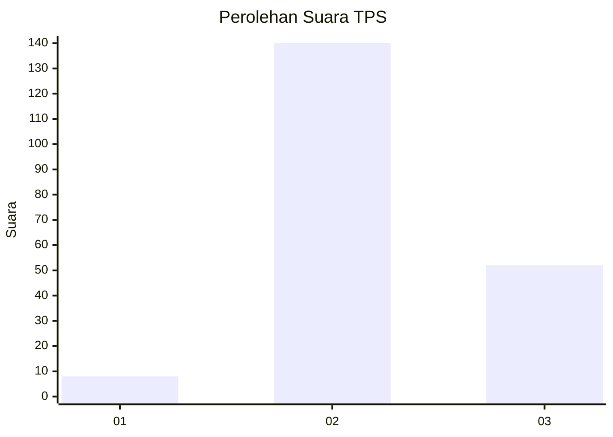
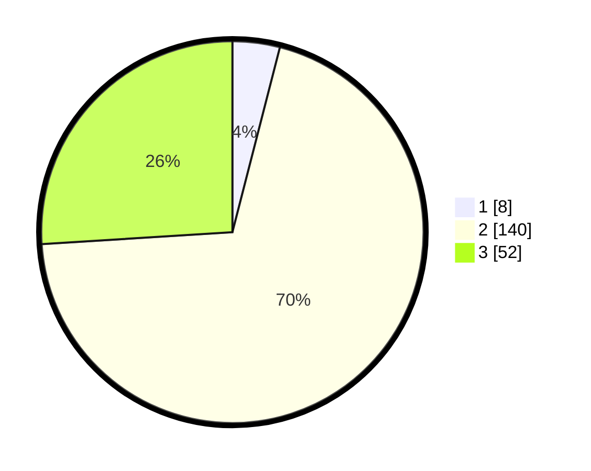

# Hasil

## Grafik

## Tabel

| No. | Nama Paslon    | Suara | Suara (raw) | Persentase |
|:--- |:-------------- | -----:| -----------:| ----------:|
| 1   | ANIES MUHAIMIN | 8     | [8][p-1]    | 4,00       |
| 2   | PRABOWO GIBRAN | 140   | [140][p-2]  | 70,00      |
| 3   | GANJAR MAHFUD  | 52    | [52][p-3]   | 26,00      |

[p-1]: https://github.com/gigit-pemilu/pemilu-2024-51-bali/blob/main/pilpres/hitung-suara/sub/51-bali/sub/06-bangli/sub/02-bangli/sub/2008-pengotan/sub/014-tps/sub/paslon-1.txt
[p-2]: https://github.com/gigit-pemilu/pemilu-2024-51-bali/blob/main/pilpres/hitung-suara/sub/51-bali/sub/06-bangli/sub/02-bangli/sub/2008-pengotan/sub/014-tps/sub/paslon-2.txt
[p-3]: https://github.com/gigit-pemilu/pemilu-2024-51-bali/blob/main/pilpres/hitung-suara/sub/51-bali/sub/06-bangli/sub/02-bangli/sub/2008-pengotan/sub/014-tps/sub/paslon-3.txt

## Foto C Plano

https://sirekap-obj-formc.kpu.go.id/ecbb/pemilu/ppwp/51/06/02/20/08/5106022008014-20240214-204306--f1e13af3-4bee-44c0-b11b-2d39057732f3.jpg

https://sirekap-obj-formc.kpu.go.id/ecbb/pemilu/ppwp/51/06/02/20/08/5106022008014-20240214-204416--304c1628-a1d0-4a86-9dcb-b22ce9bfb00c.jpg

https://sirekap-obj-formc.kpu.go.id/ecbb/pemilu/ppwp/51/06/02/20/08/5106022008014-20240214-204627--912cae85-3e31-486d-af62-9883dd06949c.jpg

## Metadata

| Key        | Value               |
| ---------- | ------------------- |
| Time Stamp | 2024-02-25 15:00:00 |

