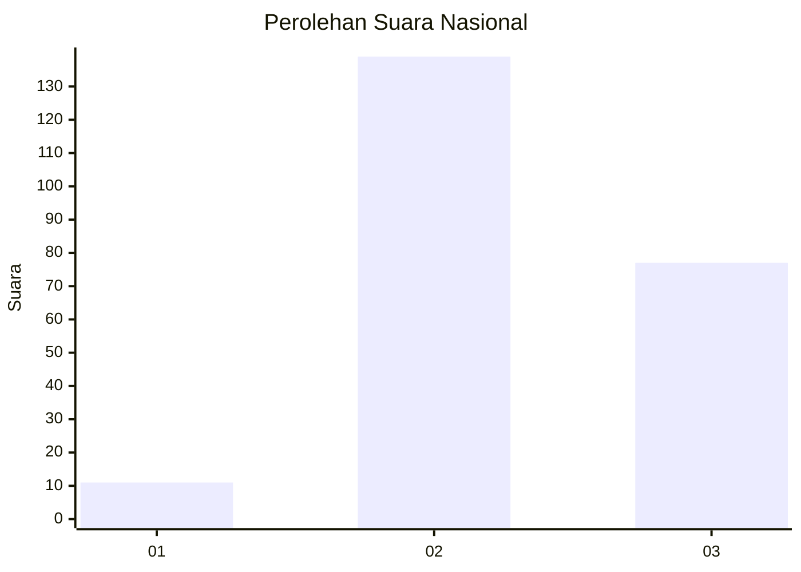
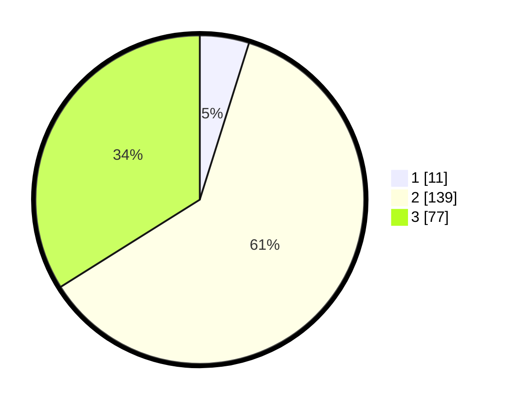

# Hasil

## Grafik

## Tabel

| No. | Nama Paslon    | Suara | Suara (raw) | Persentase |
|:--- |:-------------- | -----:| -----------:| ----------:|
| 1   | ANIES MUHAIMIN | 11    | [11][p-1]   | 4,85       |
| 2   | PRABOWO GIBRAN | 139   | [139][p-2]  | 61,23      |
| 3   | GANJAR MAHFUD  | 77    | [77][p-3]   | 33,92      |

[p-1]: https://github.com/gigit-pemilu/pemilu-2024/blob/main/pilpres/hitung-suara/sub/51-bali/sub/06-bangli/sub/03-tembuku/sub/2001-jehem/sub/001-tps/sub/paslon-1.txt
[p-2]: https://github.com/gigit-pemilu/pemilu-2024/blob/main/pilpres/hitung-suara/sub/51-bali/sub/06-bangli/sub/03-tembuku/sub/2001-jehem/sub/001-tps/sub/paslon-2.txt
[p-3]: https://github.com/gigit-pemilu/pemilu-2024/blob/main/pilpres/hitung-suara/sub/51-bali/sub/06-bangli/sub/03-tembuku/sub/2001-jehem/sub/001-tps/sub/paslon-3.txt

## Foto C Plano

https://sirekap-obj-formc.kpu.go.id/5618/pemilu/ppwp/51/06/03/20/01/5106032001001-20240214-225633--04f788d4-4602-450e-a27f-5167748ec5ba.jpg

https://sirekap-obj-formc.kpu.go.id/5618/pemilu/ppwp/51/06/03/20/01/5106032001001-20240214-225917--e297d288-d74a-4cbd-b1fe-ae5b8c565bdf.jpg

https://sirekap-obj-formc.kpu.go.id/5618/pemilu/ppwp/51/06/03/20/01/5106032001001-20240214-230106--537e04a8-bb35-4901-bdbc-6029bcc5e346.jpg

## Metadata

| Key        | Value               |
| ---------- | ------------------- |
| Time Stamp | 2024-02-16 13:30:32 |

## DATA PEMILIH TETAP

Jumlah pemilih dalam DPT: **275**.
 * L: **135**.
 * P: **140**.

## DATA PENGGUNA HAK PILIH

Jumlah pengguna hak pilih dalam DPT: **239**.
 * L: **117**.
 * P: **122**.

Jumlah pengguna hak pilih dalam DPTb: **0**.
 * L: **0**.
 * P: **0**.

Jumlah pengguna hak pilih dalam DPK: **0**.
 * L: **0**.
 * P: **0**.

Jumlah pengguna hak pilih: **239**.
 * L: **117**.
 * P: **122**.

## JUMLAH SUARA SAH DAN TIDAK SAH

JUMLAH SELURUH SUARA SAH: **227**.

JUMLAH SUARA TIDAK SAH: **12**.

JUMLAH SELURUH SUARA SAH DAN SUARA TIDAK SAH: **239**.

