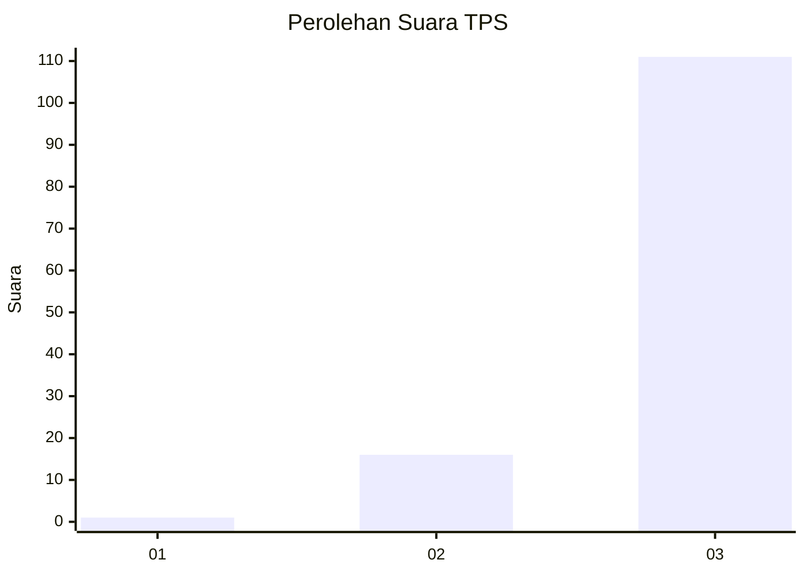
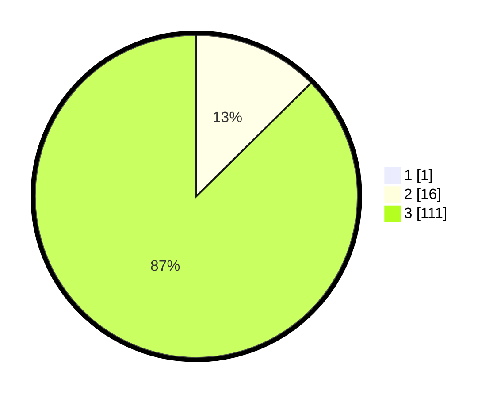

# Hasil

## Grafik

## Tabel

| No. | Nama Paslon    | Suara | Suara (raw) | Persentase |
|:--- |:-------------- | -----:| -----------:| ----------:|
| 1   | ANIES MUHAIMIN | 1     | [1][p-1]    | 0,78       |
| 2   | PRABOWO GIBRAN | 16    | [16][p-2]   | 12,50      |
| 3   | GANJAR MAHFUD  | 111   | [111][p-3]  | 86,72      |

[p-1]: https://github.com/gigit-pemilu/pemilu-2024-51-bali/blob/main/pilpres/hitung-suara/sub/51-bali/sub/06-bangli/sub/03-tembuku/sub/2001-jehem/sub/002-tps/sub/paslon-1.txt
[p-2]: https://github.com/gigit-pemilu/pemilu-2024-51-bali/blob/main/pilpres/hitung-suara/sub/51-bali/sub/06-bangli/sub/03-tembuku/sub/2001-jehem/sub/002-tps/sub/paslon-2.txt
[p-3]: https://github.com/gigit-pemilu/pemilu-2024-51-bali/blob/main/pilpres/hitung-suara/sub/51-bali/sub/06-bangli/sub/03-tembuku/sub/2001-jehem/sub/002-tps/sub/paslon-3.txt

## Foto C Plano

https://sirekap-obj-formc.kpu.go.id/9851/pemilu/ppwp/51/06/03/20/01/5106032001002-20240214-204248--a2b3f7aa-7975-492a-ab1b-a85c5c450957.jpg

https://sirekap-obj-formc.kpu.go.id/9851/pemilu/ppwp/51/06/03/20/01/5106032001002-20240214-215320--31c4f68f-da45-43c4-a6c4-5e9bfa1103d9.jpg

https://sirekap-obj-formc.kpu.go.id/9851/pemilu/ppwp/51/06/03/20/01/5106032001002-20240214-193019--0b8627f4-f8a7-4f86-8a2e-d68581aed33a.jpg

## Metadata

| Key        | Value               |
| ---------- | ------------------- |
| Time Stamp | 2024-02-24 22:31:28 |

## DATA PEMILIH TETAP

Jumlah pemilih dalam DPT: **148**.
 * L: **70**.
 * P: **78**.

## DATA PENGGUNA HAK PILIH

Jumlah pengguna hak pilih dalam DPT: **131**.
 * L: **60**.
 * P: **71**.

Jumlah pengguna hak pilih dalam DPTb: **2**.
 * L: **1**.
 * P: **1**.

Jumlah pengguna hak pilih dalam DPK: **0**.
 * L: **0**.
 * P: **0**.

Jumlah pengguna hak pilih: **133**.
 * L: **61**.
 * P: **72**.

## JUMLAH SUARA SAH DAN TIDAK SAH

JUMLAH SELURUH SUARA SAH: **128**.

JUMLAH SUARA TIDAK SAH: **5**.

JUMLAH SELURUH SUARA SAH DAN SUARA TIDAK SAH: **133**.

