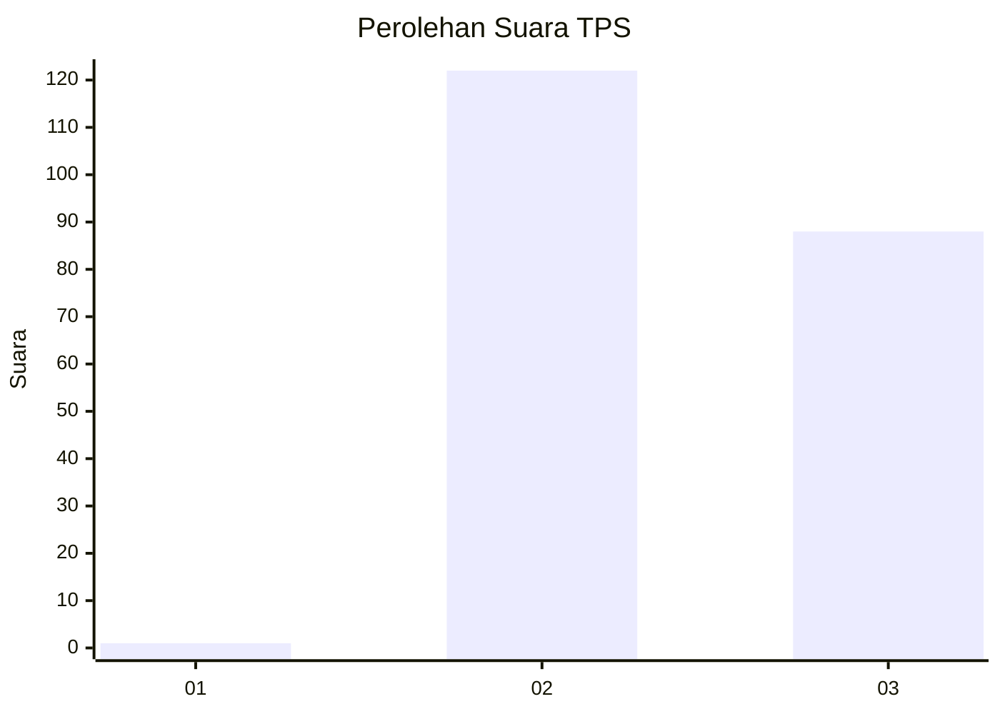
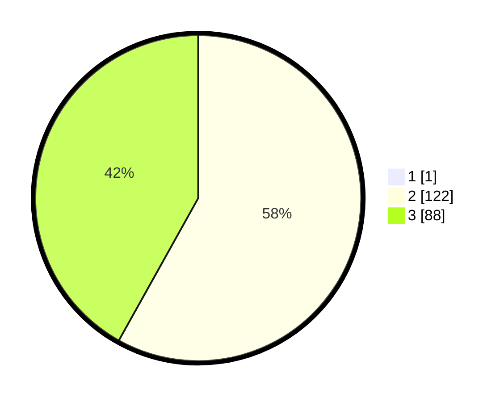

# Hasil

## Grafik

## Tabel

| No. | Nama Paslon    | Suara | Suara (raw) | Persentase |
|:--- |:-------------- | -----:| -----------:| ----------:|
| 1   | ANIES MUHAIMIN | 1     | [1][p-1]    | 0,47       |
| 2   | PRABOWO GIBRAN | 122   | [122][p-2]  | 57,82      |
| 3   | GANJAR MAHFUD  | 88    | [88][p-3]   | 41,71      |

[p-1]: https://github.com/gigit-pemilu/pemilu-2024-51-bali/blob/main/pilpres/hitung-suara/sub/51-bali/sub/06-bangli/sub/03-tembuku/sub/2001-jehem/sub/004-tps/sub/paslon-1.txt
[p-2]: https://github.com/gigit-pemilu/pemilu-2024-51-bali/blob/main/pilpres/hitung-suara/sub/51-bali/sub/06-bangli/sub/03-tembuku/sub/2001-jehem/sub/004-tps/sub/paslon-2.txt
[p-3]: https://github.com/gigit-pemilu/pemilu-2024-51-bali/blob/main/pilpres/hitung-suara/sub/51-bali/sub/06-bangli/sub/03-tembuku/sub/2001-jehem/sub/004-tps/sub/paslon-3.txt

## Foto C Plano

https://sirekap-obj-formc.kpu.go.id/e430/pemilu/ppwp/51/06/03/20/01/5106032001004-20240214-230714--bf12ce79-f62f-4bf2-98f5-926287e00fd2.jpg

https://sirekap-obj-formc.kpu.go.id/e430/pemilu/ppwp/51/06/03/20/01/5106032001004-20240214-230815--3a86afd1-c8fc-4eb6-8c81-e07b83421d7a.jpg

https://sirekap-obj-formc.kpu.go.id/e430/pemilu/ppwp/51/06/03/20/01/5106032001004-20240214-224326--96e56129-6d61-4ef5-9b3d-caea8213743c.jpg

## Metadata

| Key        | Value               |
| ---------- | ------------------- |
| Time Stamp | 2024-02-16 21:01:00 |

