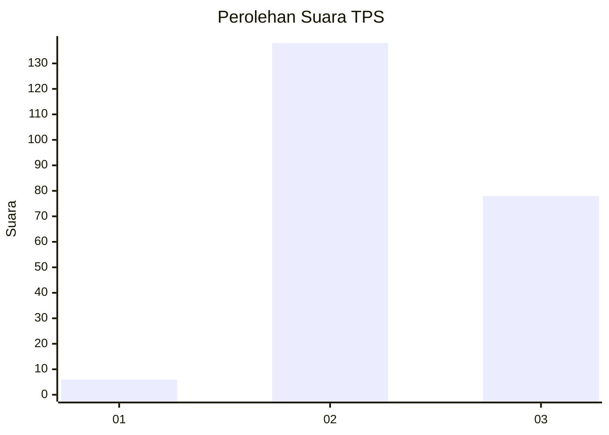
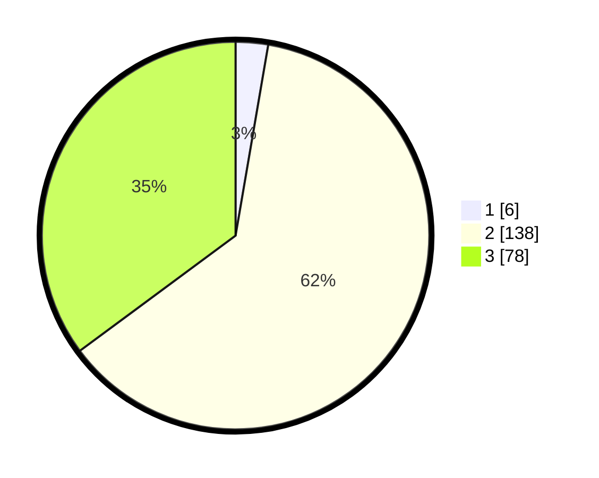

# Hasil

## Grafik

## Tabel

| No. | Nama Paslon    | Suara | Suara (raw) | Persentase |
|:--- |:-------------- | -----:| -----------:| ----------:|
| 1   | ANIES MUHAIMIN | 6     | [6][p-1]    | 2,70       |
| 2   | PRABOWO GIBRAN | 138   | [138][p-2]  | 62,16      |
| 3   | GANJAR MAHFUD  | 78    | [78][p-3]   | 35,14      |

[p-1]: https://github.com/gigit-pemilu/pemilu-2024-51-bali/blob/main/pilpres/hitung-suara/sub/51-bali/sub/06-bangli/sub/03-tembuku/sub/2001-jehem/sub/006-tps/sub/paslon-1.txt
[p-2]: https://github.com/gigit-pemilu/pemilu-2024-51-bali/blob/main/pilpres/hitung-suara/sub/51-bali/sub/06-bangli/sub/03-tembuku/sub/2001-jehem/sub/006-tps/sub/paslon-2.txt
[p-3]: https://github.com/gigit-pemilu/pemilu-2024-51-bali/blob/main/pilpres/hitung-suara/sub/51-bali/sub/06-bangli/sub/03-tembuku/sub/2001-jehem/sub/006-tps/sub/paslon-3.txt

## Foto C Plano

https://sirekap-obj-formc.kpu.go.id/febe/pemilu/ppwp/51/06/03/20/01/5106032001006-20240214-133052--9d59e5d6-f7d8-41ac-bf84-82d1eccd4bfd.jpg

https://sirekap-obj-formc.kpu.go.id/febe/pemilu/ppwp/51/06/03/20/01/5106032001006-20240214-195318--1b95b524-192b-4b35-a016-ba26579edb37.jpg

https://sirekap-obj-formc.kpu.go.id/febe/pemilu/ppwp/51/06/03/20/01/5106032001006-20240214-195427--f97c3d5a-03a0-4a09-a764-3c9aa8f13d7b.jpg

## Metadata

| Key        | Value               |
| ---------- | ------------------- |
| Time Stamp | 2024-02-24 22:31:28 |

