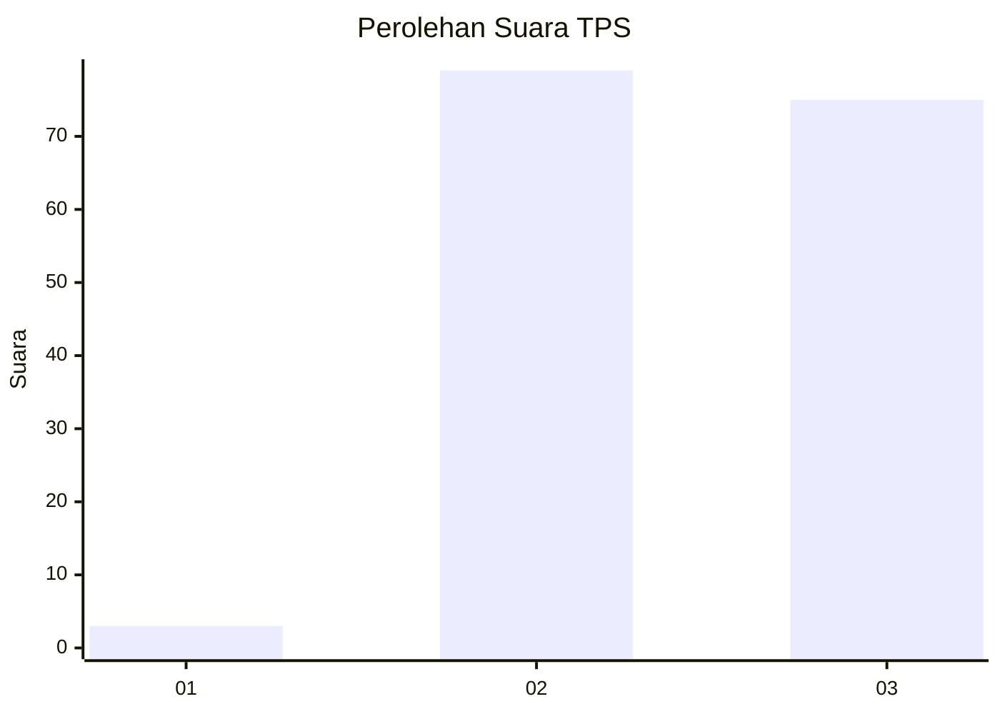
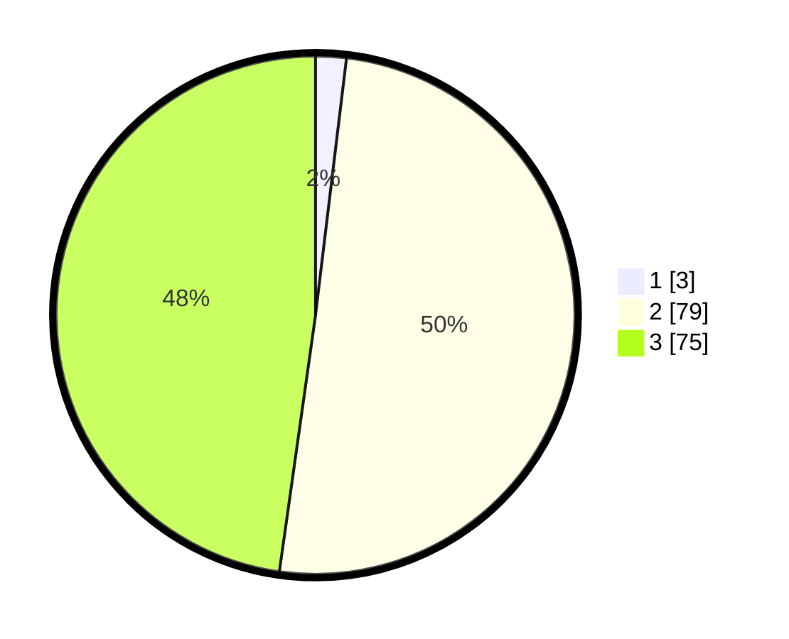

# Hasil

## Grafik

## Tabel

| No. | Nama Paslon    | Suara | Suara (raw) | Persentase |
|:--- |:-------------- | -----:| -----------:| ----------:|
| 1   | ANIES MUHAIMIN | 3     | [3][p-1]    | 1,91       |
| 2   | PRABOWO GIBRAN | 79    | [79][p-2]   | 50,32      |
| 3   | GANJAR MAHFUD  | 75    | [75][p-3]   | 47,77      |

[p-1]: https://github.com/gigit-pemilu/pemilu-2024-51-bali/blob/main/pilpres/hitung-suara/sub/51-bali/sub/06-bangli/sub/03-tembuku/sub/2001-jehem/sub/025-tps/sub/paslon-1.txt
[p-2]: https://github.com/gigit-pemilu/pemilu-2024-51-bali/blob/main/pilpres/hitung-suara/sub/51-bali/sub/06-bangli/sub/03-tembuku/sub/2001-jehem/sub/025-tps/sub/paslon-2.txt
[p-3]: https://github.com/gigit-pemilu/pemilu-2024-51-bali/blob/main/pilpres/hitung-suara/sub/51-bali/sub/06-bangli/sub/03-tembuku/sub/2001-jehem/sub/025-tps/sub/paslon-3.txt

## Foto C Plano

https://sirekap-obj-formc.kpu.go.id/c1e9/pemilu/ppwp/51/06/03/20/01/5106032001025-20240214-203005--b34b39ab-2fea-48f6-87ff-df95ba36f96a.jpg

https://sirekap-obj-formc.kpu.go.id/c1e9/pemilu/ppwp/51/06/03/20/01/5106032001025-20240214-203548--7e30af55-4a1d-4ede-b64d-50a9b46e0cac.jpg

https://sirekap-obj-formc.kpu.go.id/c1e9/pemilu/ppwp/51/06/03/20/01/5106032001025-20240214-203648--b25e9703-80c5-42ff-a567-014e9d1d886a.jpg

## Metadata

| Key        | Value               |
| ---------- | ------------------- |
| Time Stamp | 2024-02-24 22:31:28 |

