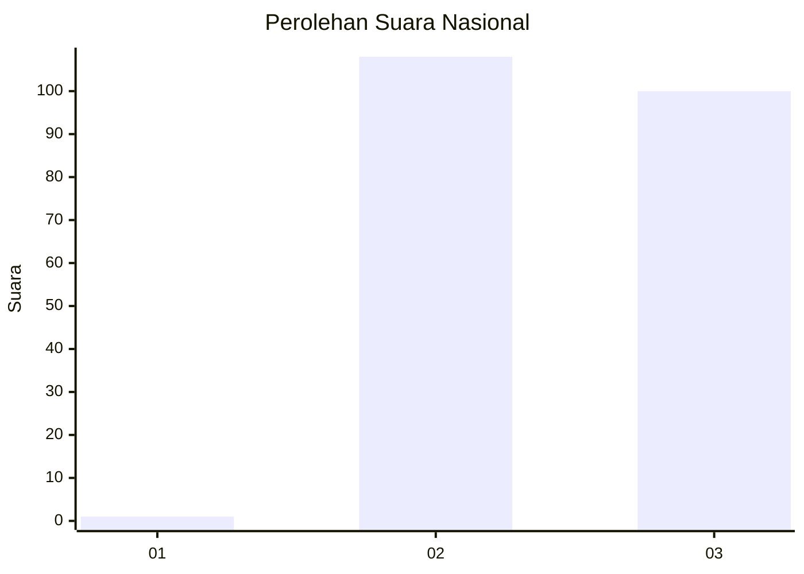
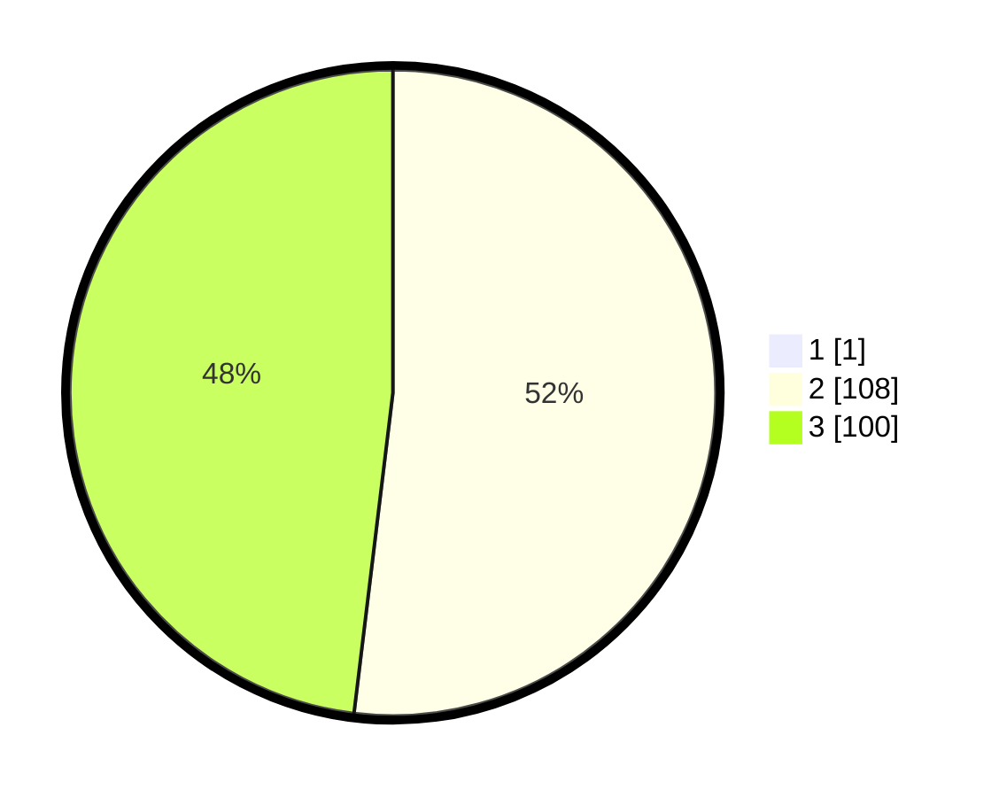

# Hasil

## Grafik

## Tabel

| No. | Nama Paslon    | Suara | Suara (raw) | Persentase |
|:--- |:-------------- | -----:| -----------:| ----------:|
| 1   | ANIES MUHAIMIN | 1     | [1][p-1]    | 0,48       |
| 2   | PRABOWO GIBRAN | 108   | [108][p-2]  | 51,67      |
| 3   | GANJAR MAHFUD  | 100   | [100][p-3]  | 47,85      |

[p-1]: https://github.com/gigit-pemilu/pemilu-2024/blob/main/pilpres/hitung-suara/sub/51-bali/sub/06-bangli/sub/03-tembuku/sub/2002-tembuku/sub/007-tps/sub/paslon-1.txt
[p-2]: https://github.com/gigit-pemilu/pemilu-2024/blob/main/pilpres/hitung-suara/sub/51-bali/sub/06-bangli/sub/03-tembuku/sub/2002-tembuku/sub/007-tps/sub/paslon-2.txt
[p-3]: https://github.com/gigit-pemilu/pemilu-2024/blob/main/pilpres/hitung-suara/sub/51-bali/sub/06-bangli/sub/03-tembuku/sub/2002-tembuku/sub/007-tps/sub/paslon-3.txt

## Foto C Plano

https://sirekap-obj-formc.kpu.go.id/d141/pemilu/ppwp/51/06/03/20/02/5106032002007-20240214-141257--d35bf499-1e44-479b-9b45-b8a77bd3b3cc.jpg

https://sirekap-obj-formc.kpu.go.id/d141/pemilu/ppwp/51/06/03/20/02/5106032002007-20240214-155548--0cd32000-504c-481f-ac18-ca478b4c2557.jpg

https://sirekap-obj-formc.kpu.go.id/d141/pemilu/ppwp/51/06/03/20/02/5106032002007-20240214-141937--dac95ef7-2d04-49bc-a9c3-8933e38feafa.jpg

## Metadata

| Key        | Value               |
| ---------- | ------------------- |
| Time Stamp | 2024-02-15 16:00:26 |

