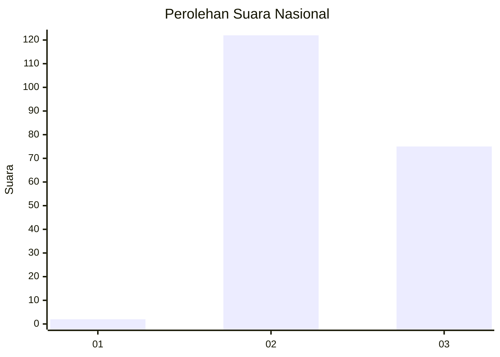
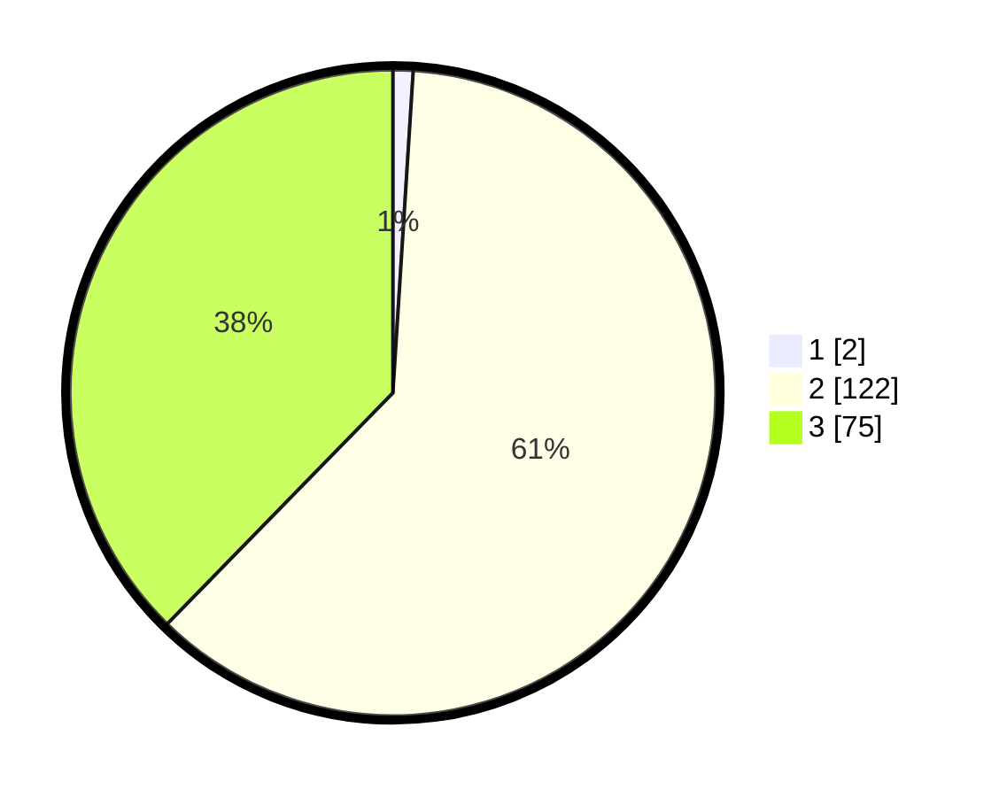

# Hasil

## Grafik

## Tabel

| No. | Nama Paslon    | Suara | Suara (raw) | Persentase |
|:--- |:-------------- | -----:| -----------:| ----------:|
| 1   | ANIES MUHAIMIN | 2     | [2][p-1]    | 1,01       |
| 2   | PRABOWO GIBRAN | 122   | [122][p-2]  | 61,31      |
| 3   | GANJAR MAHFUD  | 75    | [75][p-3]   | 37,69      |

[p-1]: https://github.com/gigit-pemilu/pemilu-2024/blob/main/pilpres/hitung-suara/sub/51-bali/sub/06-bangli/sub/03-tembuku/sub/2002-tembuku/sub/010-tps/sub/paslon-1.txt
[p-2]: https://github.com/gigit-pemilu/pemilu-2024/blob/main/pilpres/hitung-suara/sub/51-bali/sub/06-bangli/sub/03-tembuku/sub/2002-tembuku/sub/010-tps/sub/paslon-2.txt
[p-3]: https://github.com/gigit-pemilu/pemilu-2024/blob/main/pilpres/hitung-suara/sub/51-bali/sub/06-bangli/sub/03-tembuku/sub/2002-tembuku/sub/010-tps/sub/paslon-3.txt

## Foto C Plano

https://sirekap-obj-formc.kpu.go.id/f9b4/pemilu/ppwp/51/06/03/20/02/5106032002010-20240214-220716--48240381-1efc-4b15-be01-1e13f213ab30.jpg

https://sirekap-obj-formc.kpu.go.id/f9b4/pemilu/ppwp/51/06/03/20/02/5106032002010-20240214-202545--30c9ef16-e2a9-4f77-afec-2d62a9a0e52f.jpg

https://sirekap-obj-formc.kpu.go.id/f9b4/pemilu/ppwp/51/06/03/20/02/5106032002010-20240214-202638--30dbd208-d0e0-4d29-afc1-ca2c228b1e18.jpg

## Metadata

| Key        | Value               |
| ---------- | ------------------- |
| Time Stamp | 2024-02-15 16:00:26 |

