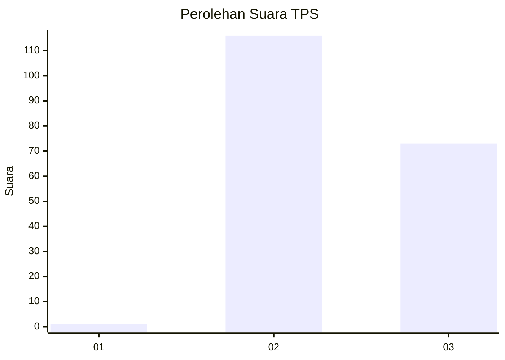
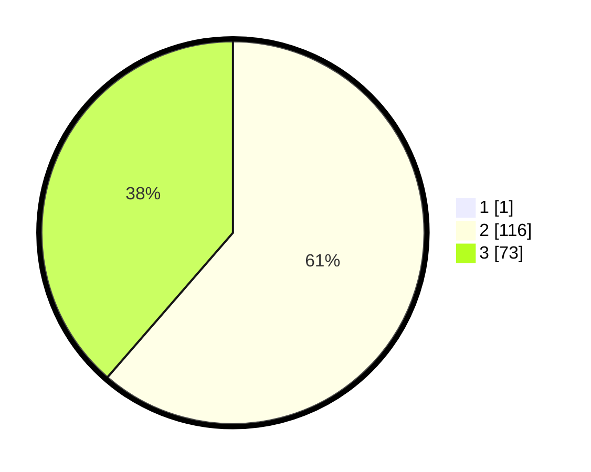

# Hasil

## Grafik

## Tabel

| No. | Nama Paslon    | Suara | Suara (raw) | Persentase |
|:--- |:-------------- | -----:| -----------:| ----------:|
| 1   | ANIES MUHAIMIN | 1     | [1][p-1]    | 0,53       |
| 2   | PRABOWO GIBRAN | 116   | [116][p-2]  | 61,05      |
| 3   | GANJAR MAHFUD  | 73    | [73][p-3]   | 38,42      |

[p-1]: https://github.com/gigit-pemilu/pemilu-2024-51-bali/blob/main/pilpres/hitung-suara/sub/51-bali/sub/06-bangli/sub/03-tembuku/sub/2002-tembuku/sub/012-tps/sub/paslon-1.txt
[p-2]: https://github.com/gigit-pemilu/pemilu-2024-51-bali/blob/main/pilpres/hitung-suara/sub/51-bali/sub/06-bangli/sub/03-tembuku/sub/2002-tembuku/sub/012-tps/sub/paslon-2.txt
[p-3]: https://github.com/gigit-pemilu/pemilu-2024-51-bali/blob/main/pilpres/hitung-suara/sub/51-bali/sub/06-bangli/sub/03-tembuku/sub/2002-tembuku/sub/012-tps/sub/paslon-3.txt

## Foto C Plano

https://sirekap-obj-formc.kpu.go.id/c717/pemilu/ppwp/51/06/03/20/02/5106032002012-20240214-235311--2731ab45-4dfc-4b6c-bc2f-d3277a622d72.jpg

https://sirekap-obj-formc.kpu.go.id/c717/pemilu/ppwp/51/06/03/20/02/5106032002012-20240214-235413--ed6bcfab-ea31-4e82-9d1b-fde81f63781c.jpg

https://sirekap-obj-formc.kpu.go.id/c717/pemilu/ppwp/51/06/03/20/02/5106032002012-20240214-235456--371cc5c2-661f-4a74-9cf8-39c1e8e41fdb.jpg

## Metadata

| Key        | Value               |
| ---------- | ------------------- |
| Time Stamp | 2024-02-24 22:31:28 |

