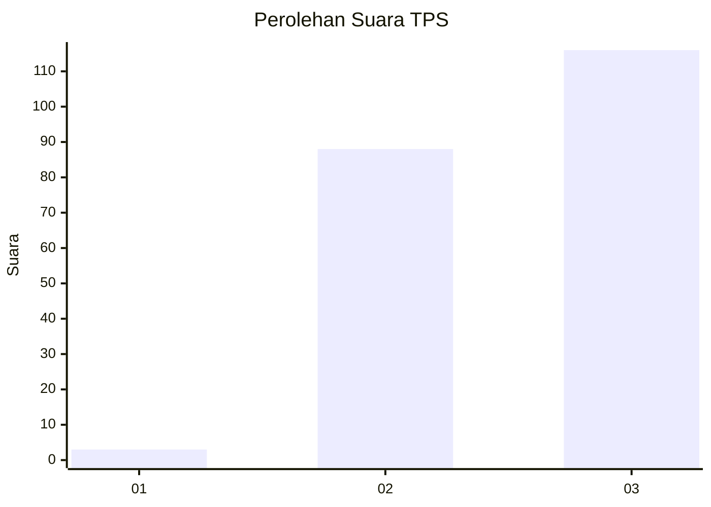
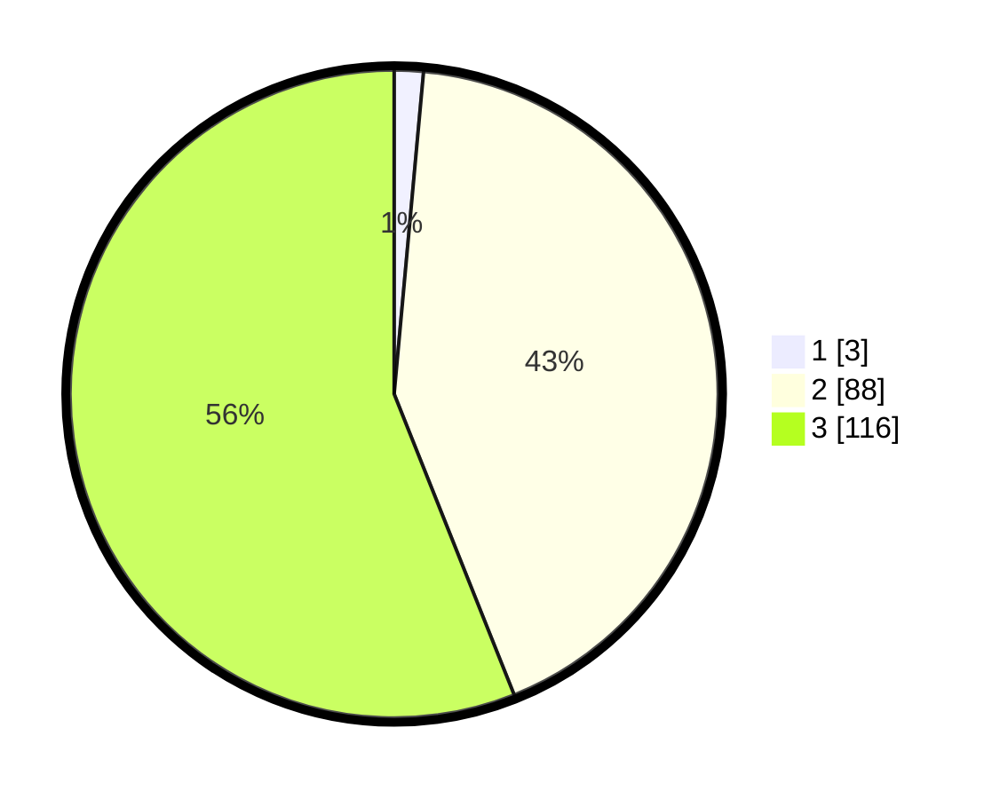

# Hasil

## Grafik

## Tabel

| No. | Nama Paslon    | Suara | Suara (raw) | Persentase |
|:--- |:-------------- | -----:| -----------:| ----------:|
| 1   | ANIES MUHAIMIN | 3     | [3][p-1]    | 1,45       |
| 2   | PRABOWO GIBRAN | 88    | [88][p-2]   | 42,51      |
| 3   | GANJAR MAHFUD  | 116   | [116][p-3]  | 56,04      |

[p-1]: https://github.com/gigit-pemilu/pemilu-2024-51-bali/blob/main/pilpres/hitung-suara/sub/51-bali/sub/06-bangli/sub/03-tembuku/sub/2002-tembuku/sub/015-tps/sub/paslon-1.txt
[p-2]: https://github.com/gigit-pemilu/pemilu-2024-51-bali/blob/main/pilpres/hitung-suara/sub/51-bali/sub/06-bangli/sub/03-tembuku/sub/2002-tembuku/sub/015-tps/sub/paslon-2.txt
[p-3]: https://github.com/gigit-pemilu/pemilu-2024-51-bali/blob/main/pilpres/hitung-suara/sub/51-bali/sub/06-bangli/sub/03-tembuku/sub/2002-tembuku/sub/015-tps/sub/paslon-3.txt

## Foto C Plano

https://sirekap-obj-formc.kpu.go.id/0220/pemilu/ppwp/51/06/03/20/02/5106032002015-20240214-204215--b8e88c8a-958c-423d-a282-6d7b024d06b5.jpg

https://sirekap-obj-formc.kpu.go.id/0220/pemilu/ppwp/51/06/03/20/02/5106032002015-20240214-204348--5d371d7c-c038-493f-9623-4cfff121e38c.jpg

https://sirekap-obj-formc.kpu.go.id/0220/pemilu/ppwp/51/06/03/20/02/5106032002015-20240214-204518--daf5182b-0f8d-4b8f-add4-e24095bc127c.jpg

## Metadata

| Key        | Value               |
| ---------- | ------------------- |
| Time Stamp | 2024-02-15 02:10:27 |

