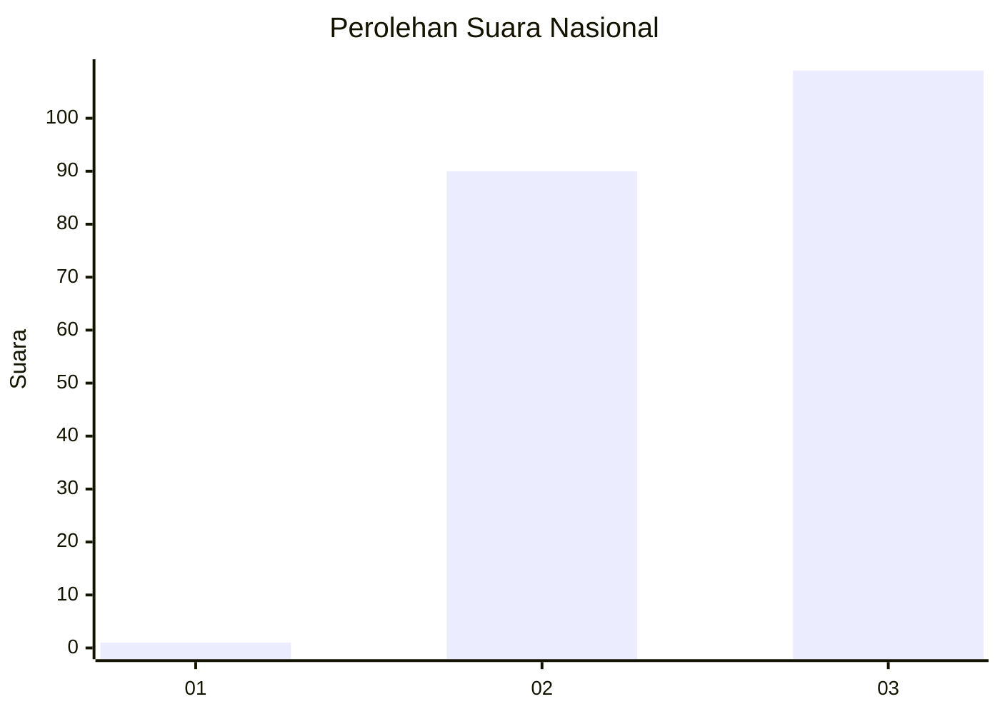
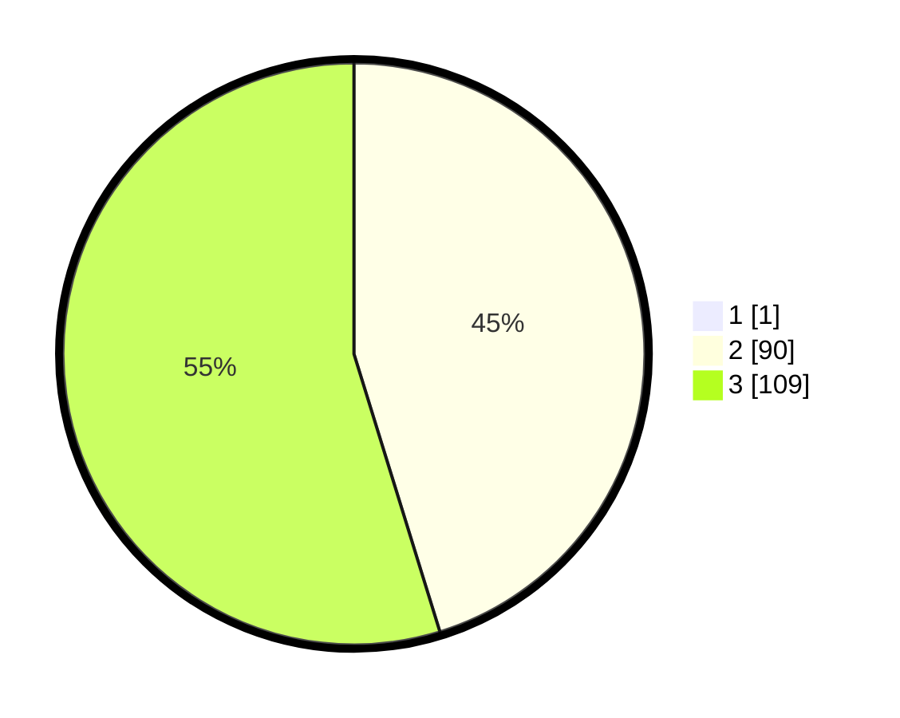

# Hasil

## Grafik

## Tabel

| No. | Nama Paslon    | Suara | Suara (raw) | Persentase |
|:--- |:-------------- | -----:| -----------:| ----------:|
| 1   | ANIES MUHAIMIN | 1     | [1][p-1]    | 0,50       |
| 2   | PRABOWO GIBRAN | 90    | [90][p-2]   | 45,00      |
| 3   | GANJAR MAHFUD  | 109   | [109][p-3]  | 54,50      |

[p-1]: https://github.com/gigit-pemilu/pemilu-2024/blob/main/pilpres/hitung-suara/sub/51-bali/sub/06-bangli/sub/03-tembuku/sub/2003-yangapi/sub/003-tps/sub/paslon-1.txt
[p-2]: https://github.com/gigit-pemilu/pemilu-2024/blob/main/pilpres/hitung-suara/sub/51-bali/sub/06-bangli/sub/03-tembuku/sub/2003-yangapi/sub/003-tps/sub/paslon-2.txt
[p-3]: https://github.com/gigit-pemilu/pemilu-2024/blob/main/pilpres/hitung-suara/sub/51-bali/sub/06-bangli/sub/03-tembuku/sub/2003-yangapi/sub/003-tps/sub/paslon-3.txt

## Foto C Plano

https://sirekap-obj-formc.kpu.go.id/a9f6/pemilu/ppwp/51/06/03/20/03/5106032003003-20240215-014049--fed100fa-bfb5-4209-8c82-25e80f95b982.jpg

https://sirekap-obj-formc.kpu.go.id/a9f6/pemilu/ppwp/51/06/03/20/03/5106032003003-20240215-014551--f40905fb-b347-466d-9251-d59e8765fb1a.jpg

https://sirekap-obj-formc.kpu.go.id/a9f6/pemilu/ppwp/51/06/03/20/03/5106032003003-20240215-014709--f08903f5-ad53-4aab-999d-7ed7b3111c17.jpg

## Metadata

| Key        | Value               |
| ---------- | ------------------- |
| Time Stamp | 2024-02-24 22:31:28 |

