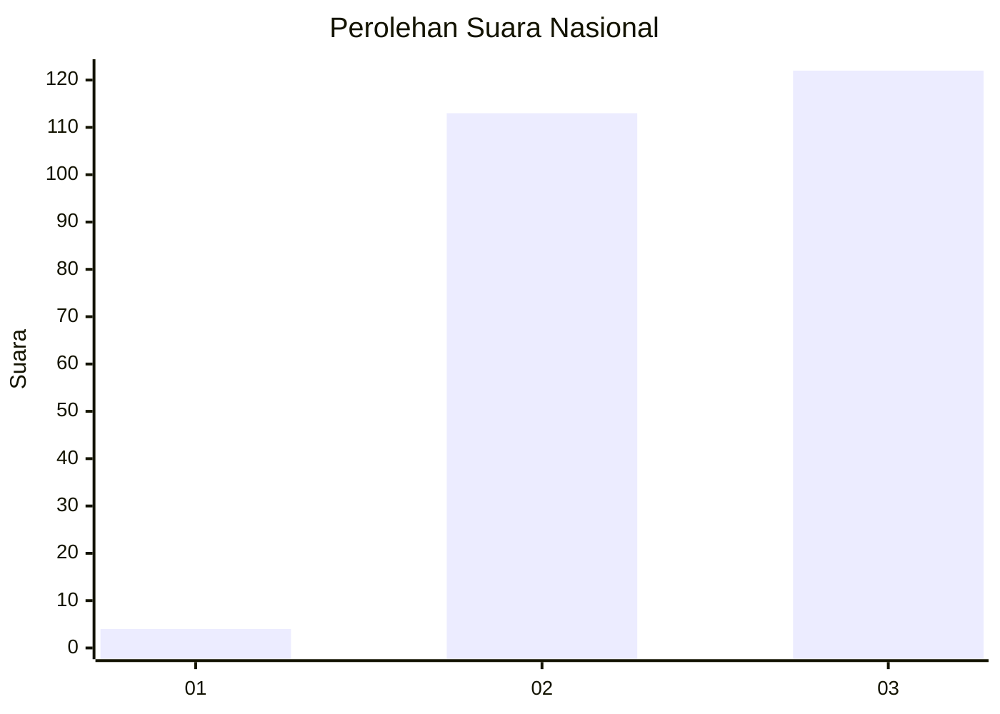
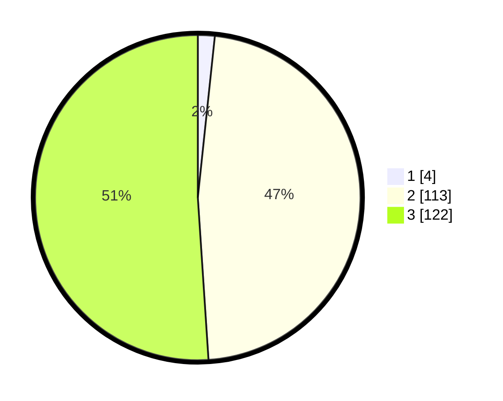

# Hasil

## Grafik

## Tabel

| No. | Nama Paslon    | Suara | Suara (raw) | Persentase |
|:--- |:-------------- | -----:| -----------:| ----------:|
| 1   | ANIES MUHAIMIN | 4     | [4][p-1]    | 1,67       |
| 2   | PRABOWO GIBRAN | 113   | [113][p-2]  | 47,28      |
| 3   | GANJAR MAHFUD  | 122   | [122][p-3]  | 51,05      |

[p-1]: https://github.com/gigit-pemilu/pemilu-2024/blob/main/pilpres/hitung-suara/sub/51-bali/sub/06-bangli/sub/03-tembuku/sub/2003-yangapi/sub/007-tps/sub/paslon-1.txt
[p-2]: https://github.com/gigit-pemilu/pemilu-2024/blob/main/pilpres/hitung-suara/sub/51-bali/sub/06-bangli/sub/03-tembuku/sub/2003-yangapi/sub/007-tps/sub/paslon-2.txt
[p-3]: https://github.com/gigit-pemilu/pemilu-2024/blob/main/pilpres/hitung-suara/sub/51-bali/sub/06-bangli/sub/03-tembuku/sub/2003-yangapi/sub/007-tps/sub/paslon-3.txt

## Foto C Plano

https://sirekap-obj-formc.kpu.go.id/78db/pemilu/ppwp/51/06/03/20/03/5106032003007-20240214-224547--7624c7a4-9b45-4a1c-b69d-a7a6ccdceba4.jpg

https://sirekap-obj-formc.kpu.go.id/78db/pemilu/ppwp/51/06/03/20/03/5106032003007-20240214-201218--94b1d556-fd39-4778-a3af-6cfe0ab08614.jpg

https://sirekap-obj-formc.kpu.go.id/78db/pemilu/ppwp/51/06/03/20/03/5106032003007-20240214-201327--bff772de-3111-453b-ba8a-9e4e7d176247.jpg

## Metadata

| Key        | Value               |
| ---------- | ------------------- |
| Time Stamp | 2024-02-15 03:06:03 |

