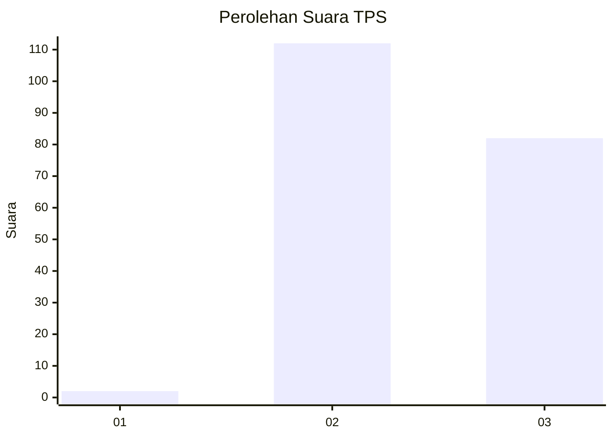
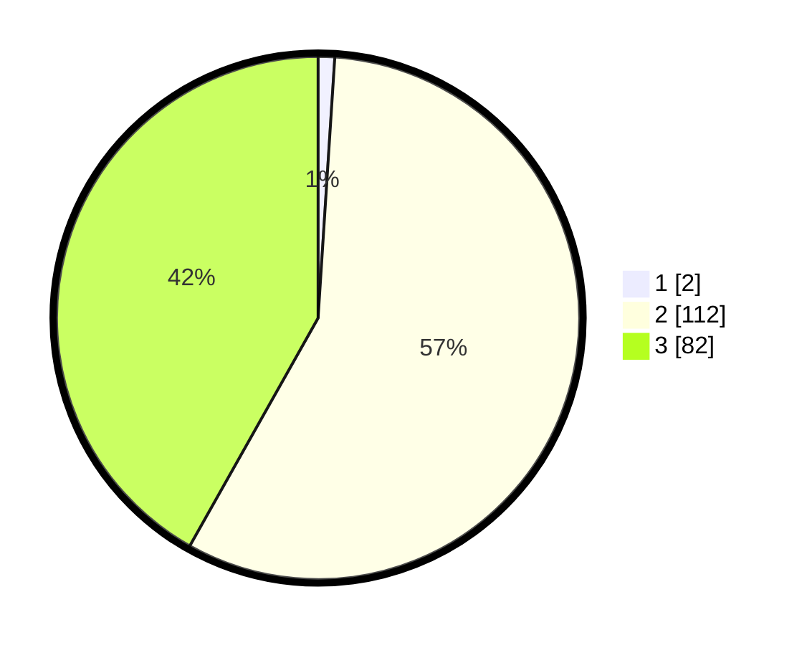

# Hasil

## Grafik

## Tabel

| No. | Nama Paslon    | Suara | Suara (raw) | Persentase |
|:--- |:-------------- | -----:| -----------:| ----------:|
| 1   | ANIES MUHAIMIN | 2     | [2][p-1]    | 1,02       |
| 2   | PRABOWO GIBRAN | 112   | [112][p-2]  | 57,14      |
| 3   | GANJAR MAHFUD  | 82    | [82][p-3]   | 41,84      |

[p-1]: https://github.com/gigit-pemilu/pemilu-2024-51-bali/blob/main/pilpres/hitung-suara/sub/51-bali/sub/06-bangli/sub/03-tembuku/sub/2003-yangapi/sub/015-tps/sub/paslon-1.txt
[p-2]: https://github.com/gigit-pemilu/pemilu-2024-51-bali/blob/main/pilpres/hitung-suara/sub/51-bali/sub/06-bangli/sub/03-tembuku/sub/2003-yangapi/sub/015-tps/sub/paslon-2.txt
[p-3]: https://github.com/gigit-pemilu/pemilu-2024-51-bali/blob/main/pilpres/hitung-suara/sub/51-bali/sub/06-bangli/sub/03-tembuku/sub/2003-yangapi/sub/015-tps/sub/paslon-3.txt

## Foto C Plano

https://sirekap-obj-formc.kpu.go.id/8631/pemilu/ppwp/51/06/03/20/03/5106032003015-20240214-213417--3e303e3a-97f7-4427-837d-dd7907f0cea0.jpg

https://sirekap-obj-formc.kpu.go.id/8631/pemilu/ppwp/51/06/03/20/03/5106032003015-20240214-214109--120cfee9-63cb-4859-ac30-57bd2c387e8b.jpg

https://sirekap-obj-formc.kpu.go.id/8631/pemilu/ppwp/51/06/03/20/03/5106032003015-20240214-214359--ce15b787-f4b5-4840-966f-eb6a6c3dc03e.jpg

## Metadata

| Key        | Value               |
| ---------- | ------------------- |
| Time Stamp | 2024-02-25 15:00:00 |

