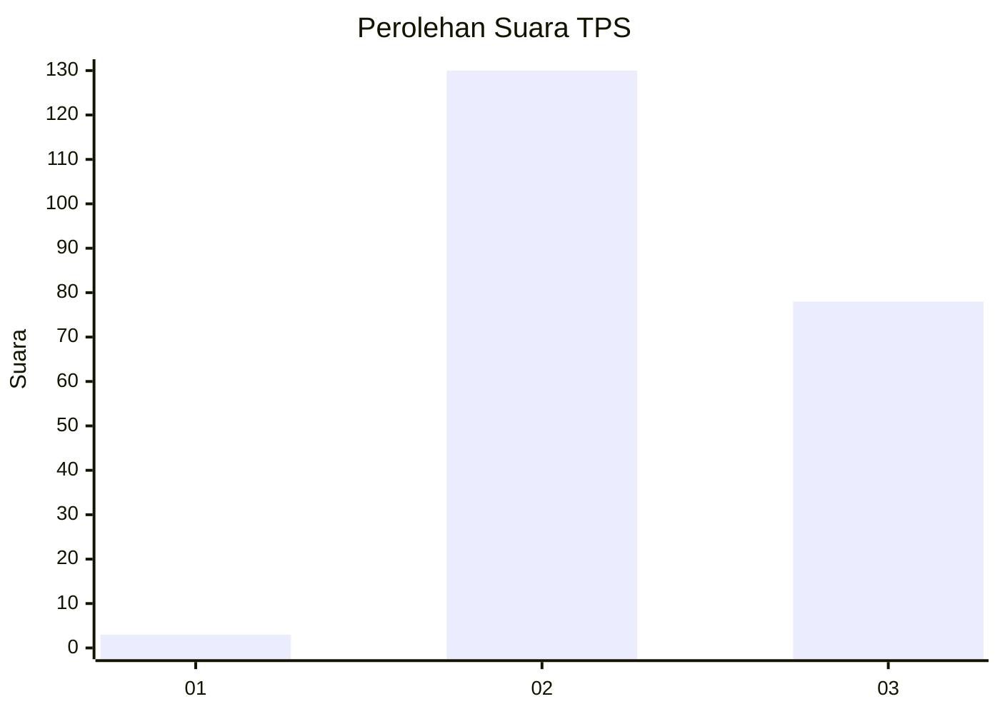
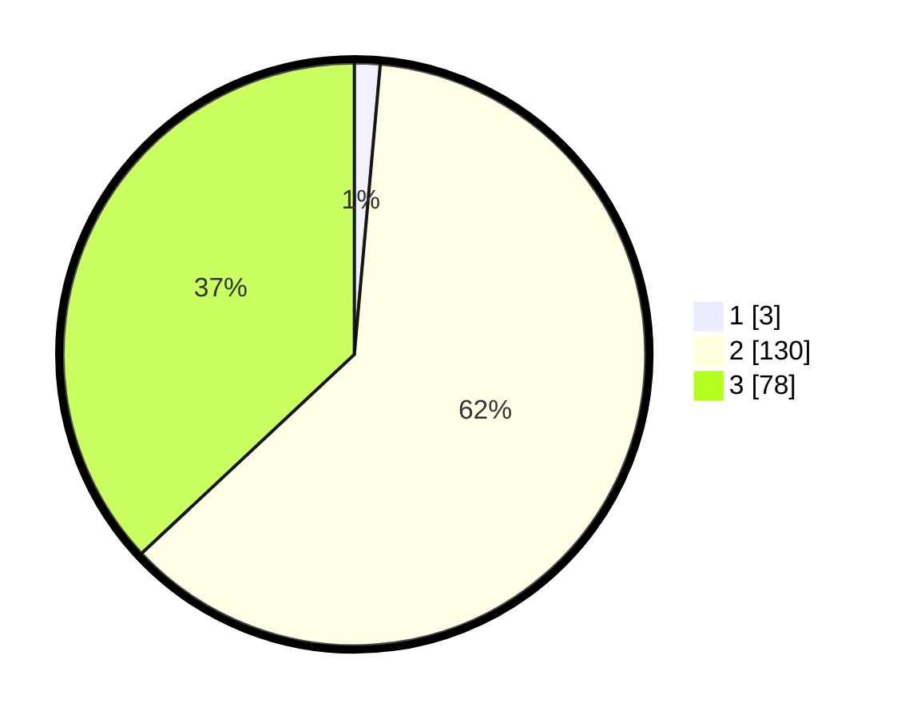

# Hasil

## Grafik

## Tabel

| No. | Nama Paslon    | Suara | Suara (raw) | Persentase |
|:--- |:-------------- | -----:| -----------:| ----------:|
| 1   | ANIES MUHAIMIN | 3     | [3][p-1]    | 1,42       |
| 2   | PRABOWO GIBRAN | 130   | [130][p-2]  | 61,61      |
| 3   | GANJAR MAHFUD  | 78    | [78][p-3]   | 36,97      |

[p-1]: https://github.com/gigit-pemilu/pemilu-2024-51-bali/blob/main/pilpres/hitung-suara/sub/51-bali/sub/06-bangli/sub/03-tembuku/sub/2003-yangapi/sub/016-tps/sub/paslon-1.txt
[p-2]: https://github.com/gigit-pemilu/pemilu-2024-51-bali/blob/main/pilpres/hitung-suara/sub/51-bali/sub/06-bangli/sub/03-tembuku/sub/2003-yangapi/sub/016-tps/sub/paslon-2.txt
[p-3]: https://github.com/gigit-pemilu/pemilu-2024-51-bali/blob/main/pilpres/hitung-suara/sub/51-bali/sub/06-bangli/sub/03-tembuku/sub/2003-yangapi/sub/016-tps/sub/paslon-3.txt

## Foto C Plano

https://sirekap-obj-formc.kpu.go.id/540c/pemilu/ppwp/51/06/03/20/03/5106032003016-20240214-223703--cff55bf0-20c0-41c0-ab26-49c59407a072.jpg

https://sirekap-obj-formc.kpu.go.id/540c/pemilu/ppwp/51/06/03/20/03/5106032003016-20240214-234002--581f0b24-4133-4131-80a7-e465160fd647.jpg

https://sirekap-obj-formc.kpu.go.id/540c/pemilu/ppwp/51/06/03/20/03/5106032003016-20240214-234243--2bfbb9c6-0a2c-443c-bb1f-dd6ee70afd58.jpg

## Metadata

| Key        | Value               |
| ---------- | ------------------- |
| Time Stamp | 2024-02-24 22:31:28 |

