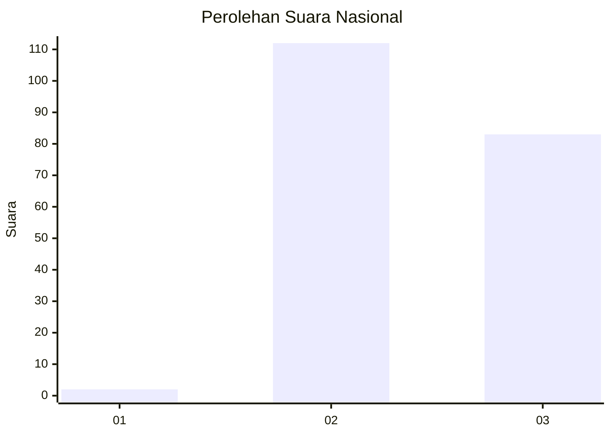
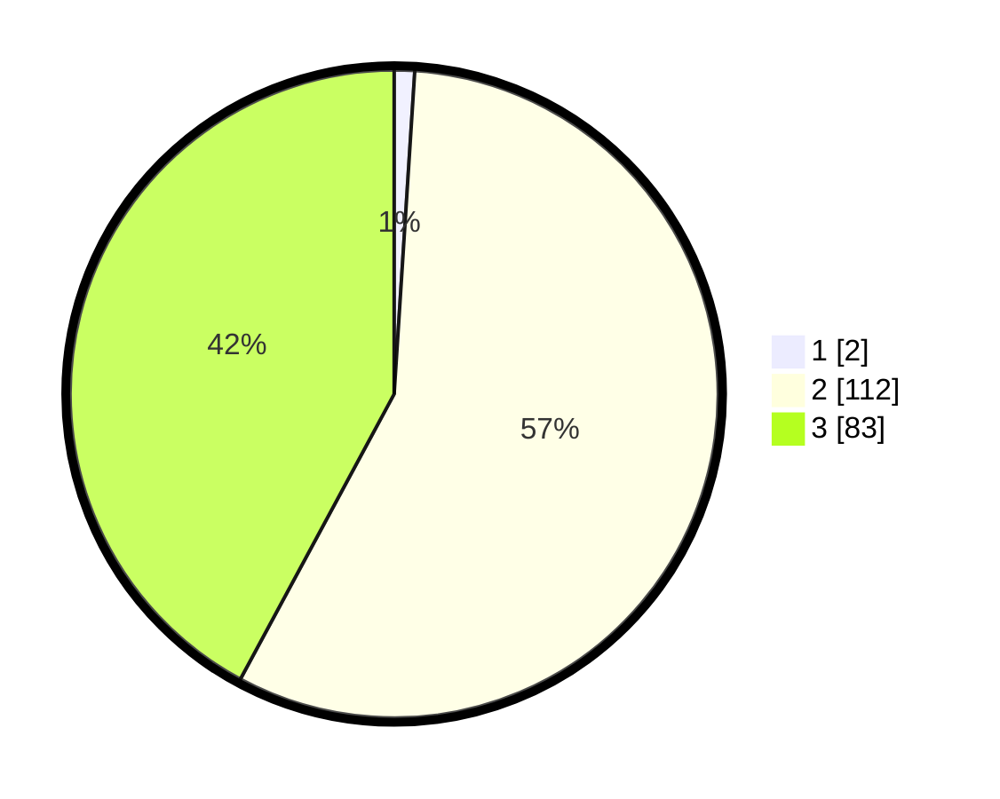

# Hasil

## Grafik

## Tabel

| No. | Nama Paslon    | Suara | Suara (raw) | Persentase |
|:--- |:-------------- | -----:| -----------:| ----------:|
| 1   | ANIES MUHAIMIN | 2     | [2][p-1]    | 1,02       |
| 2   | PRABOWO GIBRAN | 112   | [112][p-2]  | 56,85      |
| 3   | GANJAR MAHFUD  | 83    | [83][p-3]   | 42,13      |

[p-1]: https://github.com/gigit-pemilu/pemilu-2024/blob/main/pilpres/hitung-suara/sub/51-bali/sub/06-bangli/sub/03-tembuku/sub/2003-yangapi/sub/021-tps/sub/paslon-1.txt
[p-2]: https://github.com/gigit-pemilu/pemilu-2024/blob/main/pilpres/hitung-suara/sub/51-bali/sub/06-bangli/sub/03-tembuku/sub/2003-yangapi/sub/021-tps/sub/paslon-2.txt
[p-3]: https://github.com/gigit-pemilu/pemilu-2024/blob/main/pilpres/hitung-suara/sub/51-bali/sub/06-bangli/sub/03-tembuku/sub/2003-yangapi/sub/021-tps/sub/paslon-3.txt

## Foto C Plano

https://sirekap-obj-formc.kpu.go.id/995f/pemilu/ppwp/51/06/03/20/03/5106032003021-20240214-225940--f9b34f80-cc5d-4c3d-a668-a0d0751b766d.jpg

https://sirekap-obj-formc.kpu.go.id/995f/pemilu/ppwp/51/06/03/20/03/5106032003021-20240214-230057--b798bb72-c28d-4c48-9395-280c537c2609.jpg

https://sirekap-obj-formc.kpu.go.id/995f/pemilu/ppwp/51/06/03/20/03/5106032003021-20240214-230209--386a0728-d81d-47ab-91a4-fd5200856fcc.jpg

## Metadata

| Key        | Value               |
| ---------- | ------------------- |
| Time Stamp | 2024-02-24 22:31:28 |

