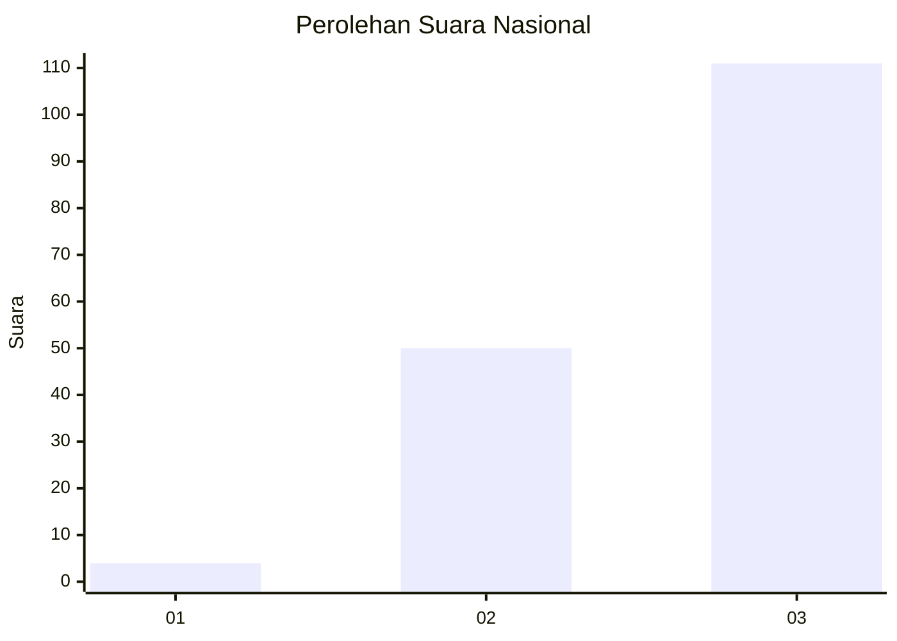
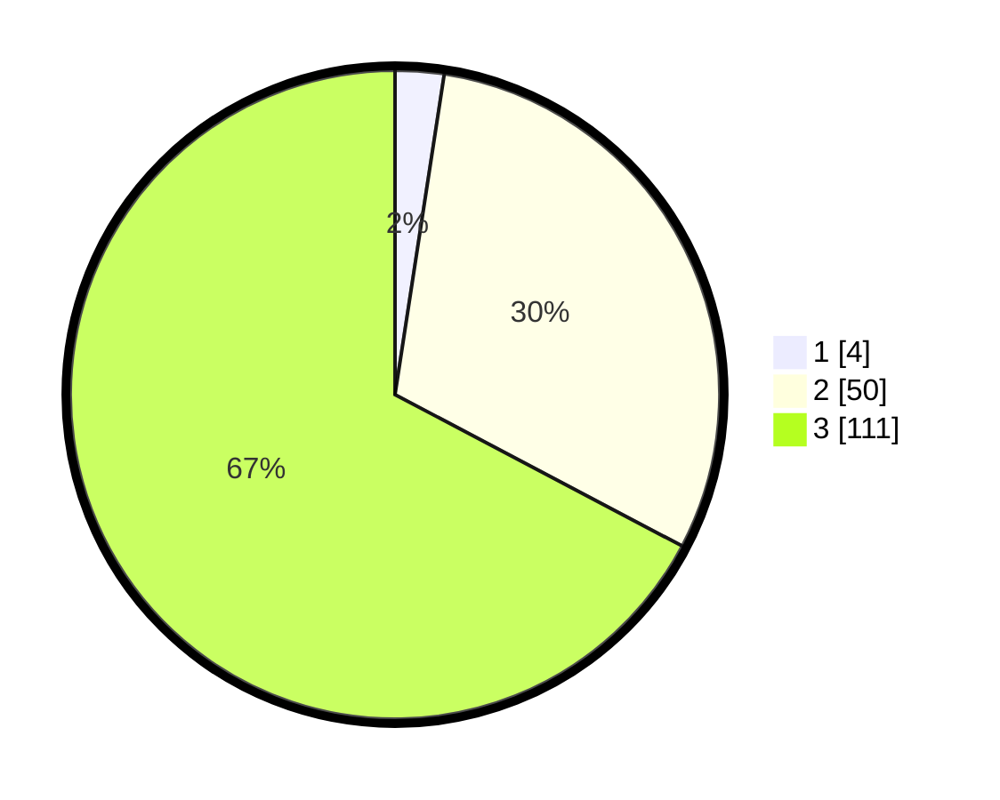

# Hasil

## Grafik

## Tabel

| No. | Nama Paslon    | Suara | Suara (raw) | Persentase |
|:--- |:-------------- | -----:| -----------:| ----------:|
| 1   | ANIES MUHAIMIN | 4     | [4][p-1]    | 2,42       |
| 2   | PRABOWO GIBRAN | 50    | [50][p-2]   | 30,30      |
| 3   | GANJAR MAHFUD  | 111   | [111][p-3]  | 67,27      |

[p-1]: https://github.com/gigit-pemilu/pemilu-2024/blob/main/pilpres/hitung-suara/sub/51-bali/sub/06-bangli/sub/03-tembuku/sub/2003-yangapi/sub/023-tps/sub/paslon-1.txt
[p-2]: https://github.com/gigit-pemilu/pemilu-2024/blob/main/pilpres/hitung-suara/sub/51-bali/sub/06-bangli/sub/03-tembuku/sub/2003-yangapi/sub/023-tps/sub/paslon-2.txt
[p-3]: https://github.com/gigit-pemilu/pemilu-2024/blob/main/pilpres/hitung-suara/sub/51-bali/sub/06-bangli/sub/03-tembuku/sub/2003-yangapi/sub/023-tps/sub/paslon-3.txt

## Foto C Plano

https://sirekap-obj-formc.kpu.go.id/0c2a/pemilu/ppwp/51/06/03/20/03/5106032003023-20240214-192305--86e46cde-42c0-49af-9657-6314fe52d699.jpg

https://sirekap-obj-formc.kpu.go.id/0c2a/pemilu/ppwp/51/06/03/20/03/5106032003023-20240214-190321--924e6e8e-4b23-4bde-bfbf-96ba7cb1d562.jpg

https://sirekap-obj-formc.kpu.go.id/0c2a/pemilu/ppwp/51/06/03/20/03/5106032003023-20240214-190643--a3ce1d37-3693-41ec-baa9-db143279e35b.jpg

## Metadata

| Key        | Value               |
| ---------- | ------------------- |
| Time Stamp | 2024-02-24 22:31:28 |

## DATA PEMILIH TETAP

Jumlah pemilih dalam DPT: **221**.
 * L: **108**.
 * P: **113**.

## DATA PENGGUNA HAK PILIH

Jumlah pengguna hak pilih dalam DPT: **166**.
 * L: **84**.
 * P: **82**.

Jumlah pengguna hak pilih dalam DPTb: **0**.
 * L: **0**.
 * P: **0**.

Jumlah pengguna hak pilih dalam DPK: **8**.
 * L: **2**.
 * P: **6**.

Jumlah pengguna hak pilih: **174**.
 * L: **86**.
 * P: **88**.

## JUMLAH SUARA SAH DAN TIDAK SAH

JUMLAH SELURUH SUARA SAH: **165**.

JUMLAH SUARA TIDAK SAH: **9**.

JUMLAH SELURUH SUARA SAH DAN SUARA TIDAK SAH: **174**.

