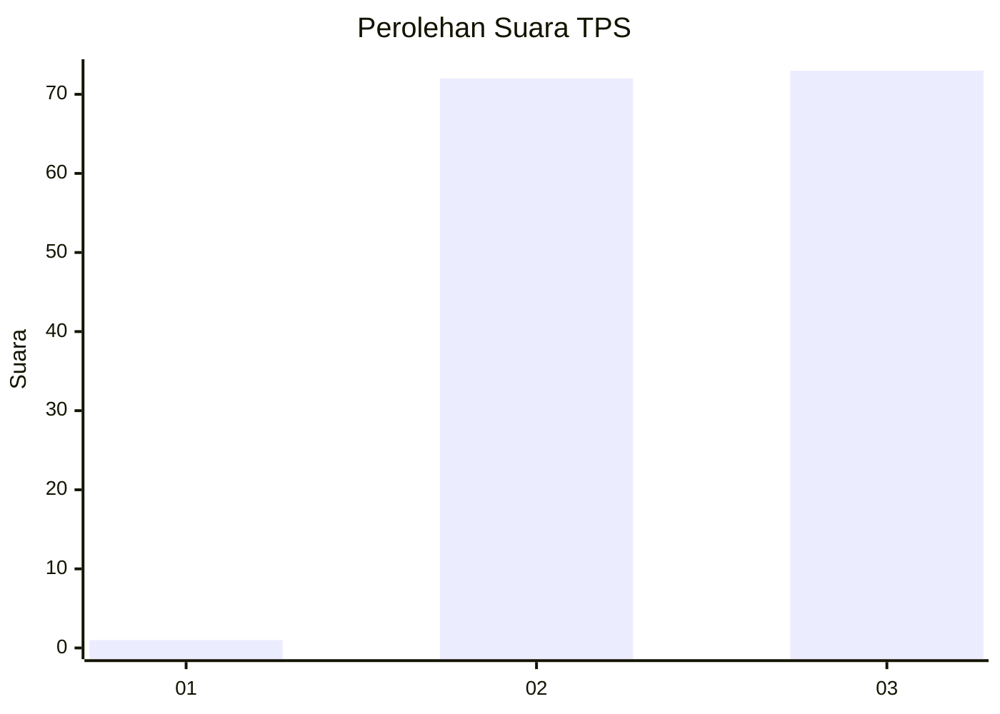
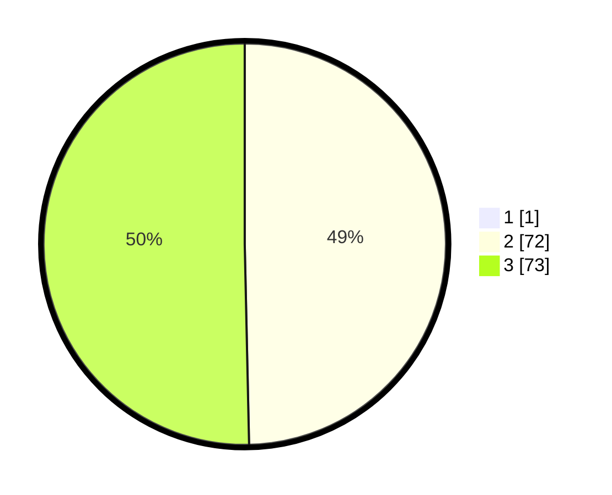

# Hasil

## Grafik

## Tabel

| No. | Nama Paslon    | Suara | Suara (raw) | Persentase |
|:--- |:-------------- | -----:| -----------:| ----------:|
| 1   | ANIES MUHAIMIN | 1     | [1][p-1]    | 0,68       |
| 2   | PRABOWO GIBRAN | 72    | [72][p-2]   | 49,32      |
| 3   | GANJAR MAHFUD  | 73    | [73][p-3]   | 50,00      |

[p-1]: https://github.com/gigit-pemilu/pemilu-2024-51-bali/blob/main/pilpres/hitung-suara/sub/51-bali/sub/06-bangli/sub/03-tembuku/sub/2005-bangbang/sub/012-tps/sub/paslon-1.txt
[p-2]: https://github.com/gigit-pemilu/pemilu-2024-51-bali/blob/main/pilpres/hitung-suara/sub/51-bali/sub/06-bangli/sub/03-tembuku/sub/2005-bangbang/sub/012-tps/sub/paslon-2.txt
[p-3]: https://github.com/gigit-pemilu/pemilu-2024-51-bali/blob/main/pilpres/hitung-suara/sub/51-bali/sub/06-bangli/sub/03-tembuku/sub/2005-bangbang/sub/012-tps/sub/paslon-3.txt

## Foto C Plano

https://sirekap-obj-formc.kpu.go.id/9be1/pemilu/ppwp/51/06/03/20/05/5106032005012-20240214-193959--9267eb2d-2108-43e7-a420-d1c5f367c4f1.jpg

https://sirekap-obj-formc.kpu.go.id/9be1/pemilu/ppwp/51/06/03/20/05/5106032005012-20240214-194127--8461f87f-5693-4ceb-9675-3a119868e336.jpg

https://sirekap-obj-formc.kpu.go.id/9be1/pemilu/ppwp/51/06/03/20/05/5106032005012-20240214-194228--9d318040-732a-42eb-afd6-a2db7440ae0c.jpg

## Metadata

| Key        | Value               |
| ---------- | ------------------- |
| Time Stamp | 2024-02-14 21:46:01 |

