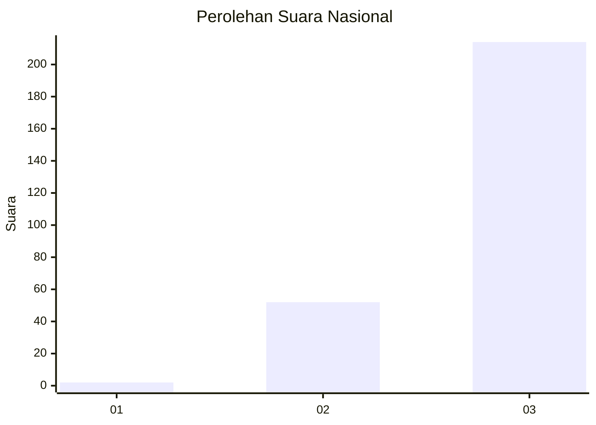
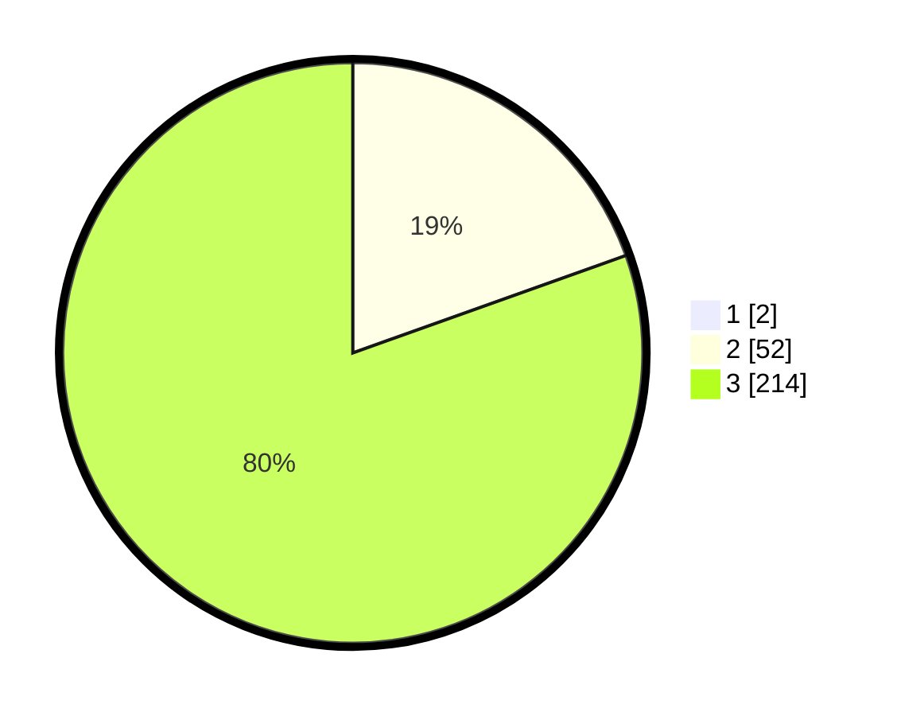

# Hasil

## Grafik

## Tabel

| No. | Nama Paslon    | Suara | Suara (raw) | Persentase |
|:--- |:-------------- | -----:| -----------:| ----------:|
| 1   | ANIES MUHAIMIN | 2     | [2][p-1]    | 0,75       |
| 2   | PRABOWO GIBRAN | 52    | [52][p-2]   | 19,40      |
| 3   | GANJAR MAHFUD  | 214   | [214][p-3]  | 79,85      |

[p-1]: https://github.com/gigit-pemilu/pemilu-2024/blob/main/pilpres/hitung-suara/sub/51-bali/sub/06-bangli/sub/03-tembuku/sub/2005-bangbang/sub/014-tps/sub/paslon-1.txt
[p-2]: https://github.com/gigit-pemilu/pemilu-2024/blob/main/pilpres/hitung-suara/sub/51-bali/sub/06-bangli/sub/03-tembuku/sub/2005-bangbang/sub/014-tps/sub/paslon-2.txt
[p-3]: https://github.com/gigit-pemilu/pemilu-2024/blob/main/pilpres/hitung-suara/sub/51-bali/sub/06-bangli/sub/03-tembuku/sub/2005-bangbang/sub/014-tps/sub/paslon-3.txt

## Foto C Plano

https://sirekap-obj-formc.kpu.go.id/e65f/pemilu/ppwp/51/06/03/20/05/5106032005014-20240215-001741--67fc962b-7f96-4d91-a269-c2bbc9151c52.jpg

https://sirekap-obj-formc.kpu.go.id/e65f/pemilu/ppwp/51/06/03/20/05/5106032005014-20240215-001812--dacb7709-3398-4019-b95f-103dd668addd.jpg

https://sirekap-obj-formc.kpu.go.id/e65f/pemilu/ppwp/51/06/03/20/05/5106032005014-20240215-001843--6ef51dbb-a841-4d48-a557-78e9717b8d25.jpg

## Metadata

| Key        | Value               |
| ---------- | ------------------- |
| Time Stamp | 2024-02-24 22:31:28 |

