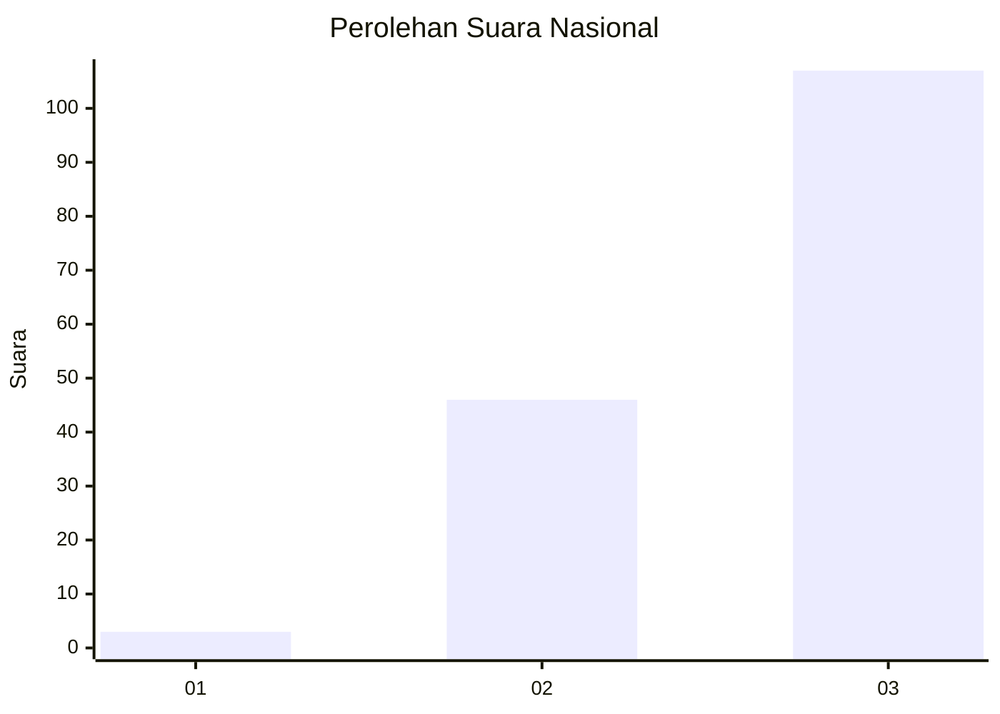
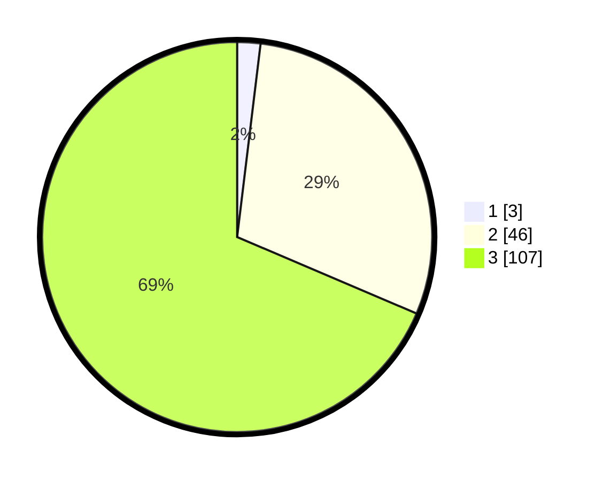

# Hasil

## Grafik

## Tabel

| No. | Nama Paslon    | Suara | Suara (raw) | Persentase |
|:--- |:-------------- | -----:| -----------:| ----------:|
| 1   | ANIES MUHAIMIN | 3     | [3][p-1]    | 1,92       |
| 2   | PRABOWO GIBRAN | 46    | [46][p-2]   | 29,49      |
| 3   | GANJAR MAHFUD  | 107   | [107][p-3]  | 68,59      |

[p-1]: https://github.com/gigit-pemilu/pemilu-2024/blob/main/pilpres/hitung-suara/sub/51-bali/sub/06-bangli/sub/03-tembuku/sub/2006-peninjoan/sub/002-tps/sub/paslon-1.txt
[p-2]: https://github.com/gigit-pemilu/pemilu-2024/blob/main/pilpres/hitung-suara/sub/51-bali/sub/06-bangli/sub/03-tembuku/sub/2006-peninjoan/sub/002-tps/sub/paslon-2.txt
[p-3]: https://github.com/gigit-pemilu/pemilu-2024/blob/main/pilpres/hitung-suara/sub/51-bali/sub/06-bangli/sub/03-tembuku/sub/2006-peninjoan/sub/002-tps/sub/paslon-3.txt

## Foto C Plano

https://sirekap-obj-formc.kpu.go.id/7a43/pemilu/ppwp/51/06/03/20/06/5106032006002-20240216-020309--e89042e3-333d-4837-93ee-67b47162777f.jpg

https://sirekap-obj-formc.kpu.go.id/7a43/pemilu/ppwp/51/06/03/20/06/5106032006002-20240214-131706--94acc925-1761-437a-88ce-56d45f2b32ab.jpg

https://sirekap-obj-formc.kpu.go.id/7a43/pemilu/ppwp/51/06/03/20/06/5106032006002-20240214-132116--f72c912c-0074-41bc-934a-a120172a60ca.jpg

## Metadata

| Key        | Value               |
| ---------- | ------------------- |
| Time Stamp | 2024-02-16 02:30:27 |

## DATA PEMILIH TETAP

Jumlah pemilih dalam DPT: **175**.
 * L: **86**.
 * P: **89**.

## DATA PENGGUNA HAK PILIH

Jumlah pengguna hak pilih dalam DPT: **158**.
 * L: **81**.
 * P: **77**.

Jumlah pengguna hak pilih dalam DPTb: **0**.
 * L: **0**.
 * P: **0**.

Jumlah pengguna hak pilih dalam DPK: **0**.
 * L: **0**.
 * P: **0**.

Jumlah pengguna hak pilih: **158**.
 * L: **81**.
 * P: **77**.

## JUMLAH SUARA SAH DAN TIDAK SAH

JUMLAH SELURUH SUARA SAH: **156**.

JUMLAH SUARA TIDAK SAH: **2**.

JUMLAH SELURUH SUARA SAH DAN SUARA TIDAK SAH: **158**.

