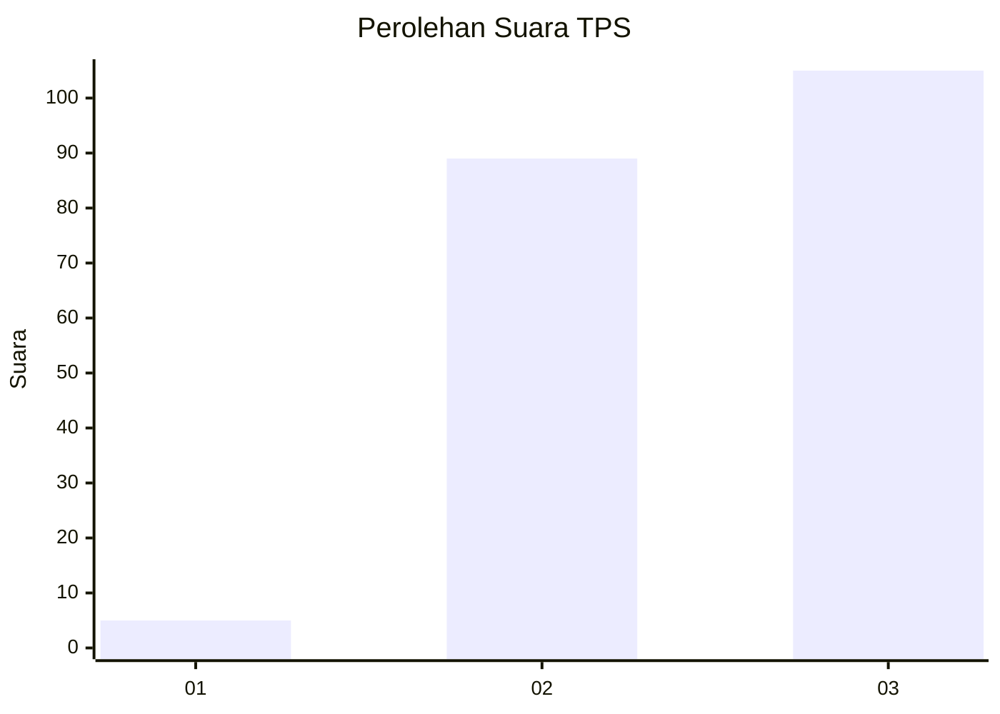
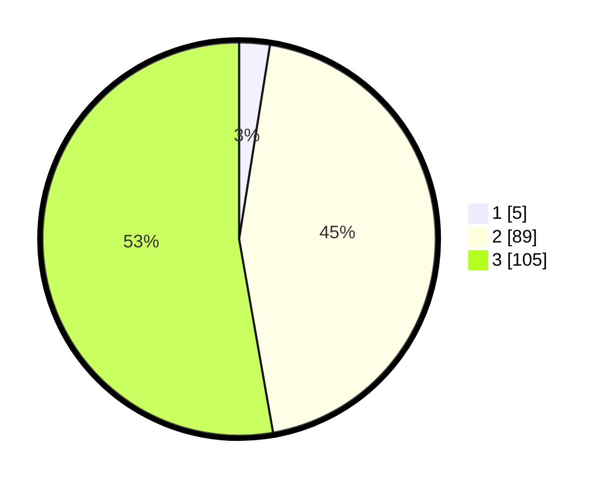

# Hasil

## Grafik

## Tabel

| No. | Nama Paslon    | Suara | Suara (raw) | Persentase |
|:--- |:-------------- | -----:| -----------:| ----------:|
| 1   | ANIES MUHAIMIN | 5     | [5][p-1]    | 2,51       |
| 2   | PRABOWO GIBRAN | 89    | [89][p-2]   | 44,72      |
| 3   | GANJAR MAHFUD  | 105   | [105][p-3]  | 52,76      |

[p-1]: https://github.com/gigit-pemilu/pemilu-2024-51-bali/blob/main/pilpres/hitung-suara/sub/51-bali/sub/06-bangli/sub/03-tembuku/sub/2006-peninjoan/sub/003-tps/sub/paslon-1.txt
[p-2]: https://github.com/gigit-pemilu/pemilu-2024-51-bali/blob/main/pilpres/hitung-suara/sub/51-bali/sub/06-bangli/sub/03-tembuku/sub/2006-peninjoan/sub/003-tps/sub/paslon-2.txt
[p-3]: https://github.com/gigit-pemilu/pemilu-2024-51-bali/blob/main/pilpres/hitung-suara/sub/51-bali/sub/06-bangli/sub/03-tembuku/sub/2006-peninjoan/sub/003-tps/sub/paslon-3.txt

## Foto C Plano

https://sirekap-obj-formc.kpu.go.id/621c/pemilu/ppwp/51/06/03/20/06/5106032006003-20240215-024737--a1db2240-7113-401c-9501-6de722a21103.jpg

https://sirekap-obj-formc.kpu.go.id/621c/pemilu/ppwp/51/06/03/20/06/5106032006003-20240215-024829--ee666b09-74df-4f36-8fd2-83ef96100d04.jpg

https://sirekap-obj-formc.kpu.go.id/621c/pemilu/ppwp/51/06/03/20/06/5106032006003-20240215-025044--f95cc33e-56e4-4bde-ab43-d49f68c222e4.jpg

## Metadata

| Key        | Value               |
| ---------- | ------------------- |
| Time Stamp | 2024-02-24 22:31:28 |

