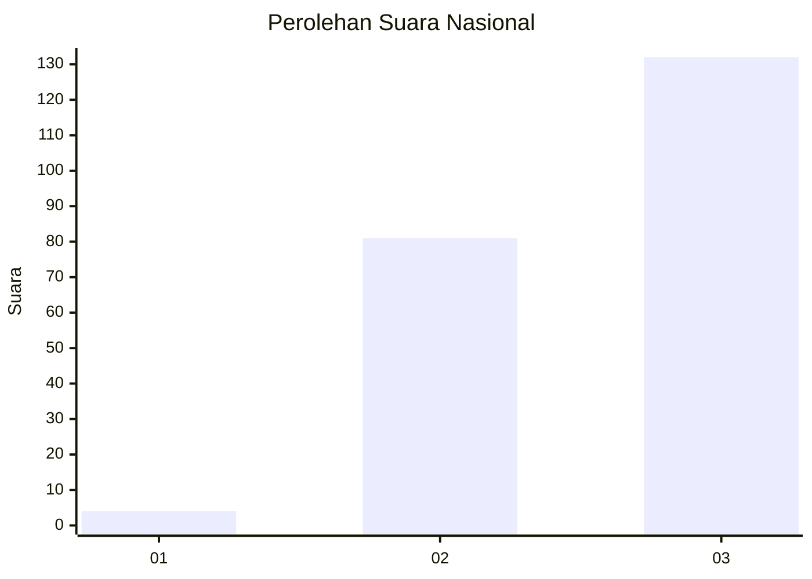
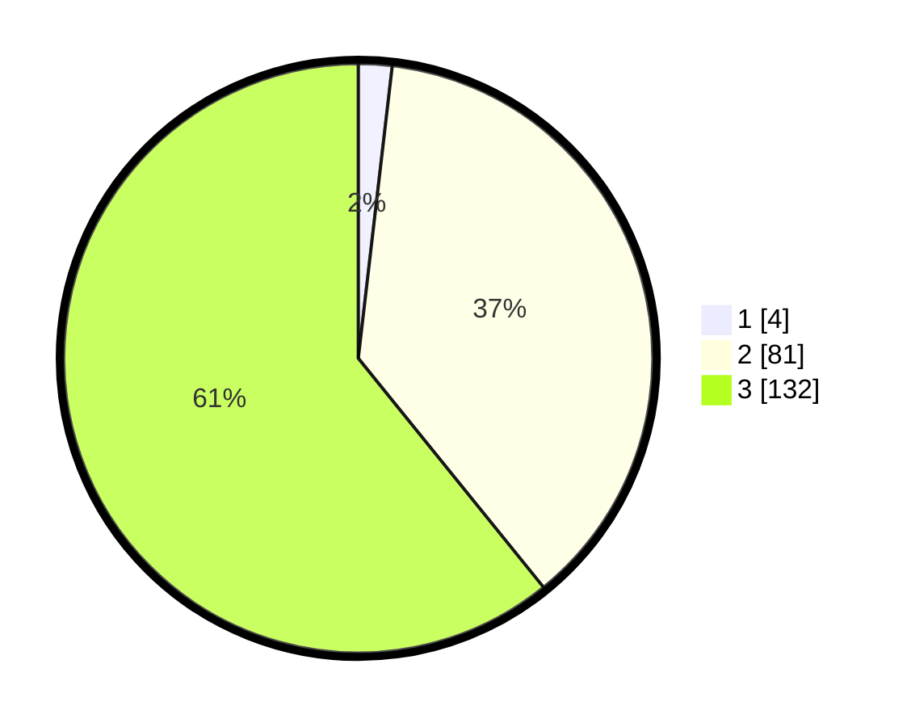

# Hasil

## Grafik

## Tabel

| No. | Nama Paslon    | Suara | Suara (raw) | Persentase |
|:--- |:-------------- | -----:| -----------:| ----------:|
| 1   | ANIES MUHAIMIN | 4     | [4][p-1]    | 1,84       |
| 2   | PRABOWO GIBRAN | 81    | [81][p-2]   | 37,33      |
| 3   | GANJAR MAHFUD  | 132   | [132][p-3]  | 60,83      |

[p-1]: https://github.com/gigit-pemilu/pemilu-2024/blob/main/pilpres/hitung-suara/sub/51-bali/sub/06-bangli/sub/03-tembuku/sub/2006-peninjoan/sub/013-tps/sub/paslon-1.txt
[p-2]: https://github.com/gigit-pemilu/pemilu-2024/blob/main/pilpres/hitung-suara/sub/51-bali/sub/06-bangli/sub/03-tembuku/sub/2006-peninjoan/sub/013-tps/sub/paslon-2.txt
[p-3]: https://github.com/gigit-pemilu/pemilu-2024/blob/main/pilpres/hitung-suara/sub/51-bali/sub/06-bangli/sub/03-tembuku/sub/2006-peninjoan/sub/013-tps/sub/paslon-3.txt

## Foto C Plano

https://sirekap-obj-formc.kpu.go.id/d92c/pemilu/ppwp/51/06/03/20/06/5106032006013-20240227-131148--2d90112e-2fc2-4528-a549-99608af0868b.jpg

https://sirekap-obj-formc.kpu.go.id/d92c/pemilu/ppwp/51/06/03/20/06/5106032006013-20240215-000240--22df59b4-a4f7-4e08-8a92-568c19bdca21.jpg

https://sirekap-obj-formc.kpu.go.id/d92c/pemilu/ppwp/51/06/03/20/06/5106032006013-20240215-000619--e0635fca-0eb5-49db-a010-4c41d4d5e96b.jpg

## Metadata

| Key        | Value               |
| ---------- | ------------------- |
| Time Stamp | 2024-02-27 14:00:00 |

