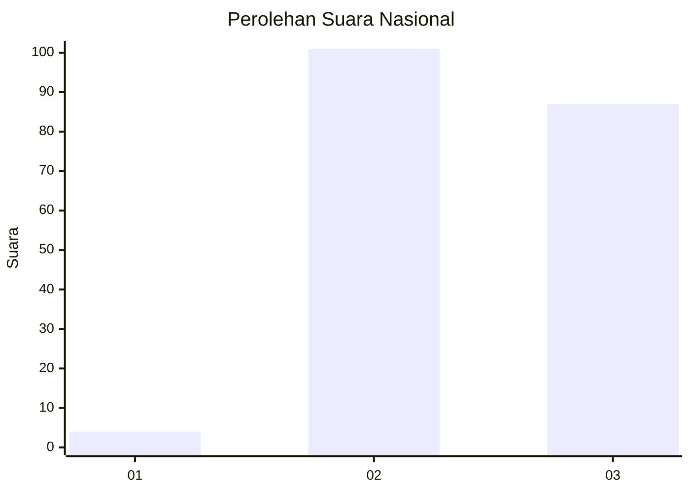
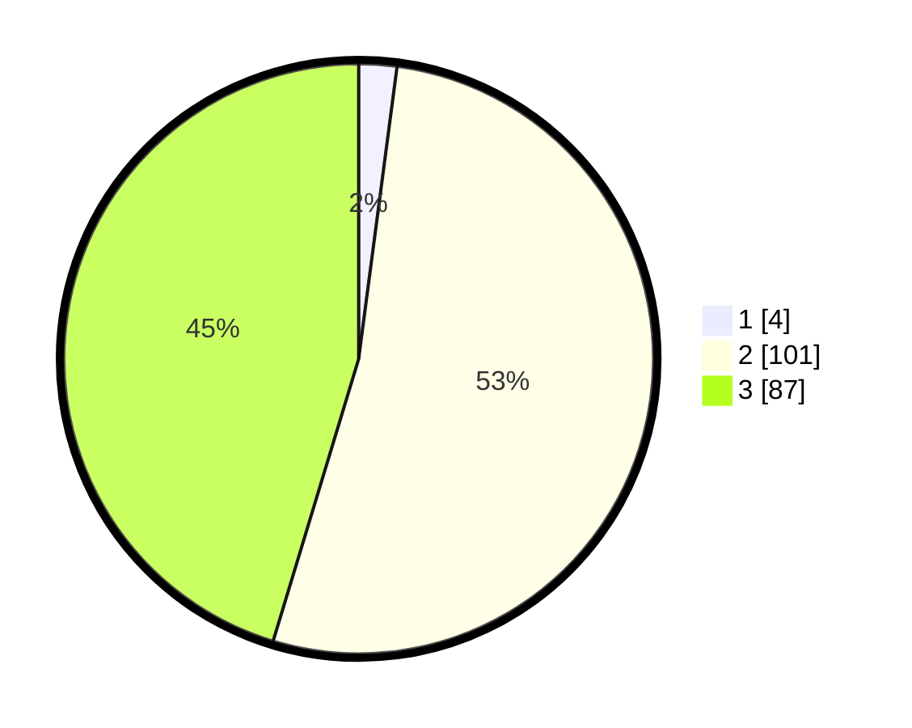

# Hasil

## Grafik

## Tabel

| No. | Nama Paslon    | Suara | Suara (raw) | Persentase |
|:--- |:-------------- | -----:| -----------:| ----------:|
| 1   | ANIES MUHAIMIN | 4     | [4][p-1]    | 2,08       |
| 2   | PRABOWO GIBRAN | 101   | [101][p-2]  | 52,60      |
| 3   | GANJAR MAHFUD  | 87    | [87][p-3]   | 45,31      |

[p-1]: https://github.com/gigit-pemilu/pemilu-2024/blob/main/pilpres/hitung-suara/sub/51-bali/sub/06-bangli/sub/03-tembuku/sub/2006-peninjoan/sub/016-tps/sub/paslon-1.txt
[p-2]: https://github.com/gigit-pemilu/pemilu-2024/blob/main/pilpres/hitung-suara/sub/51-bali/sub/06-bangli/sub/03-tembuku/sub/2006-peninjoan/sub/016-tps/sub/paslon-2.txt
[p-3]: https://github.com/gigit-pemilu/pemilu-2024/blob/main/pilpres/hitung-suara/sub/51-bali/sub/06-bangli/sub/03-tembuku/sub/2006-peninjoan/sub/016-tps/sub/paslon-3.txt

## Foto C Plano

https://sirekap-obj-formc.kpu.go.id/5ff8/pemilu/ppwp/51/06/03/20/06/5106032006016-20240227-131434--b86db71a-db81-4bce-b2ea-c5cb45507cfd.jpg

https://sirekap-obj-formc.kpu.go.id/5ff8/pemilu/ppwp/51/06/03/20/06/5106032006016-20240214-224956--947c2666-ab7c-40fc-8d66-cc0cfb213cdb.jpg

https://sirekap-obj-formc.kpu.go.id/5ff8/pemilu/ppwp/51/06/03/20/06/5106032006016-20240214-225109--1554f37e-1a44-4551-b37c-34533f862c4d.jpg

## Metadata

| Key        | Value               |
| ---------- | ------------------- |
| Time Stamp | 2024-02-27 14:00:00 |

