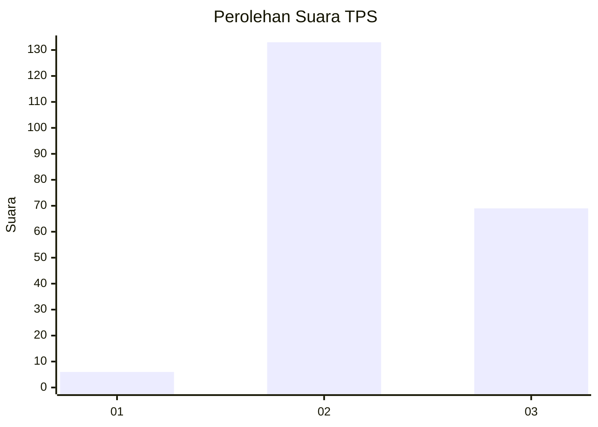
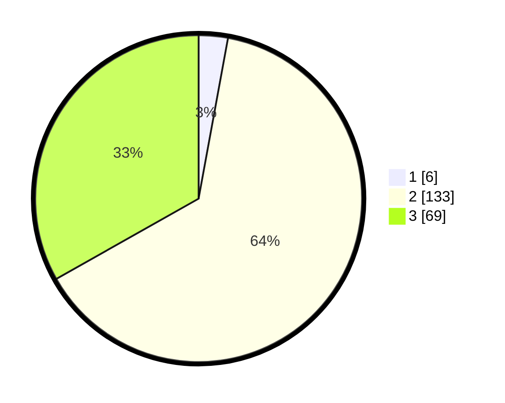

# Hasil

## Grafik

## Tabel

| No. | Nama Paslon    | Suara | Suara (raw) | Persentase |
|:--- |:-------------- | -----:| -----------:| ----------:|
| 1   | ANIES MUHAIMIN | 6     | [6][p-1]    | 2,88       |
| 2   | PRABOWO GIBRAN | 133   | [133][p-2]  | 63,94      |
| 3   | GANJAR MAHFUD  | 69    | [69][p-3]   | 33,17      |

[p-1]: https://github.com/gigit-pemilu/pemilu-2024-51-bali/blob/main/pilpres/hitung-suara/sub/51-bali/sub/06-bangli/sub/03-tembuku/sub/2006-peninjoan/sub/018-tps/sub/paslon-1.txt
[p-2]: https://github.com/gigit-pemilu/pemilu-2024-51-bali/blob/main/pilpres/hitung-suara/sub/51-bali/sub/06-bangli/sub/03-tembuku/sub/2006-peninjoan/sub/018-tps/sub/paslon-2.txt
[p-3]: https://github.com/gigit-pemilu/pemilu-2024-51-bali/blob/main/pilpres/hitung-suara/sub/51-bali/sub/06-bangli/sub/03-tembuku/sub/2006-peninjoan/sub/018-tps/sub/paslon-3.txt

## Foto C Plano

https://sirekap-obj-formc.kpu.go.id/af10/pemilu/ppwp/51/06/03/20/06/5106032006018-20240214-202324--869bad24-a451-4eae-b0c9-626350aa36e9.jpg

https://sirekap-obj-formc.kpu.go.id/af10/pemilu/ppwp/51/06/03/20/06/5106032006018-20240214-202328--2a8df5bf-5566-45d3-87a4-bd1018611c58.jpg

https://sirekap-obj-formc.kpu.go.id/af10/pemilu/ppwp/51/06/03/20/06/5106032006018-20240214-202333--d60d9dd7-2021-401b-b0d9-36eb5abe6217.jpg

## Metadata

| Key        | Value               |
| ---------- | ------------------- |
| Time Stamp | 2024-02-15 00:41:44 |

## DATA PEMILIH TETAP

Jumlah pemilih dalam DPT: **267**.
 * L: **129**.
 * P: **138**.

## DATA PENGGUNA HAK PILIH

Jumlah pengguna hak pilih dalam DPT: **230**.
 * L: **118**.
 * P: **112**.

Jumlah pengguna hak pilih dalam DPTb: **0**.
 * L: **0**.
 * P: **0**.

Jumlah pengguna hak pilih dalam DPK: **0**.
 * L: **0**.
 * P: **0**.

Jumlah pengguna hak pilih: **230**.
 * L: **118**.
 * P: **112**.

## JUMLAH SUARA SAH DAN TIDAK SAH

JUMLAH SELURUH SUARA SAH: **208**.

JUMLAH SUARA TIDAK SAH: **22**.

JUMLAH SELURUH SUARA SAH DAN SUARA TIDAK SAH: **230**.

