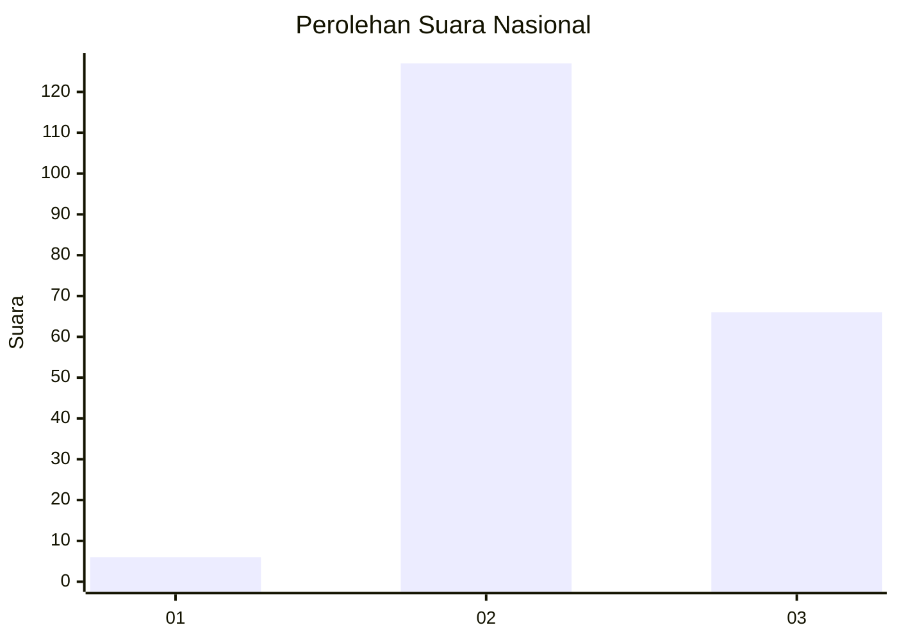
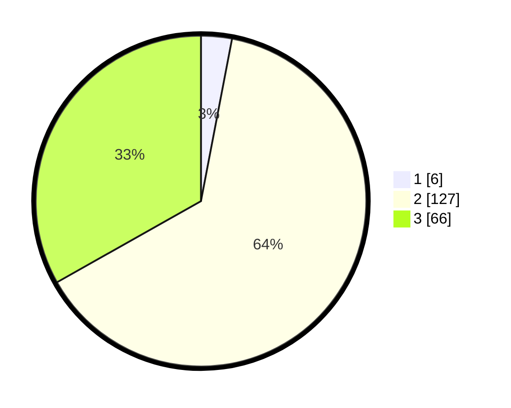

# Hasil

## Grafik

## Tabel

| No. | Nama Paslon    | Suara | Suara (raw) | Persentase |
|:--- |:-------------- | -----:| -----------:| ----------:|
| 1   | ANIES MUHAIMIN | 6     | [6][p-1]    | 3,02       |
| 2   | PRABOWO GIBRAN | 127   | [127][p-2]  | 63,82      |
| 3   | GANJAR MAHFUD  | 66    | [66][p-3]   | 33,17      |

[p-1]: https://github.com/gigit-pemilu/pemilu-2024/blob/main/pilpres/hitung-suara/sub/51-bali/sub/06-bangli/sub/03-tembuku/sub/2006-peninjoan/sub/021-tps/sub/paslon-1.txt
[p-2]: https://github.com/gigit-pemilu/pemilu-2024/blob/main/pilpres/hitung-suara/sub/51-bali/sub/06-bangli/sub/03-tembuku/sub/2006-peninjoan/sub/021-tps/sub/paslon-2.txt
[p-3]: https://github.com/gigit-pemilu/pemilu-2024/blob/main/pilpres/hitung-suara/sub/51-bali/sub/06-bangli/sub/03-tembuku/sub/2006-peninjoan/sub/021-tps/sub/paslon-3.txt

## Foto C Plano

https://sirekap-obj-formc.kpu.go.id/8842/pemilu/ppwp/51/06/03/20/06/5106032006021-20240214-191931--c3a699ff-b0a3-45e0-a018-8dd8a95fdd59.jpg

https://sirekap-obj-formc.kpu.go.id/8842/pemilu/ppwp/51/06/03/20/06/5106032006021-20240214-192011--ace31381-dae3-4979-832a-93e876deac72.jpg

https://sirekap-obj-formc.kpu.go.id/8842/pemilu/ppwp/51/06/03/20/06/5106032006021-20240214-200129--e39c5940-f36d-4713-a471-94973c936249.jpg

## Metadata

| Key        | Value               |
| ---------- | ------------------- |
| Time Stamp | 2024-02-24 22:31:28 |

