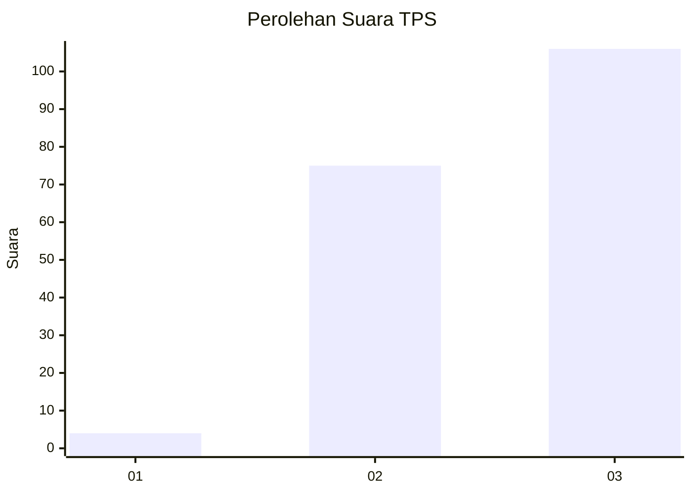
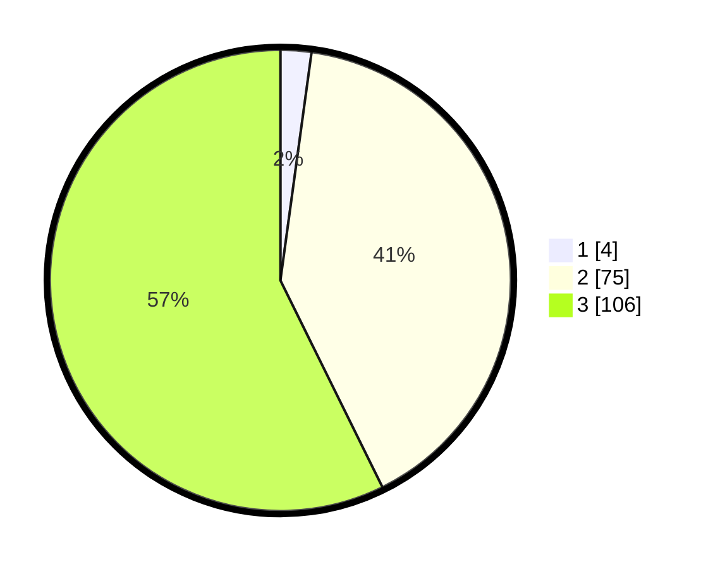

# Hasil

## Grafik

## Tabel

| No. | Nama Paslon    | Suara | Suara (raw) | Persentase |
|:--- |:-------------- | -----:| -----------:| ----------:|
| 1   | ANIES MUHAIMIN | 4     | [4][p-1]    | 2,16       |
| 2   | PRABOWO GIBRAN | 75    | [75][p-2]   | 40,54      |
| 3   | GANJAR MAHFUD  | 106   | [106][p-3]  | 57,30      |

[p-1]: https://github.com/gigit-pemilu/pemilu-2024-51-bali/blob/main/pilpres/hitung-suara/sub/51-bali/sub/06-bangli/sub/03-tembuku/sub/2006-peninjoan/sub/023-tps/sub/paslon-1.txt
[p-2]: https://github.com/gigit-pemilu/pemilu-2024-51-bali/blob/main/pilpres/hitung-suara/sub/51-bali/sub/06-bangli/sub/03-tembuku/sub/2006-peninjoan/sub/023-tps/sub/paslon-2.txt
[p-3]: https://github.com/gigit-pemilu/pemilu-2024-51-bali/blob/main/pilpres/hitung-suara/sub/51-bali/sub/06-bangli/sub/03-tembuku/sub/2006-peninjoan/sub/023-tps/sub/paslon-3.txt

## Foto C Plano

https://sirekap-obj-formc.kpu.go.id/01e5/pemilu/ppwp/51/06/03/20/06/5106032006023-20240214-185623--ccf1780d-3ff3-4cc0-9d01-12eb1d85a02f.jpg

https://sirekap-obj-formc.kpu.go.id/01e5/pemilu/ppwp/51/06/03/20/06/5106032006023-20240214-185717--808d2489-5f16-44c4-84e5-68f61a3d7016.jpg

https://sirekap-obj-formc.kpu.go.id/01e5/pemilu/ppwp/51/06/03/20/06/5106032006023-20240214-190819--8d008098-3576-450f-88f8-fcb60fb94da3.jpg

## Metadata

| Key        | Value               |
| ---------- | ------------------- |
| Time Stamp | 2024-02-14 21:46:01 |

