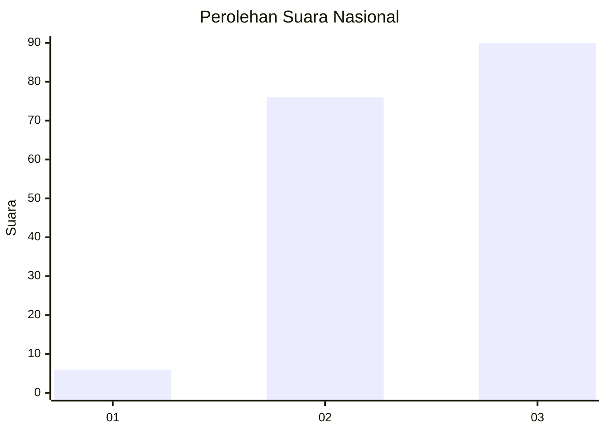
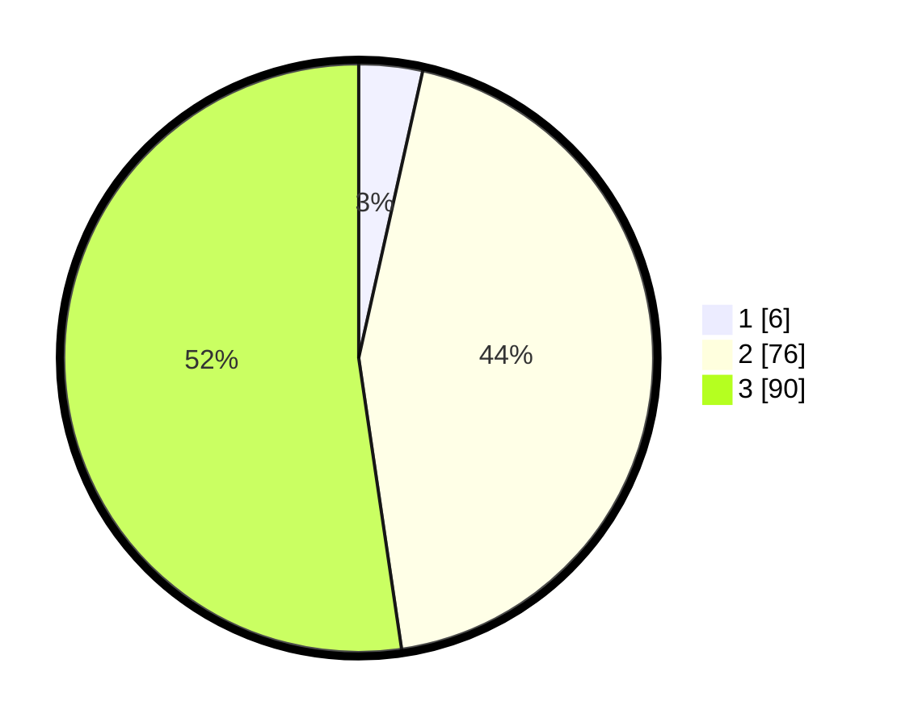

# Hasil

## Grafik

## Tabel

| No. | Nama Paslon    | Suara | Suara (raw) | Persentase |
|:--- |:-------------- | -----:| -----------:| ----------:|
| 1   | ANIES MUHAIMIN | 6     | [6][p-1]    | 3,49       |
| 2   | PRABOWO GIBRAN | 76    | [76][p-2]   | 44,19      |
| 3   | GANJAR MAHFUD  | 90    | [90][p-3]   | 52,33      |

[p-1]: https://github.com/gigit-pemilu/pemilu-2024/blob/main/pilpres/hitung-suara/sub/51-bali/sub/06-bangli/sub/03-tembuku/sub/2006-peninjoan/sub/024-tps/sub/paslon-1.txt
[p-2]: https://github.com/gigit-pemilu/pemilu-2024/blob/main/pilpres/hitung-suara/sub/51-bali/sub/06-bangli/sub/03-tembuku/sub/2006-peninjoan/sub/024-tps/sub/paslon-2.txt
[p-3]: https://github.com/gigit-pemilu/pemilu-2024/blob/main/pilpres/hitung-suara/sub/51-bali/sub/06-bangli/sub/03-tembuku/sub/2006-peninjoan/sub/024-tps/sub/paslon-3.txt

## Foto C Plano

https://sirekap-obj-formc.kpu.go.id/b407/pemilu/ppwp/51/06/03/20/06/5106032006024-20240227-132132--331e30ca-3ed9-48f5-8bc4-83159f0b86a6.jpg

https://sirekap-obj-formc.kpu.go.id/b407/pemilu/ppwp/51/06/03/20/06/5106032006024-20240216-091207--89922c29-1699-46dd-94aa-2b670cefb447.jpg

https://sirekap-obj-formc.kpu.go.id/b407/pemilu/ppwp/51/06/03/20/06/5106032006024-20240215-030506--3a7916b9-ecf2-48af-a0b1-69ddc91ab66d.jpg

## Metadata

| Key        | Value               |
| ---------- | ------------------- |
| Time Stamp | 2024-02-27 14:00:00 |

