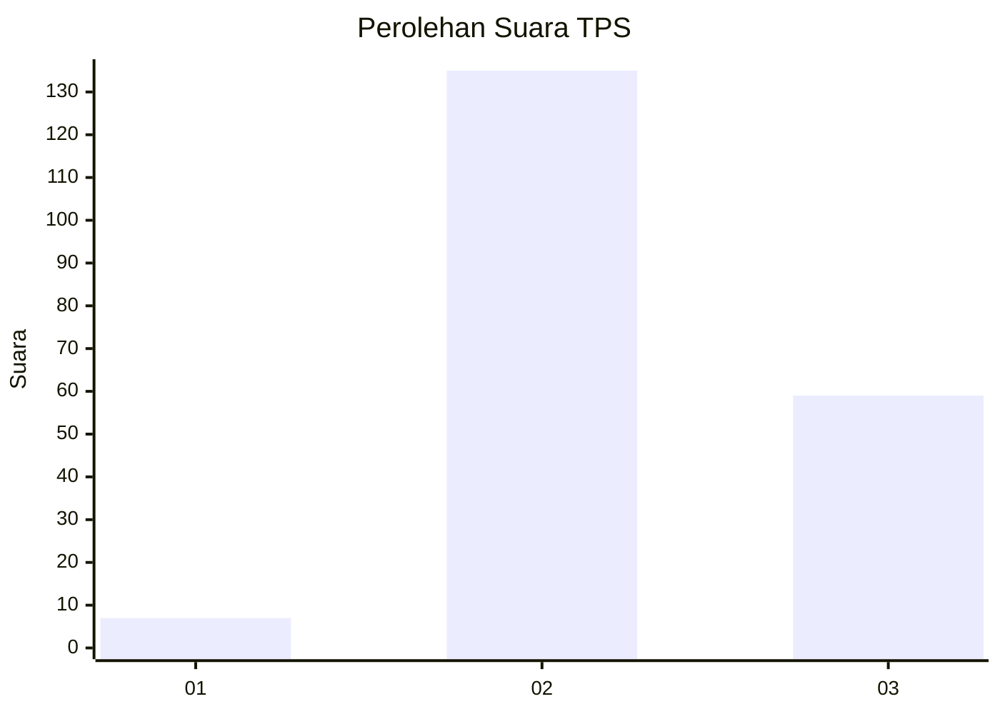

# Hasil

## Grafik

## Tabel

| No. | Nama Paslon    | Suara | Suara (raw) | Persentase |
|:--- |:-------------- | -----:| -----------:| ----------:|
| 1   | ANIES MUHAIMIN | 7     | [7][p-1]    | 3,48       |
| 2   | PRABOWO GIBRAN | 135   | [135][p-2]  | 67,16      |
| 3   | GANJAR MAHFUD  | 59    | [59][p-3]   | 29,35      |

[p-1]: https://github.com/gigit-pemilu/pemilu-2024-51-bali/blob/main/pilpres/hitung-suara/sub/51-bali/sub/06-bangli/sub/03-tembuku/sub/2006-peninjoan/sub/025-tps/sub/paslon-1.txt
[p-2]: https://github.com/gigit-pemilu/pemilu-2024-51-bali/blob/main/pilpres/hitung-suara/sub/51-bali/sub/06-bangli/sub/03-tembuku/sub/2006-peninjoan/sub/025-tps/sub/paslon-2.txt
[p-3]: https://github.com/gigit-pemilu/pemilu-2024-51-bali/blob/main/pilpres/hitung-suara/sub/51-bali/sub/06-bangli/sub/03-tembuku/sub/2006-peninjoan/sub/025-tps/sub/paslon-3.txt

## Foto C Plano

https://sirekap-obj-formc.kpu.go.id/5922/pemilu/ppwp/51/06/03/20/06/5106032006025-20240214-215759--1898b203-b60e-4d24-a9bc-9ab790f9e3cf.jpg

https://sirekap-obj-formc.kpu.go.id/5922/pemilu/ppwp/51/06/03/20/06/5106032006025-20240214-194812--2715b9b7-c516-442d-ab5b-2d17093ac8ba.jpg

https://sirekap-obj-formc.kpu.go.id/5922/pemilu/ppwp/51/06/03/20/06/5106032006025-20240214-191820--0efa712d-75f6-49d5-81c7-977c6a72658a.jpg

## Metadata

| Key        | Value               |
| ---------- | ------------------- |
| Time Stamp | 2024-02-15 03:06:03 |

