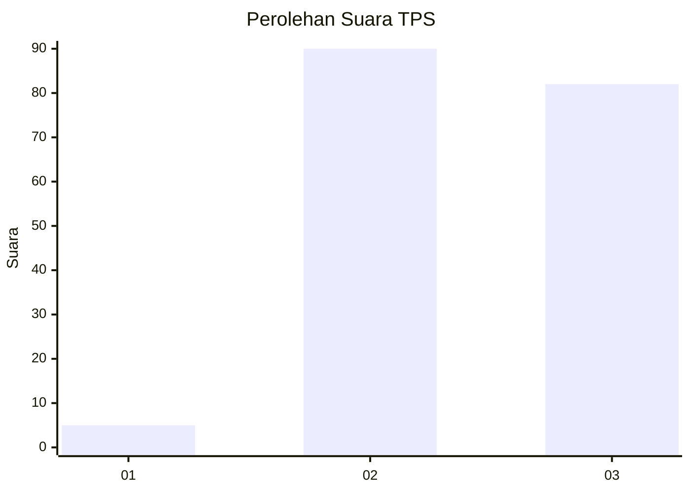
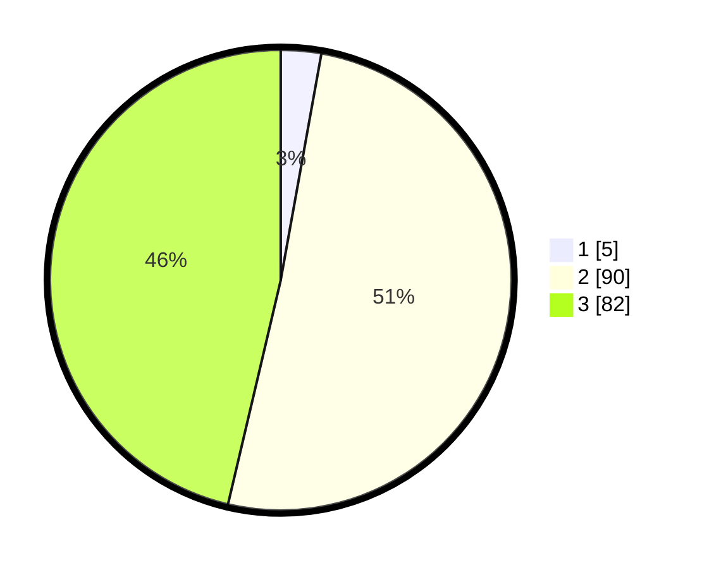

# Hasil

## Grafik

## Tabel

| No. | Nama Paslon    | Suara | Suara (raw) | Persentase |
|:--- |:-------------- | -----:| -----------:| ----------:|
| 1   | ANIES MUHAIMIN | 5     | [5][p-1]    | 2,82       |
| 2   | PRABOWO GIBRAN | 90    | [90][p-2]   | 50,85      |
| 3   | GANJAR MAHFUD  | 82    | [82][p-3]   | 46,33      |

[p-1]: https://github.com/gigit-pemilu/pemilu-2024-51-bali/blob/main/pilpres/hitung-suara/sub/51-bali/sub/06-bangli/sub/03-tembuku/sub/2006-peninjoan/sub/027-tps/sub/paslon-1.txt
[p-2]: https://github.com/gigit-pemilu/pemilu-2024-51-bali/blob/main/pilpres/hitung-suara/sub/51-bali/sub/06-bangli/sub/03-tembuku/sub/2006-peninjoan/sub/027-tps/sub/paslon-2.txt
[p-3]: https://github.com/gigit-pemilu/pemilu-2024-51-bali/blob/main/pilpres/hitung-suara/sub/51-bali/sub/06-bangli/sub/03-tembuku/sub/2006-peninjoan/sub/027-tps/sub/paslon-3.txt

## Foto C Plano

https://sirekap-obj-formc.kpu.go.id/aa2a/pemilu/ppwp/51/06/03/20/06/5106032006027-20240227-133022--cd92e76e-4b1a-4830-835e-3c2e9d03268b.jpg

https://sirekap-obj-formc.kpu.go.id/aa2a/pemilu/ppwp/51/06/03/20/06/5106032006027-20240214-155554--c61c26f2-5f3d-4f55-bd3f-bf96e007d8a5.jpg

## Metadata

| Key        | Value               |
| ---------- | ------------------- |
| Time Stamp | 2024-02-27 14:00:00 |

