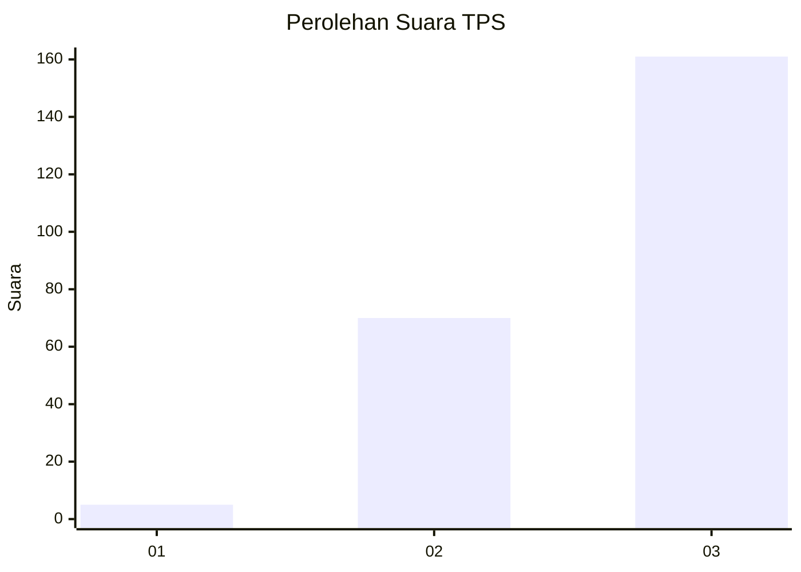
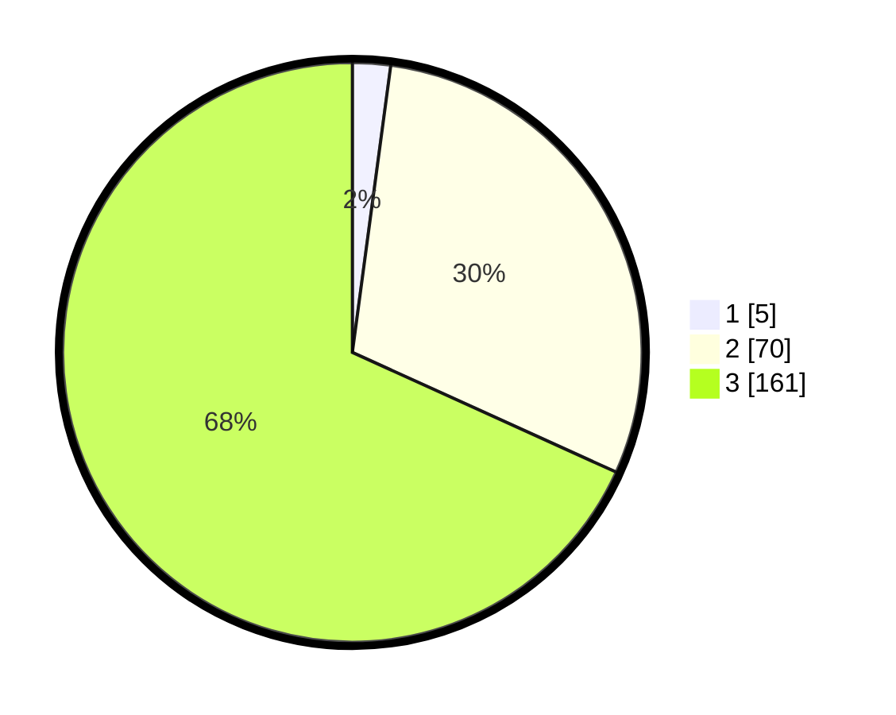

# Hasil

## Grafik

## Tabel

| No. | Nama Paslon    | Suara | Suara (raw) | Persentase |
|:--- |:-------------- | -----:| -----------:| ----------:|
| 1   | ANIES MUHAIMIN | 5     | [5][p-1]    | 2,12       |
| 2   | PRABOWO GIBRAN | 70    | [70][p-2]   | 29,66      |
| 3   | GANJAR MAHFUD  | 161   | [161][p-3]  | 68,22      |

[p-1]: https://github.com/gigit-pemilu/pemilu-2024-51-bali/blob/main/pilpres/hitung-suara/sub/51-bali/sub/06-bangli/sub/03-tembuku/sub/2006-peninjoan/sub/032-tps/sub/paslon-1.txt
[p-2]: https://github.com/gigit-pemilu/pemilu-2024-51-bali/blob/main/pilpres/hitung-suara/sub/51-bali/sub/06-bangli/sub/03-tembuku/sub/2006-peninjoan/sub/032-tps/sub/paslon-2.txt
[p-3]: https://github.com/gigit-pemilu/pemilu-2024-51-bali/blob/main/pilpres/hitung-suara/sub/51-bali/sub/06-bangli/sub/03-tembuku/sub/2006-peninjoan/sub/032-tps/sub/paslon-3.txt

## Foto C Plano

https://sirekap-obj-formc.kpu.go.id/3ffb/pemilu/ppwp/51/06/03/20/06/5106032006032-20240227-141410--04e81e80-752d-4979-8812-6498d19fe758.jpg

https://sirekap-obj-formc.kpu.go.id/3ffb/pemilu/ppwp/51/06/03/20/06/5106032006032-20240214-230901--e5de756f-f7a7-454b-8d16-b845e10aa1bc.jpg

https://sirekap-obj-formc.kpu.go.id/3ffb/pemilu/ppwp/51/06/03/20/06/5106032006032-20240214-231006--0e7ed05f-6620-41c6-a585-b6bb7b3a3550.jpg

## Metadata

| Key        | Value               |
| ---------- | ------------------- |
| Time Stamp | 2024-02-27 15:00:00 |

