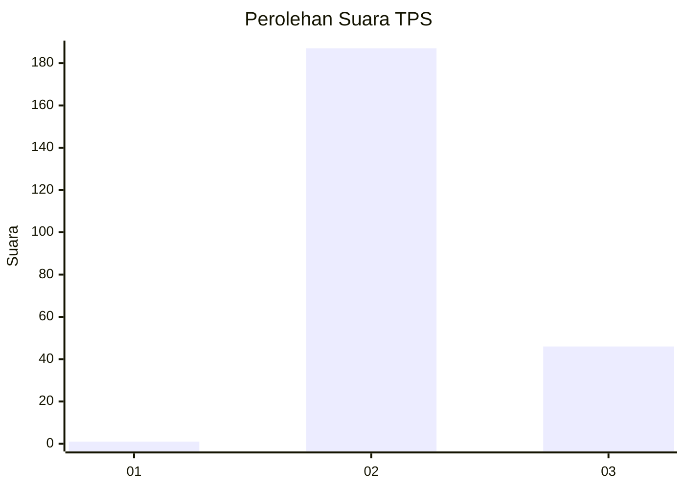
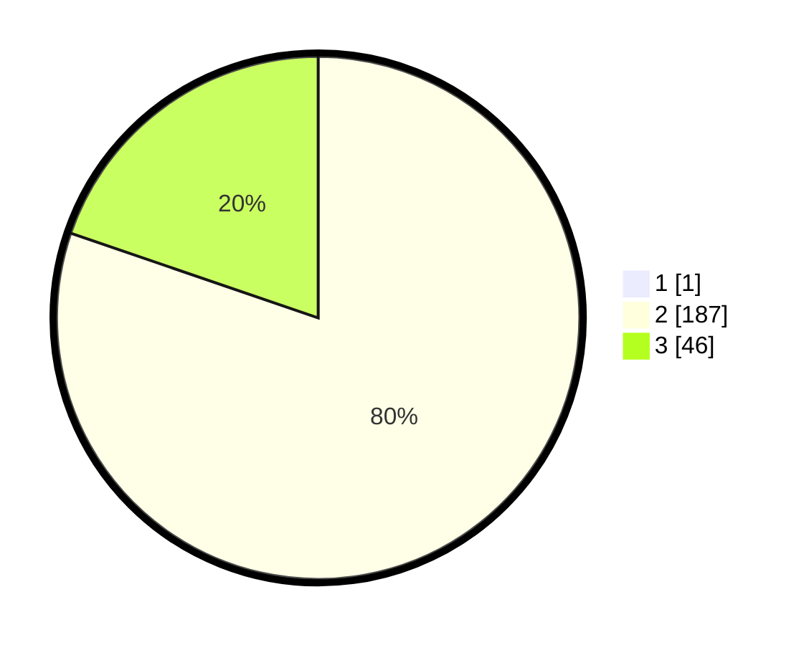

# Hasil

## Grafik

## Tabel

| No. | Nama Paslon    | Suara | Suara (raw) | Persentase |
|:--- |:-------------- | -----:| -----------:| ----------:|
| 1   | ANIES MUHAIMIN | 1     | [1][p-1]    | 0,43       |
| 2   | PRABOWO GIBRAN | 187   | [187][p-2]  | 79,91      |
| 3   | GANJAR MAHFUD  | 46    | [46][p-3]   | 19,66      |

[p-1]: https://github.com/gigit-pemilu/pemilu-2024-51-bali/blob/main/pilpres/hitung-suara/sub/51-bali/sub/06-bangli/sub/04-kintamani/sub/2003-ulian/sub/002-tps/sub/paslon-1.txt
[p-2]: https://github.com/gigit-pemilu/pemilu-2024-51-bali/blob/main/pilpres/hitung-suara/sub/51-bali/sub/06-bangli/sub/04-kintamani/sub/2003-ulian/sub/002-tps/sub/paslon-2.txt
[p-3]: https://github.com/gigit-pemilu/pemilu-2024-51-bali/blob/main/pilpres/hitung-suara/sub/51-bali/sub/06-bangli/sub/04-kintamani/sub/2003-ulian/sub/002-tps/sub/paslon-3.txt

## Foto C Plano

https://sirekap-obj-formc.kpu.go.id/e7a6/pemilu/ppwp/51/06/04/20/03/5106042003002-20240214-223226--40c4a7ab-6188-46c5-aee3-ea0fdd03bfb9.jpg

https://sirekap-obj-formc.kpu.go.id/e7a6/pemilu/ppwp/51/06/04/20/03/5106042003002-20240214-223352--4a057172-a49d-416e-a09f-9bd6ab6226aa.jpg

https://sirekap-obj-formc.kpu.go.id/e7a6/pemilu/ppwp/51/06/04/20/03/5106042003002-20240214-223448--82c6a7f6-5a1e-4e18-be78-65a141537ba9.jpg

## Metadata

| Key        | Value               |
| ---------- | ------------------- |
| Time Stamp | 2024-02-24 22:31:28 |

