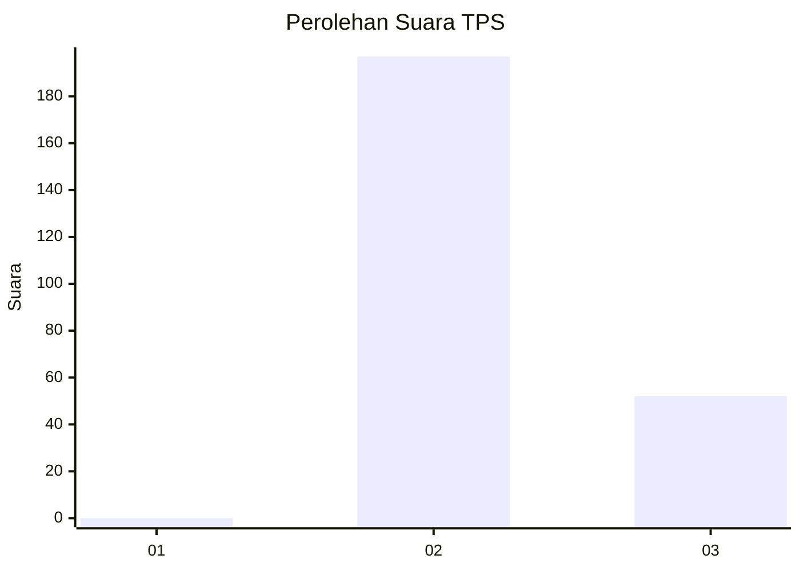
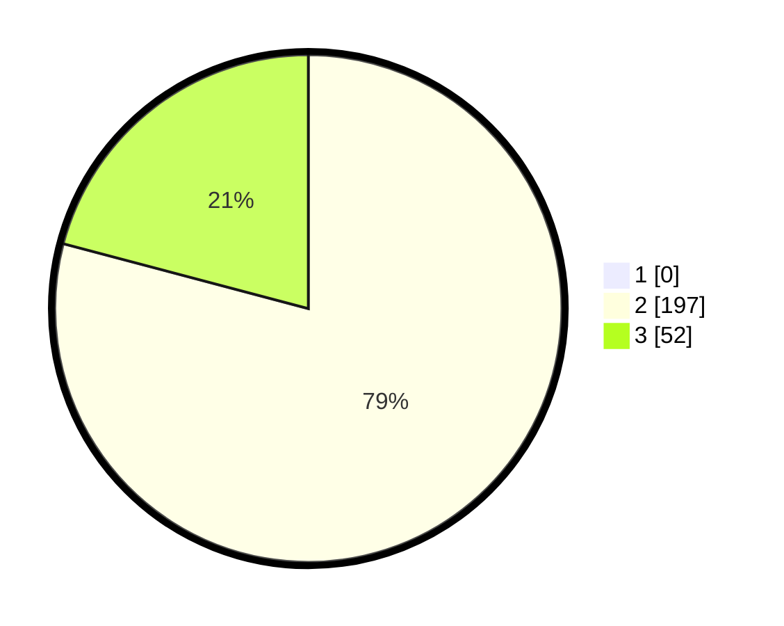

# Hasil

## Grafik

## Tabel

| No. | Nama Paslon    | Suara | Suara (raw) | Persentase |
|:--- |:-------------- | -----:| -----------:| ----------:|
| 1   | ANIES MUHAIMIN | 0     | [0][p-1]    | 0,00       |
| 2   | PRABOWO GIBRAN | 197   | [197][p-2]  | 79,12      |
| 3   | GANJAR MAHFUD  | 52    | [52][p-3]   | 20,88      |

[p-1]: https://github.com/gigit-pemilu/pemilu-2024-51-bali/blob/main/pilpres/hitung-suara/sub/51-bali/sub/06-bangli/sub/04-kintamani/sub/2003-ulian/sub/003-tps/sub/paslon-1.txt
[p-2]: https://github.com/gigit-pemilu/pemilu-2024-51-bali/blob/main/pilpres/hitung-suara/sub/51-bali/sub/06-bangli/sub/04-kintamani/sub/2003-ulian/sub/003-tps/sub/paslon-2.txt
[p-3]: https://github.com/gigit-pemilu/pemilu-2024-51-bali/blob/main/pilpres/hitung-suara/sub/51-bali/sub/06-bangli/sub/04-kintamani/sub/2003-ulian/sub/003-tps/sub/paslon-3.txt

## Foto C Plano

https://sirekap-obj-formc.kpu.go.id/9e57/pemilu/ppwp/51/06/04/20/03/5106042003003-20240214-214838--9fdbd901-7c2a-439d-836e-365a75b11d8d.jpg

https://sirekap-obj-formc.kpu.go.id/9e57/pemilu/ppwp/51/06/04/20/03/5106042003003-20240214-214945--bf38f21f-a71d-412b-ae46-151bfc7b5e56.jpg

## Metadata

| Key        | Value               |
| ---------- | ------------------- |
| Time Stamp | 2024-02-24 22:31:28 |

