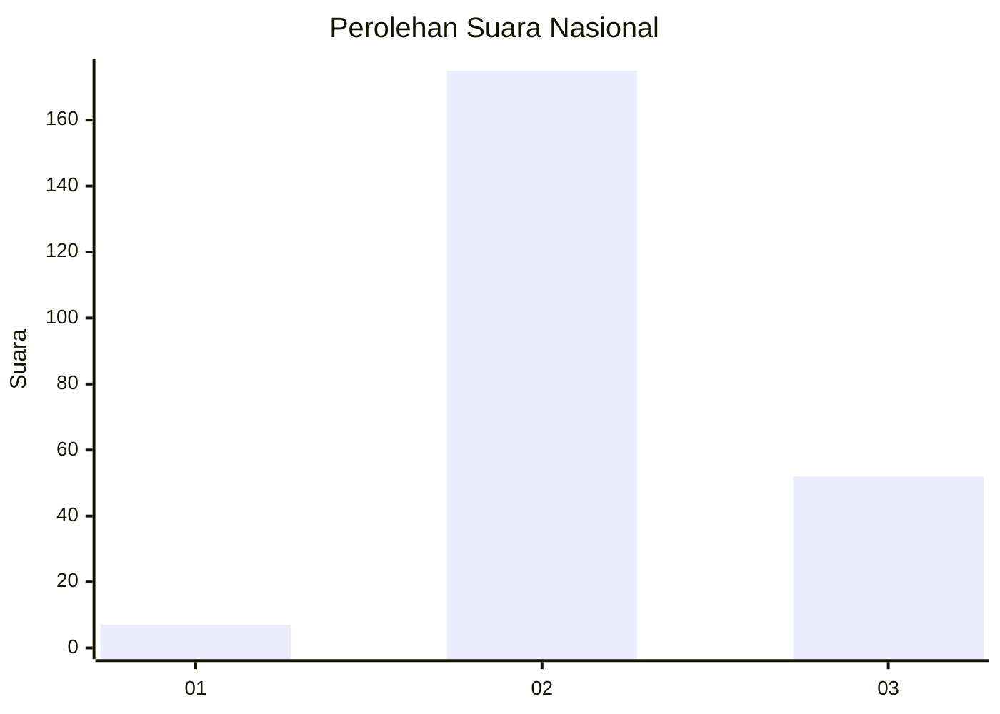
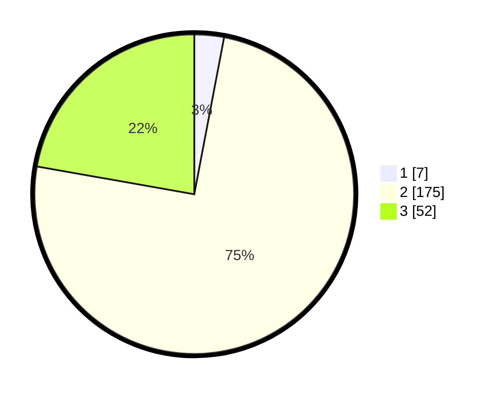

# Hasil

## Grafik

## Tabel

| No. | Nama Paslon    | Suara | Suara (raw) | Persentase |
|:--- |:-------------- | -----:| -----------:| ----------:|
| 1   | ANIES MUHAIMIN | 7     | [7][p-1]    | 2,99       |
| 2   | PRABOWO GIBRAN | 175   | [175][p-2]  | 74,79      |
| 3   | GANJAR MAHFUD  | 52    | [52][p-3]   | 22,22      |

[p-1]: https://github.com/gigit-pemilu/pemilu-2024/blob/main/pilpres/hitung-suara/sub/51-bali/sub/06-bangli/sub/04-kintamani/sub/2004-bunutin/sub/001-tps/sub/paslon-1.txt
[p-2]: https://github.com/gigit-pemilu/pemilu-2024/blob/main/pilpres/hitung-suara/sub/51-bali/sub/06-bangli/sub/04-kintamani/sub/2004-bunutin/sub/001-tps/sub/paslon-2.txt
[p-3]: https://github.com/gigit-pemilu/pemilu-2024/blob/main/pilpres/hitung-suara/sub/51-bali/sub/06-bangli/sub/04-kintamani/sub/2004-bunutin/sub/001-tps/sub/paslon-3.txt

## Foto C Plano

https://sirekap-obj-formc.kpu.go.id/dd90/pemilu/ppwp/51/06/04/20/04/5106042004001-20240215-001617--5580206f-b177-46cd-9c97-54e1433e9a6c.jpg

https://sirekap-obj-formc.kpu.go.id/dd90/pemilu/ppwp/51/06/04/20/04/5106042004001-20240215-001708--fcb85935-0ac5-40e7-9846-72b47ea692c0.jpg

https://sirekap-obj-formc.kpu.go.id/dd90/pemilu/ppwp/51/06/04/20/04/5106042004001-20240215-001753--642b2189-76d2-4e72-bc50-457b23605d8e.jpg

## Metadata

| Key        | Value               |
| ---------- | ------------------- |
| Time Stamp | 2024-02-24 22:31:28 |

