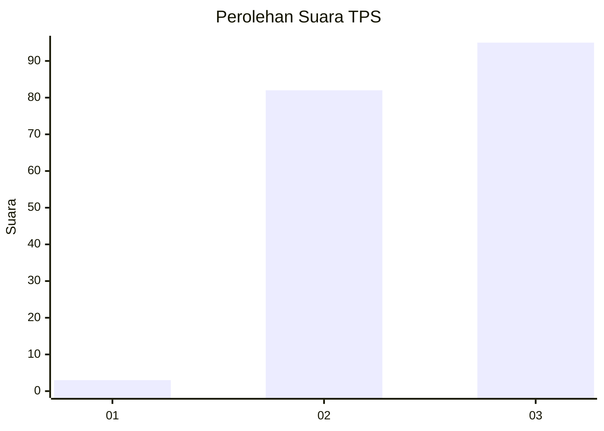
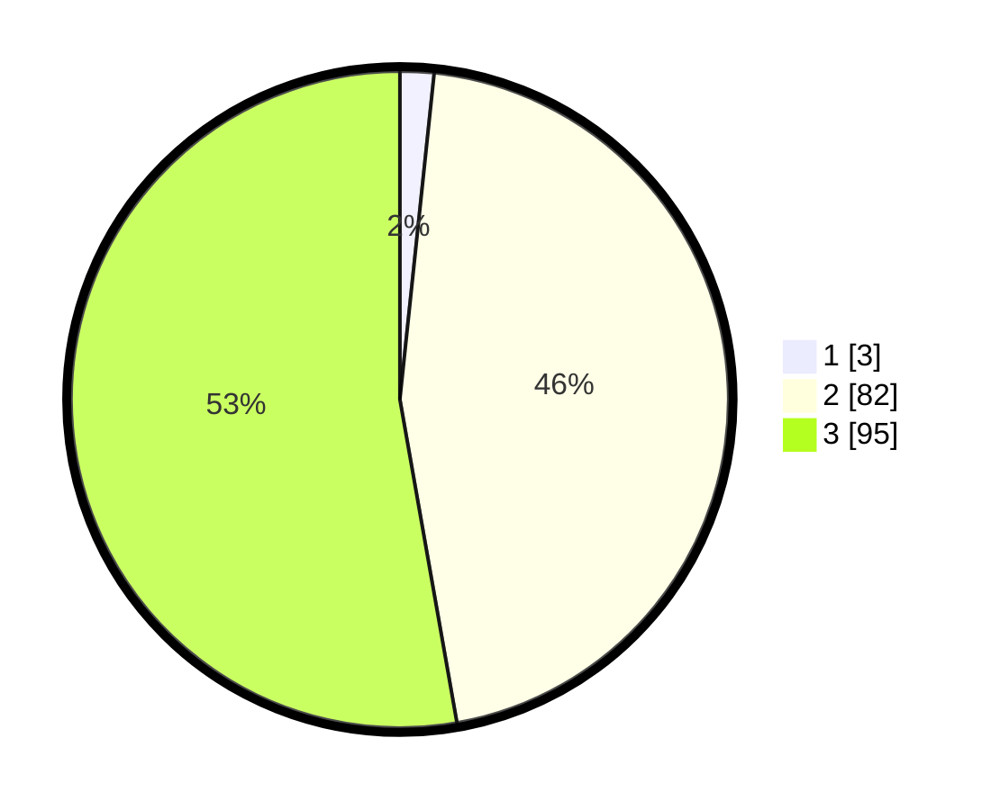

# Hasil

## Grafik

## Tabel

| No. | Nama Paslon    | Suara | Suara (raw) | Persentase |
|:--- |:-------------- | -----:| -----------:| ----------:|
| 1   | ANIES MUHAIMIN | 3     | [3][p-1]    | 1,67       |
| 2   | PRABOWO GIBRAN | 82    | [82][p-2]   | 45,56      |
| 3   | GANJAR MAHFUD  | 95    | [95][p-3]   | 52,78      |

[p-1]: https://github.com/gigit-pemilu/pemilu-2024-51-bali/blob/main/pilpres/hitung-suara/sub/51-bali/sub/06-bangli/sub/04-kintamani/sub/2006-lembean/sub/002-tps/sub/paslon-1.txt
[p-2]: https://github.com/gigit-pemilu/pemilu-2024-51-bali/blob/main/pilpres/hitung-suara/sub/51-bali/sub/06-bangli/sub/04-kintamani/sub/2006-lembean/sub/002-tps/sub/paslon-2.txt
[p-3]: https://github.com/gigit-pemilu/pemilu-2024-51-bali/blob/main/pilpres/hitung-suara/sub/51-bali/sub/06-bangli/sub/04-kintamani/sub/2006-lembean/sub/002-tps/sub/paslon-3.txt

## Foto C Plano

https://sirekap-obj-formc.kpu.go.id/a568/pemilu/ppwp/51/06/04/20/06/5106042006002-20240318-130230--8c37e9b5-325d-4655-add3-5e1c1e4e3320.jpg

https://sirekap-obj-formc.kpu.go.id/a568/pemilu/ppwp/51/06/04/20/06/5106042006002-20240214-131629--888efe00-1c8f-4237-8359-773653d3327e.jpg

https://sirekap-obj-formc.kpu.go.id/a568/pemilu/ppwp/51/06/04/20/06/5106042006002-20240214-131700--db5a70d9-1e72-408f-bc6b-420b6b082920.jpg

## Metadata

| Key        | Value               |
| ---------- | ------------------- |
| Time Stamp | 2024-03-18 13:30:00 |

