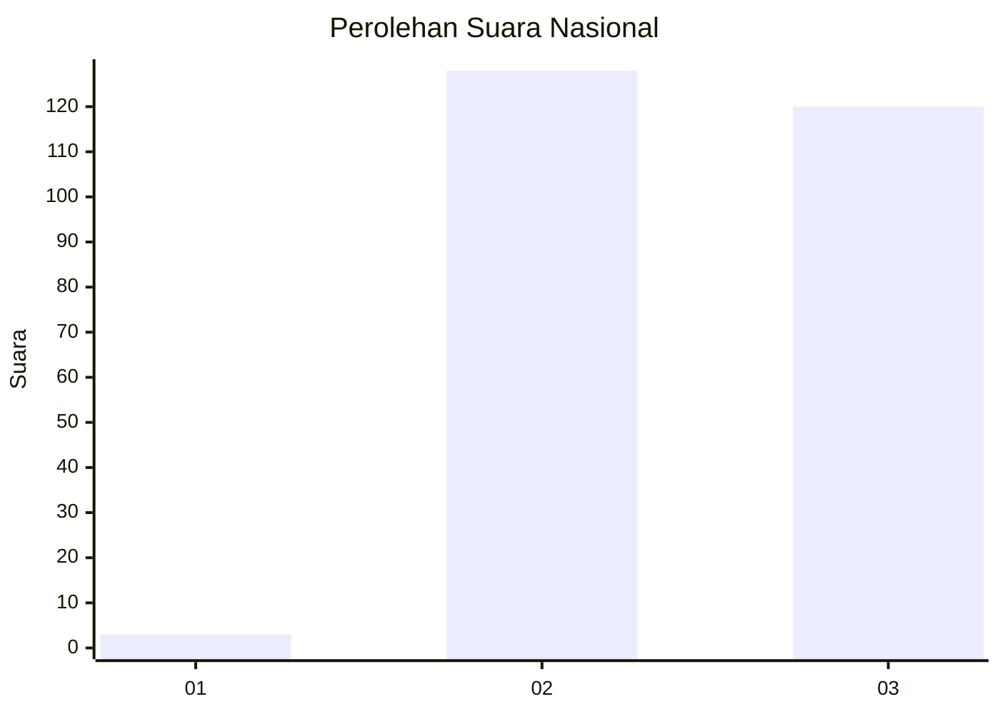
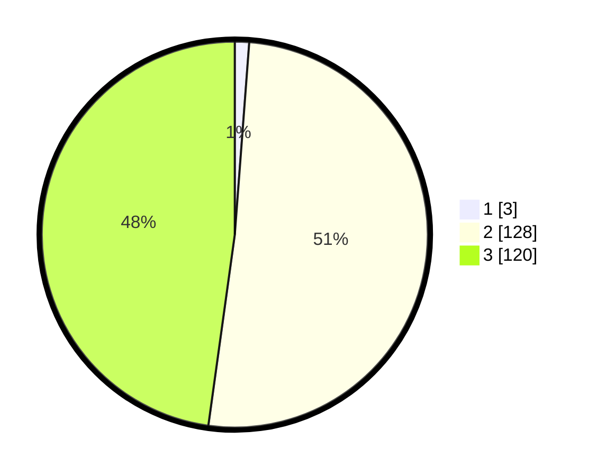

# Hasil

## Grafik

## Tabel

| No. | Nama Paslon    | Suara | Suara (raw) | Persentase |
|:--- |:-------------- | -----:| -----------:| ----------:|
| 1   | ANIES MUHAIMIN | 3     | [3][p-1]    | 1,20       |
| 2   | PRABOWO GIBRAN | 128   | [128][p-2]  | 51,00      |
| 3   | GANJAR MAHFUD  | 120   | [120][p-3]  | 47,81      |

[p-1]: https://github.com/gigit-pemilu/pemilu-2024/blob/main/pilpres/hitung-suara/sub/51-bali/sub/06-bangli/sub/04-kintamani/sub/2007-manikliyu/sub/005-tps/sub/paslon-1.txt
[p-2]: https://github.com/gigit-pemilu/pemilu-2024/blob/main/pilpres/hitung-suara/sub/51-bali/sub/06-bangli/sub/04-kintamani/sub/2007-manikliyu/sub/005-tps/sub/paslon-2.txt
[p-3]: https://github.com/gigit-pemilu/pemilu-2024/blob/main/pilpres/hitung-suara/sub/51-bali/sub/06-bangli/sub/04-kintamani/sub/2007-manikliyu/sub/005-tps/sub/paslon-3.txt

## Foto C Plano

https://sirekap-obj-formc.kpu.go.id/ce3d/pemilu/ppwp/51/06/04/20/07/5106042007005-20240214-220300--ee99d587-47f9-4510-9747-393e9fcef5d4.jpg

https://sirekap-obj-formc.kpu.go.id/ce3d/pemilu/ppwp/51/06/04/20/07/5106042007005-20240214-220402--88a664b2-0540-48e9-8f2c-3562307e1bb3.jpg

https://sirekap-obj-formc.kpu.go.id/ce3d/pemilu/ppwp/51/06/04/20/07/5106042007005-20240214-220438--88f27505-6df2-4ed4-bacb-2f88efac7a22.jpg

## Metadata

| Key        | Value               |
| ---------- | ------------------- |
| Time Stamp | 2024-02-25 12:00:00 |

