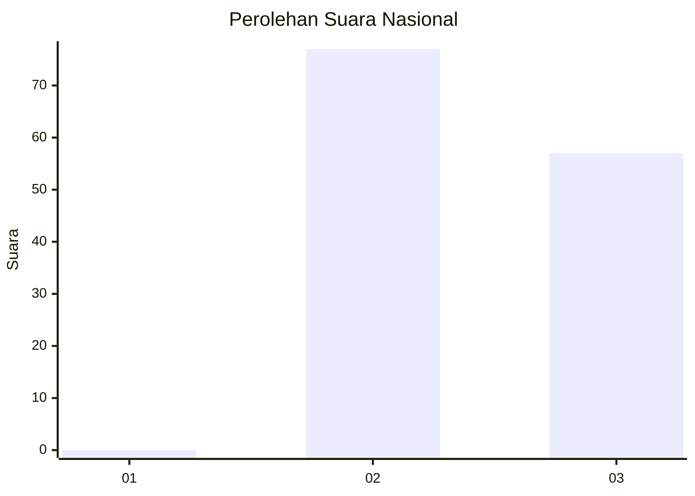
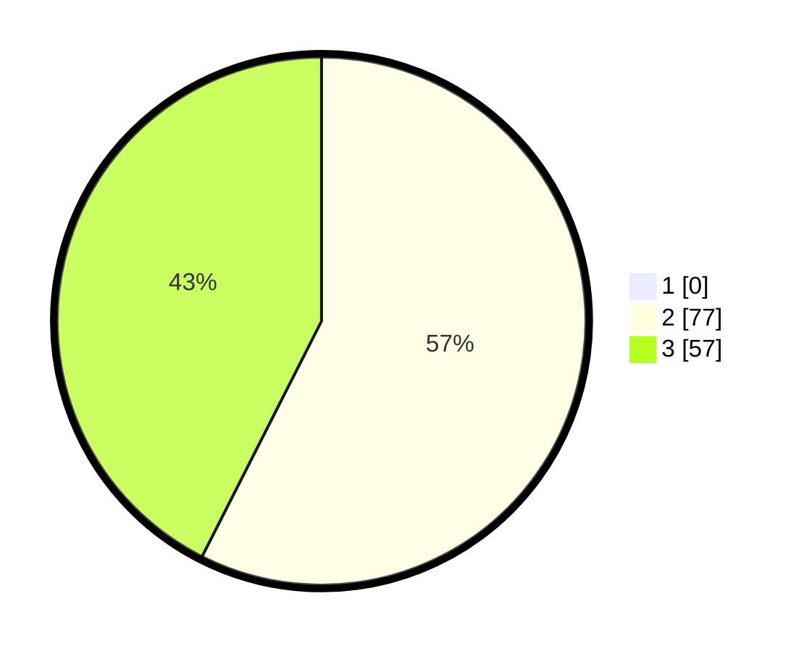

# Hasil

## Grafik

## Tabel

| No. | Nama Paslon    | Suara | Suara (raw) | Persentase |
|:--- |:-------------- | -----:| -----------:| ----------:|
| 1   | ANIES MUHAIMIN | 0     | [0][p-1]    | 0,00       |
| 2   | PRABOWO GIBRAN | 77    | [77][p-2]   | 57,46      |
| 3   | GANJAR MAHFUD  | 57    | [57][p-3]   | 42,54      |

[p-1]: https://github.com/gigit-pemilu/pemilu-2024/blob/main/pilpres/hitung-suara/sub/51-bali/sub/06-bangli/sub/04-kintamani/sub/2010-belancan/sub/001-tps/sub/paslon-1.txt
[p-2]: https://github.com/gigit-pemilu/pemilu-2024/blob/main/pilpres/hitung-suara/sub/51-bali/sub/06-bangli/sub/04-kintamani/sub/2010-belancan/sub/001-tps/sub/paslon-2.txt
[p-3]: https://github.com/gigit-pemilu/pemilu-2024/blob/main/pilpres/hitung-suara/sub/51-bali/sub/06-bangli/sub/04-kintamani/sub/2010-belancan/sub/001-tps/sub/paslon-3.txt

## Foto C Plano

https://sirekap-obj-formc.kpu.go.id/04ea/pemilu/ppwp/51/06/04/20/10/5106042010001-20240220-075049--ca50aa8a-fc57-422a-9056-f181f45dbc13.jpg

https://sirekap-obj-formc.kpu.go.id/04ea/pemilu/ppwp/51/06/04/20/10/5106042010001-20240214-141303--93b77ae2-3d0a-416d-a81d-95b22121ab15.jpg

https://sirekap-obj-formc.kpu.go.id/04ea/pemilu/ppwp/51/06/04/20/10/5106042010001-20240220-075050--7275ee51-6321-4ac3-a586-7bbbc188d6b4.jpg

## Metadata

| Key        | Value               |
| ---------- | ------------------- |
| Time Stamp | 2024-02-20 08:00:00 |

## DATA PEMILIH TETAP

Jumlah pemilih dalam DPT: **151**.
 * L: **81**.
 * P: **70**.

## DATA PENGGUNA HAK PILIH

Jumlah pengguna hak pilih dalam DPT: **136**.
 * L: **69**.
 * P: **67**.

Jumlah pengguna hak pilih dalam DPTb: **0**.
 * L: **0**.
 * P: **0**.

Jumlah pengguna hak pilih dalam DPK: **1**.
 * L: **0**.
 * P: **1**.

Jumlah pengguna hak pilih: **137**.
 * L: **69**.
 * P: **68**.

## JUMLAH SUARA SAH DAN TIDAK SAH

JUMLAH SELURUH SUARA SAH: **134**.

JUMLAH SUARA TIDAK SAH: **3**.

JUMLAH SELURUH SUARA SAH DAN SUARA TIDAK SAH: **137**.

