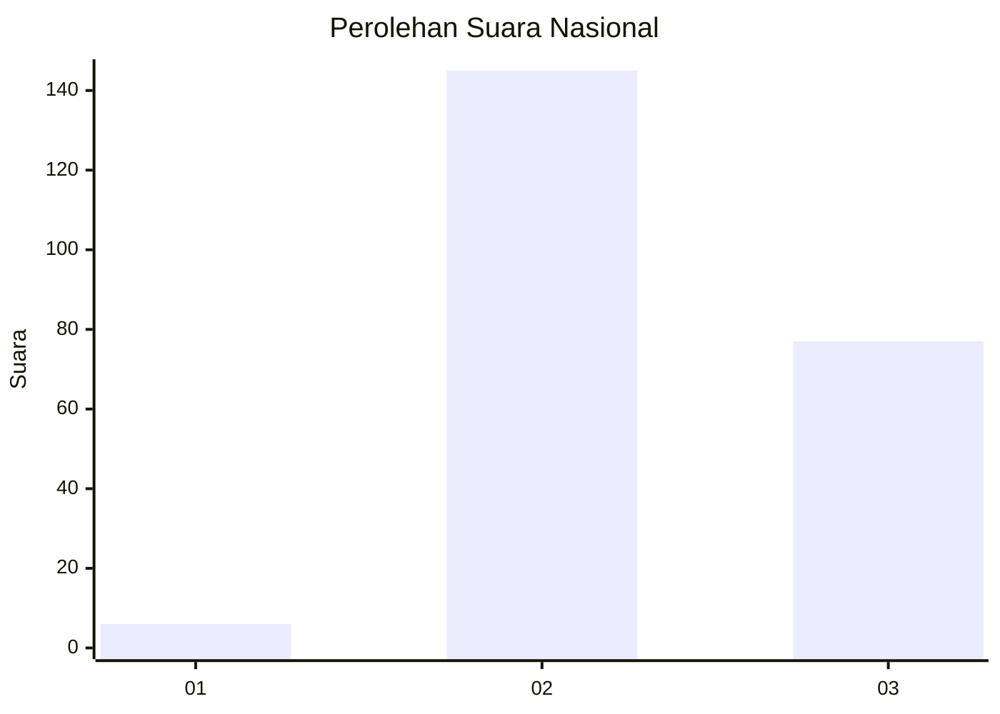
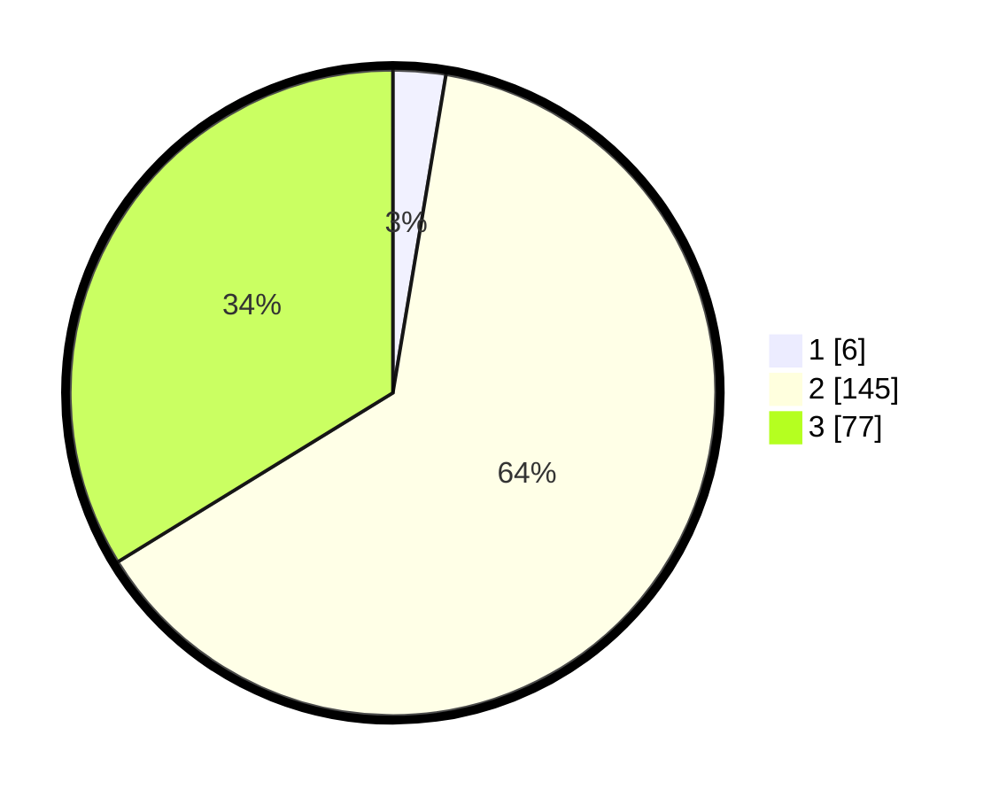

# Hasil

## Grafik

## Tabel

| No. | Nama Paslon    | Suara | Suara (raw) | Persentase |
|:--- |:-------------- | -----:| -----------:| ----------:|
| 1   | ANIES MUHAIMIN | 6     | [6][p-1]    | 2,63       |
| 2   | PRABOWO GIBRAN | 145   | [145][p-2]  | 63,60      |
| 3   | GANJAR MAHFUD  | 77    | [77][p-3]   | 33,77      |

[p-1]: https://github.com/gigit-pemilu/pemilu-2024/blob/main/pilpres/hitung-suara/sub/51-bali/sub/06-bangli/sub/04-kintamani/sub/2011-katung/sub/001-tps/sub/paslon-1.txt
[p-2]: https://github.com/gigit-pemilu/pemilu-2024/blob/main/pilpres/hitung-suara/sub/51-bali/sub/06-bangli/sub/04-kintamani/sub/2011-katung/sub/001-tps/sub/paslon-2.txt
[p-3]: https://github.com/gigit-pemilu/pemilu-2024/blob/main/pilpres/hitung-suara/sub/51-bali/sub/06-bangli/sub/04-kintamani/sub/2011-katung/sub/001-tps/sub/paslon-3.txt

## Foto C Plano

https://sirekap-obj-formc.kpu.go.id/869b/pemilu/ppwp/51/06/04/20/11/5106042011001-20240216-170539--015a827c-fa87-4296-b2d8-2eac3105b177.jpg

https://sirekap-obj-formc.kpu.go.id/869b/pemilu/ppwp/51/06/04/20/11/5106042011001-20240216-170540--30736809-a0eb-412b-957c-dace949b5266.jpg

https://sirekap-obj-formc.kpu.go.id/869b/pemilu/ppwp/51/06/04/20/11/5106042011001-20240216-170539--045dcc11-ef48-4b57-994b-7db05ea4b2a8.jpg

## Metadata

| Key        | Value               |
| ---------- | ------------------- |
| Time Stamp | 2024-02-22 12:00:00 |

## DATA PEMILIH TETAP

Jumlah pemilih dalam DPT: **258**.
 * L: **118**.
 * P: **140**.

## DATA PENGGUNA HAK PILIH

Jumlah pengguna hak pilih dalam DPT: **242**.
 * L: **111**.
 * P: **131**.

Jumlah pengguna hak pilih dalam DPTb: **0**.
 * L: **0**.
 * P: **0**.

Jumlah pengguna hak pilih dalam DPK: **0**.
 * L: **0**.
 * P: **0**.

Jumlah pengguna hak pilih: **242**.
 * L: **111**.
 * P: **131**.

## JUMLAH SUARA SAH DAN TIDAK SAH

JUMLAH SELURUH SUARA SAH: **228**.

JUMLAH SUARA TIDAK SAH: **14**.

JUMLAH SELURUH SUARA SAH DAN SUARA TIDAK SAH: **242**.

