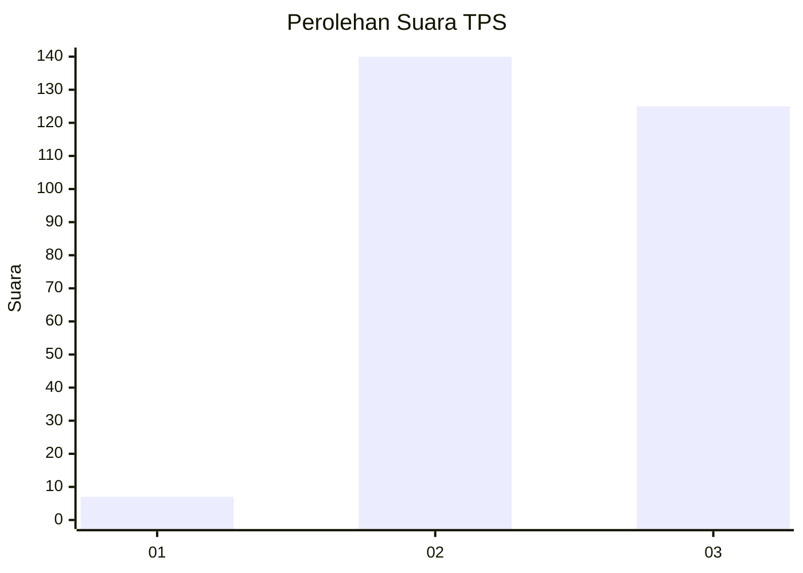
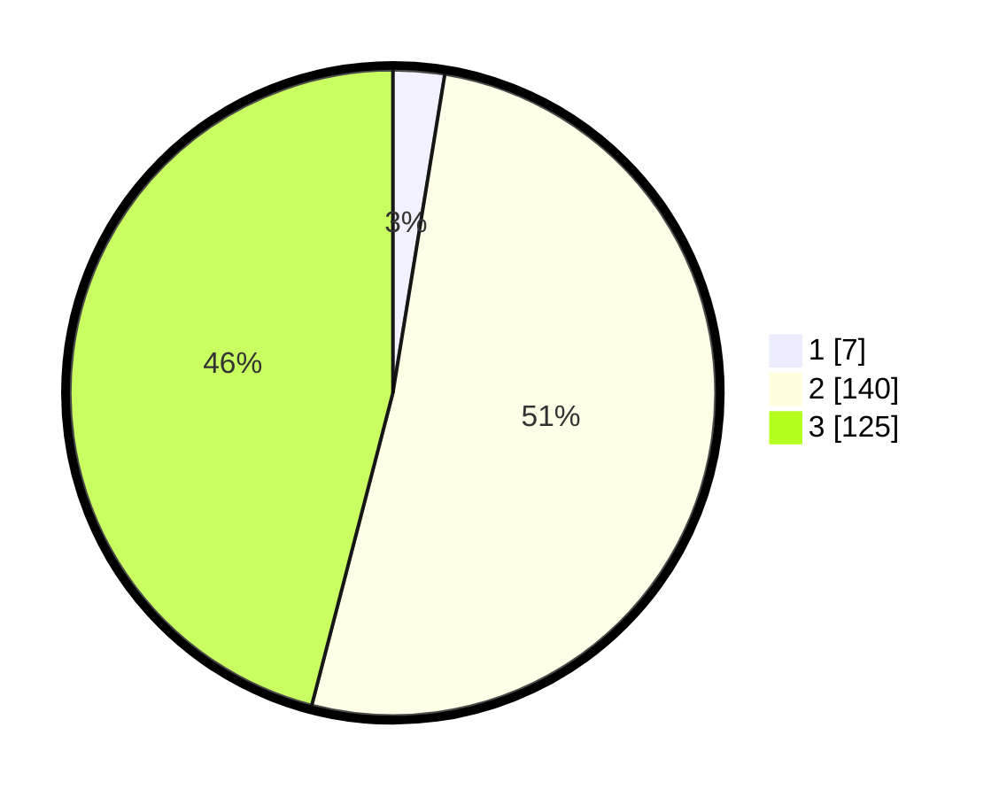

# Hasil

## Grafik

## Tabel

| No. | Nama Paslon    | Suara | Suara (raw) | Persentase |
|:--- |:-------------- | -----:| -----------:| ----------:|
| 1   | ANIES MUHAIMIN | 7     | [7][p-1]    | 2,57       |
| 2   | PRABOWO GIBRAN | 140   | [140][p-2]  | 51,47      |
| 3   | GANJAR MAHFUD  | 125   | [125][p-3]  | 45,96      |

[p-1]: https://github.com/gigit-pemilu/pemilu-2024-51-bali/blob/main/pilpres/hitung-suara/sub/51-bali/sub/06-bangli/sub/04-kintamani/sub/2012-banua/sub/001-tps/sub/paslon-1.txt
[p-2]: https://github.com/gigit-pemilu/pemilu-2024-51-bali/blob/main/pilpres/hitung-suara/sub/51-bali/sub/06-bangli/sub/04-kintamani/sub/2012-banua/sub/001-tps/sub/paslon-2.txt
[p-3]: https://github.com/gigit-pemilu/pemilu-2024-51-bali/blob/main/pilpres/hitung-suara/sub/51-bali/sub/06-bangli/sub/04-kintamani/sub/2012-banua/sub/001-tps/sub/paslon-3.txt

## Foto C Plano

https://sirekap-obj-formc.kpu.go.id/4719/pemilu/ppwp/51/06/04/20/12/5106042012001-20240214-230152--100d3407-9f39-479d-b5ff-cdb5ad225214.jpg

https://sirekap-obj-formc.kpu.go.id/4719/pemilu/ppwp/51/06/04/20/12/5106042012001-20240214-230200--6a4f0760-8076-447c-a5ab-cab0fb0974f3.jpg

https://sirekap-obj-formc.kpu.go.id/4719/pemilu/ppwp/51/06/04/20/12/5106042012001-20240214-230205--2101bcb8-7961-4dc6-b1e0-1961212f813d.jpg

## Metadata

| Key        | Value               |
| ---------- | ------------------- |
| Time Stamp | 2024-02-24 22:31:28 |

