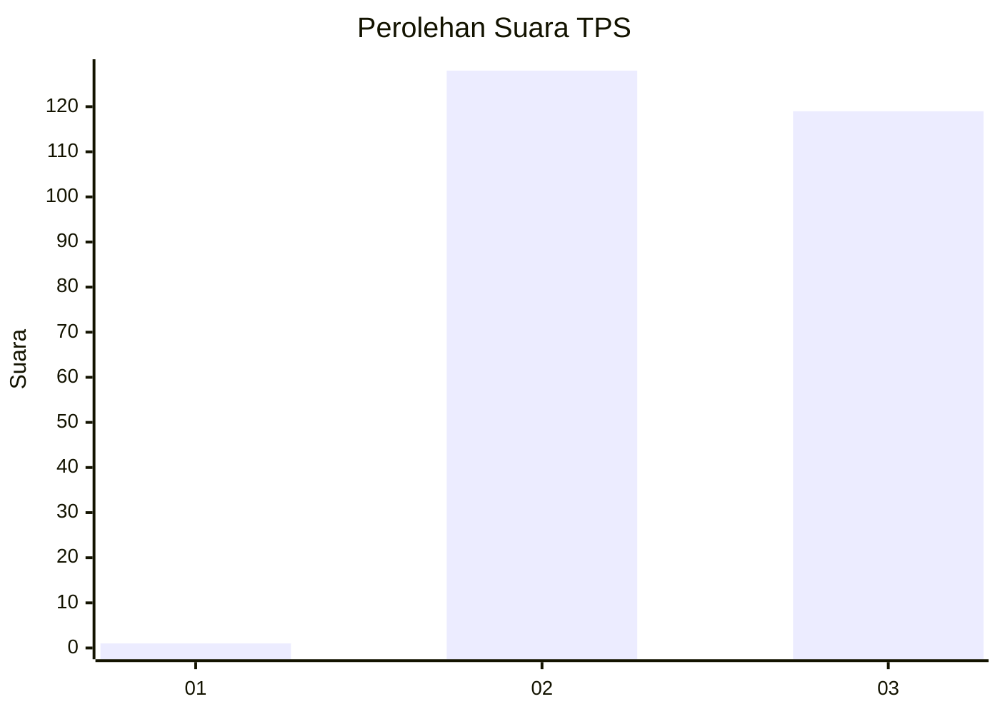
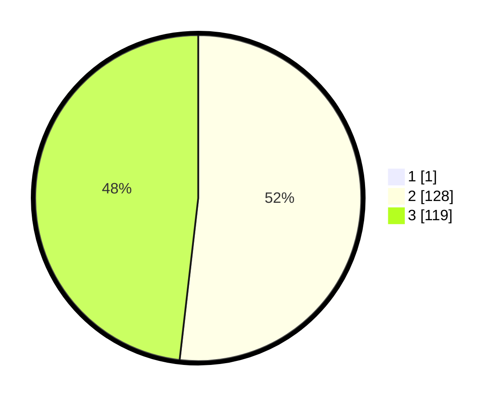

# Hasil

## Grafik

## Tabel

| No. | Nama Paslon    | Suara | Suara (raw) | Persentase |
|:--- |:-------------- | -----:| -----------:| ----------:|
| 1   | ANIES MUHAIMIN | 1     | [1][p-1]    | 0,40       |
| 2   | PRABOWO GIBRAN | 128   | [128][p-2]  | 51,61      |
| 3   | GANJAR MAHFUD  | 119   | [119][p-3]  | 47,98      |

[p-1]: https://github.com/gigit-pemilu/pemilu-2024-51-bali/blob/main/pilpres/hitung-suara/sub/51-bali/sub/06-bangli/sub/04-kintamani/sub/2015-sekaan/sub/001-tps/sub/paslon-1.txt
[p-2]: https://github.com/gigit-pemilu/pemilu-2024-51-bali/blob/main/pilpres/hitung-suara/sub/51-bali/sub/06-bangli/sub/04-kintamani/sub/2015-sekaan/sub/001-tps/sub/paslon-2.txt
[p-3]: https://github.com/gigit-pemilu/pemilu-2024-51-bali/blob/main/pilpres/hitung-suara/sub/51-bali/sub/06-bangli/sub/04-kintamani/sub/2015-sekaan/sub/001-tps/sub/paslon-3.txt

## Foto C Plano

https://sirekap-obj-formc.kpu.go.id/c73b/pemilu/ppwp/51/06/04/20/15/5106042015001-20240215-001228--e259b49b-a77f-493d-801e-2929c3d442a4.jpg

https://sirekap-obj-formc.kpu.go.id/c73b/pemilu/ppwp/51/06/04/20/15/5106042015001-20240214-233943--f5e044ae-a668-42f9-a83e-d6839774772a.jpg

https://sirekap-obj-formc.kpu.go.id/c73b/pemilu/ppwp/51/06/04/20/15/5106042015001-20240215-000745--b4205746-0121-4947-a65e-be46ed1a978a.jpg

## Metadata

| Key        | Value               |
| ---------- | ------------------- |
| Time Stamp | 2024-02-24 22:31:28 |

