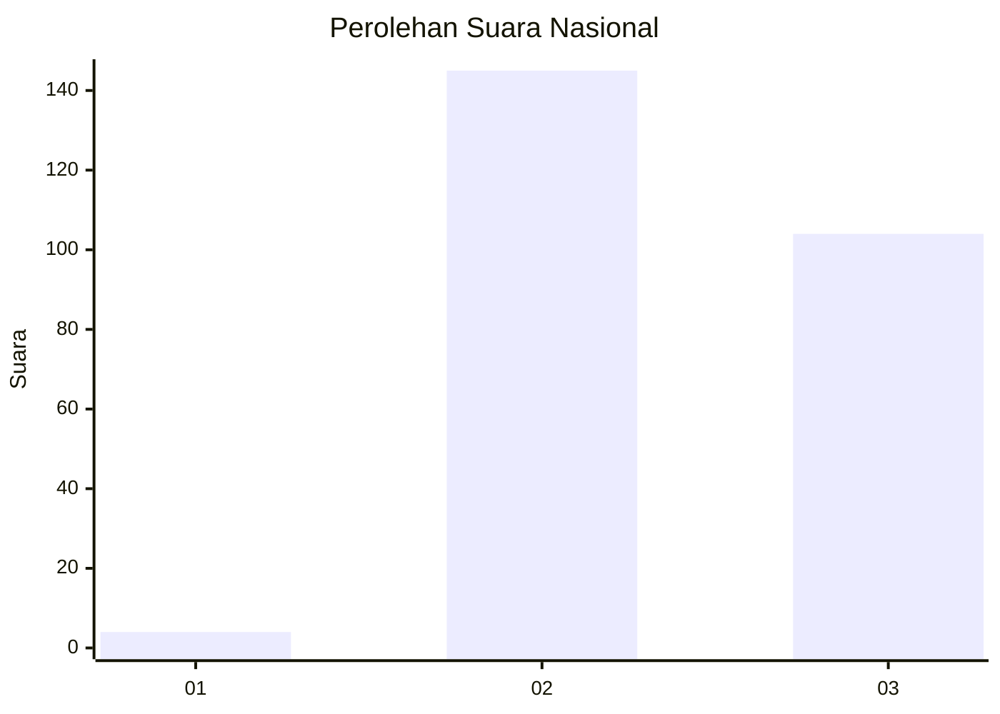
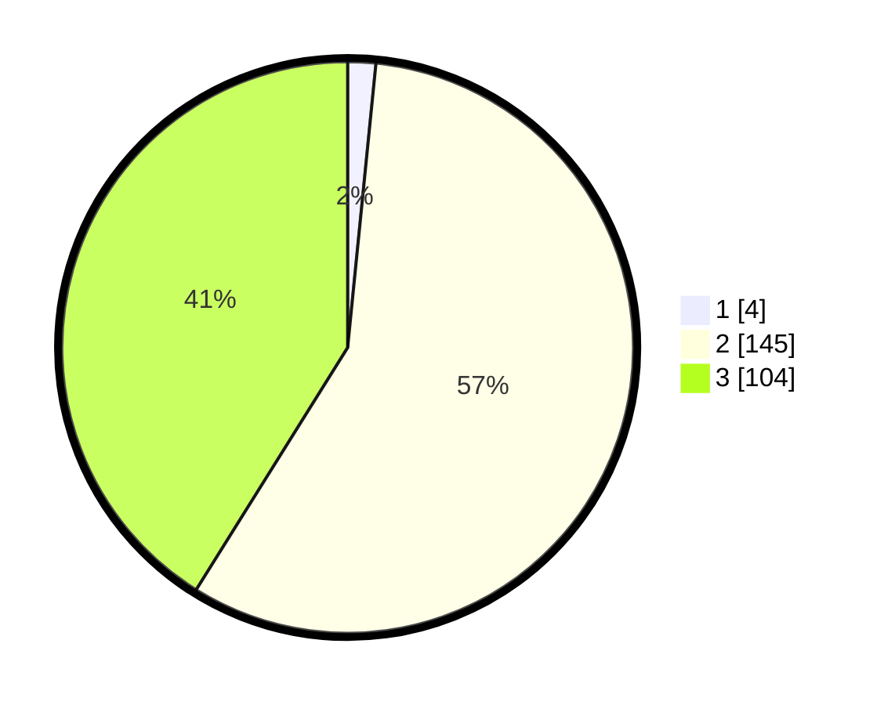

# Hasil

## Grafik

## Tabel

| No. | Nama Paslon    | Suara | Suara (raw) | Persentase |
|:--- |:-------------- | -----:| -----------:| ----------:|
| 1   | ANIES MUHAIMIN | 4     | [4][p-1]    | 1,58       |
| 2   | PRABOWO GIBRAN | 145   | [145][p-2]  | 57,31      |
| 3   | GANJAR MAHFUD  | 104   | [104][p-3]  | 41,11      |

[p-1]: https://github.com/gigit-pemilu/pemilu-2024/blob/main/pilpres/hitung-suara/sub/51-bali/sub/06-bangli/sub/04-kintamani/sub/2016-bayung-gede/sub/002-tps/sub/paslon-1.txt
[p-2]: https://github.com/gigit-pemilu/pemilu-2024/blob/main/pilpres/hitung-suara/sub/51-bali/sub/06-bangli/sub/04-kintamani/sub/2016-bayung-gede/sub/002-tps/sub/paslon-2.txt
[p-3]: https://github.com/gigit-pemilu/pemilu-2024/blob/main/pilpres/hitung-suara/sub/51-bali/sub/06-bangli/sub/04-kintamani/sub/2016-bayung-gede/sub/002-tps/sub/paslon-3.txt

## Foto C Plano

https://sirekap-obj-formc.kpu.go.id/5c13/pemilu/ppwp/51/06/04/20/16/5106042016002-20240217-141744--18a3e5bd-416c-489e-b735-2b18d5ff049c.jpg

https://sirekap-obj-formc.kpu.go.id/5c13/pemilu/ppwp/51/06/04/20/16/5106042016002-20240217-073000--01e3f508-21e2-499e-9c66-d3c60648f44c.jpg

https://sirekap-obj-formc.kpu.go.id/5c13/pemilu/ppwp/51/06/04/20/16/5106042016002-20240217-141934--0ccb690f-f790-4078-be83-b6bcc7675351.jpg

## Metadata

| Key        | Value               |
| ---------- | ------------------- |
| Time Stamp | 2024-02-24 22:31:28 |

