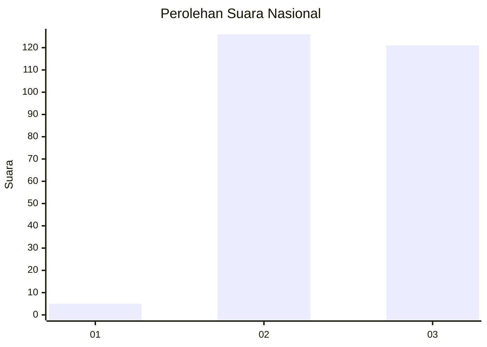
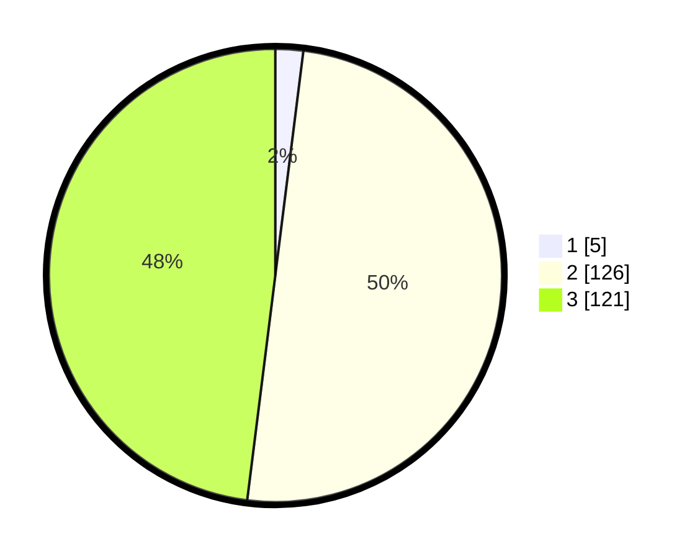

# Hasil

## Grafik

## Tabel

| No. | Nama Paslon    | Suara | Suara (raw) | Persentase |
|:--- |:-------------- | -----:| -----------:| ----------:|
| 1   | ANIES MUHAIMIN | 5     | [5][p-1]    | 1,98       |
| 2   | PRABOWO GIBRAN | 126   | [126][p-2]  | 50,00      |
| 3   | GANJAR MAHFUD  | 121   | [121][p-3]  | 48,02      |

[p-1]: https://github.com/gigit-pemilu/pemilu-2024/blob/main/pilpres/hitung-suara/sub/51-bali/sub/06-bangli/sub/04-kintamani/sub/2016-bayung-gede/sub/003-tps/sub/paslon-1.txt
[p-2]: https://github.com/gigit-pemilu/pemilu-2024/blob/main/pilpres/hitung-suara/sub/51-bali/sub/06-bangli/sub/04-kintamani/sub/2016-bayung-gede/sub/003-tps/sub/paslon-2.txt
[p-3]: https://github.com/gigit-pemilu/pemilu-2024/blob/main/pilpres/hitung-suara/sub/51-bali/sub/06-bangli/sub/04-kintamani/sub/2016-bayung-gede/sub/003-tps/sub/paslon-3.txt

## Foto C Plano

https://sirekap-obj-formc.kpu.go.id/a1fc/pemilu/ppwp/51/06/04/20/16/5106042016003-20240215-002923--c868f567-d308-40e6-b394-ba890047d616.jpg

https://sirekap-obj-formc.kpu.go.id/a1fc/pemilu/ppwp/51/06/04/20/16/5106042016003-20240215-003038--f1492f32-69d5-43cf-a6a7-9736251902ee.jpg

https://sirekap-obj-formc.kpu.go.id/a1fc/pemilu/ppwp/51/06/04/20/16/5106042016003-20240215-003144--6eb712d7-c2aa-4caa-a0b9-bbc8c678888b.jpg

## Metadata

| Key        | Value               |
| ---------- | ------------------- |
| Time Stamp | 2024-02-24 22:31:28 |

