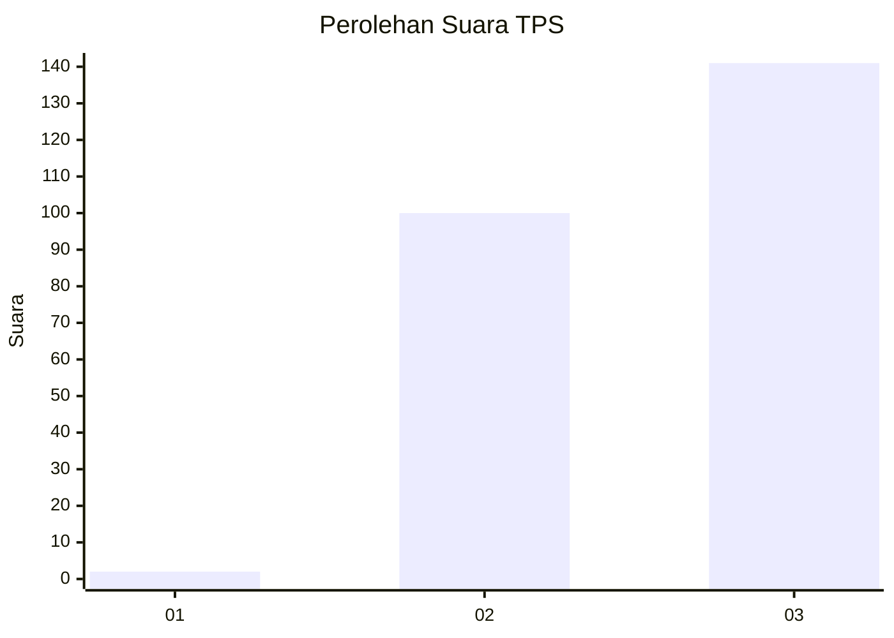
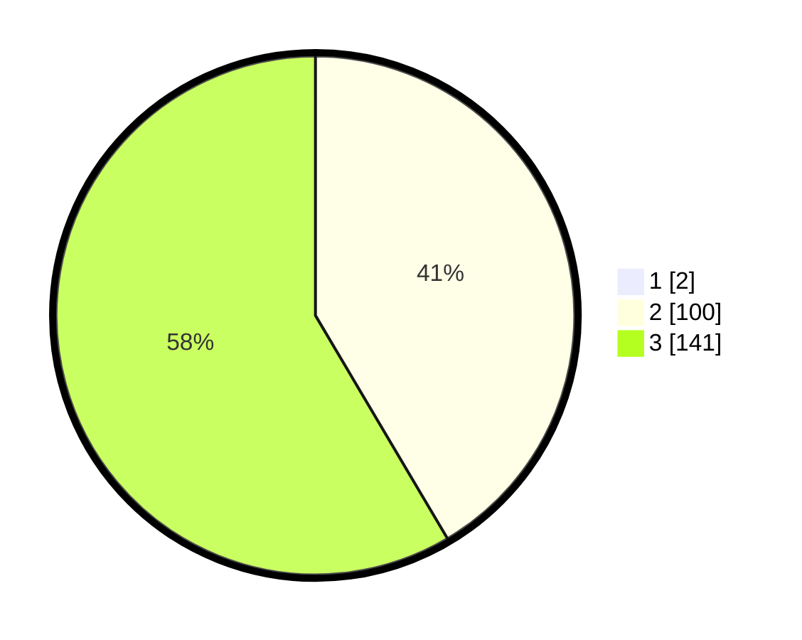

# Hasil

## Grafik

## Tabel

| No. | Nama Paslon    | Suara | Suara (raw) | Persentase |
|:--- |:-------------- | -----:| -----------:| ----------:|
| 1   | ANIES MUHAIMIN | 2     | [2][p-1]    | 0,82       |
| 2   | PRABOWO GIBRAN | 100   | [100][p-2]  | 41,15      |
| 3   | GANJAR MAHFUD  | 141   | [141][p-3]  | 58,02      |

[p-1]: https://github.com/gigit-pemilu/pemilu-2024-51-bali/blob/main/pilpres/hitung-suara/sub/51-bali/sub/06-bangli/sub/04-kintamani/sub/2016-bayung-gede/sub/004-tps/sub/paslon-1.txt
[p-2]: https://github.com/gigit-pemilu/pemilu-2024-51-bali/blob/main/pilpres/hitung-suara/sub/51-bali/sub/06-bangli/sub/04-kintamani/sub/2016-bayung-gede/sub/004-tps/sub/paslon-2.txt
[p-3]: https://github.com/gigit-pemilu/pemilu-2024-51-bali/blob/main/pilpres/hitung-suara/sub/51-bali/sub/06-bangli/sub/04-kintamani/sub/2016-bayung-gede/sub/004-tps/sub/paslon-3.txt

## Foto C Plano

https://sirekap-obj-formc.kpu.go.id/d73a/pemilu/ppwp/51/06/04/20/16/5106042016004-20240318-125159--b253f492-1eae-4c9e-8eb3-abc988a6a293.jpg

https://sirekap-obj-formc.kpu.go.id/d73a/pemilu/ppwp/51/06/04/20/16/5106042016004-20240215-010856--1c002c1d-4e3f-40b8-9591-82345ca0af70.jpg

https://sirekap-obj-formc.kpu.go.id/d73a/pemilu/ppwp/51/06/04/20/16/5106042016004-20240215-011118--61448bab-7703-40ab-82f5-a9f3a77d19d3.jpg

## Metadata

| Key        | Value               |
| ---------- | ------------------- |
| Time Stamp | 2024-03-18 13:00:00 |

