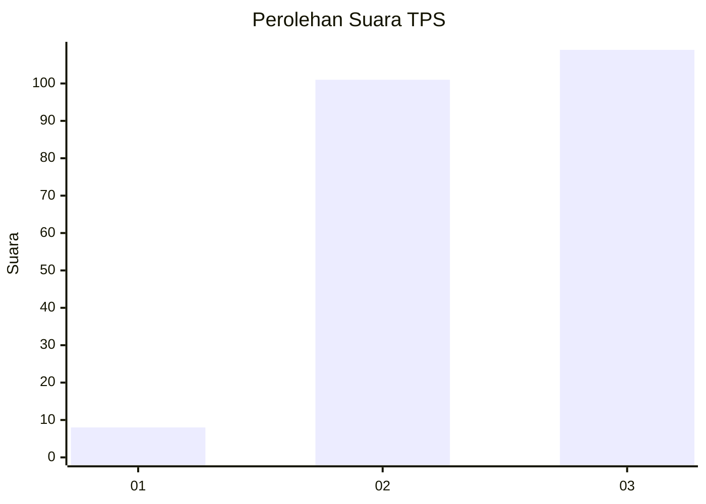
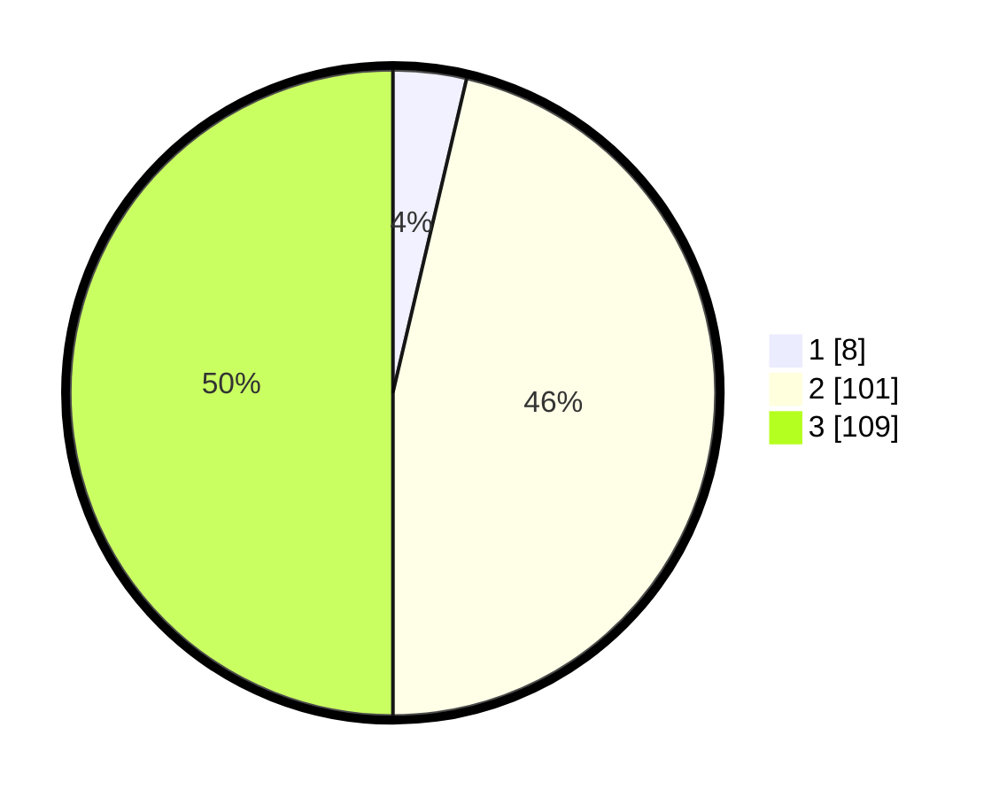

# Hasil

## Grafik

## Tabel

| No. | Nama Paslon    | Suara | Suara (raw) | Persentase |
|:--- |:-------------- | -----:| -----------:| ----------:|
| 1   | ANIES MUHAIMIN | 8     | [8][p-1]    | 3,67       |
| 2   | PRABOWO GIBRAN | 101   | [101][p-2]  | 46,33      |
| 3   | GANJAR MAHFUD  | 109   | [109][p-3]  | 50,00      |

[p-1]: https://github.com/gigit-pemilu/pemilu-2024-51-bali/blob/main/pilpres/hitung-suara/sub/51-bali/sub/06-bangli/sub/04-kintamani/sub/2016-bayung-gede/sub/005-tps/sub/paslon-1.txt
[p-2]: https://github.com/gigit-pemilu/pemilu-2024-51-bali/blob/main/pilpres/hitung-suara/sub/51-bali/sub/06-bangli/sub/04-kintamani/sub/2016-bayung-gede/sub/005-tps/sub/paslon-2.txt
[p-3]: https://github.com/gigit-pemilu/pemilu-2024-51-bali/blob/main/pilpres/hitung-suara/sub/51-bali/sub/06-bangli/sub/04-kintamani/sub/2016-bayung-gede/sub/005-tps/sub/paslon-3.txt

## Foto C Plano

https://sirekap-obj-formc.kpu.go.id/f5e2/pemilu/ppwp/51/06/04/20/16/5106042016005-20240215-002743--e8907715-1586-44c0-9478-61e0d5eb8407.jpg

https://sirekap-obj-formc.kpu.go.id/f5e2/pemilu/ppwp/51/06/04/20/16/5106042016005-20240215-002846--c721af2b-6a2a-4171-bc76-958b7b345c73.jpg

https://sirekap-obj-formc.kpu.go.id/f5e2/pemilu/ppwp/51/06/04/20/16/5106042016005-20240215-003009--5c3a83cc-d70e-47e2-9c03-45acc145837b.jpg

## Metadata

| Key        | Value               |
| ---------- | ------------------- |
| Time Stamp | 2024-02-24 22:31:28 |

