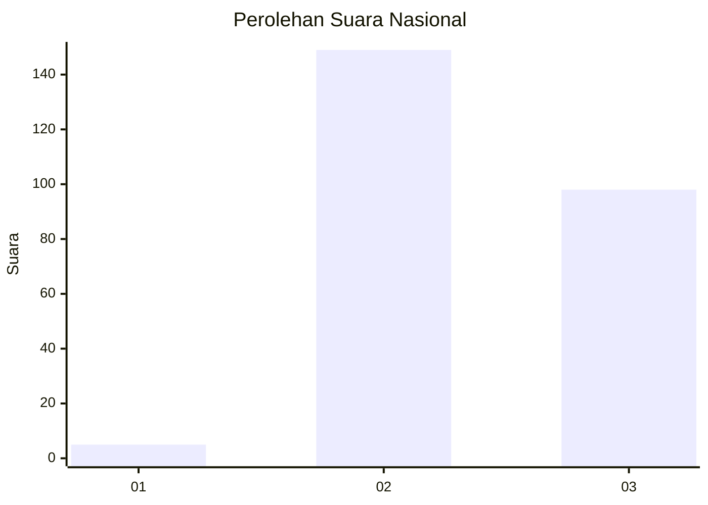
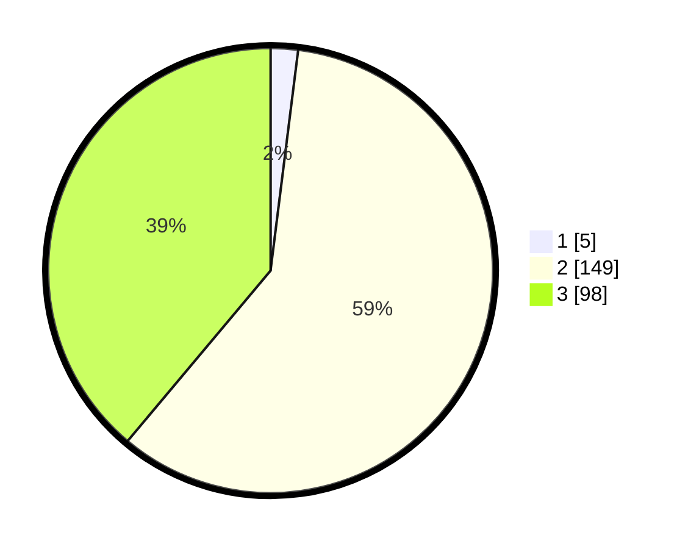

# Hasil

## Grafik

## Tabel

| No. | Nama Paslon    | Suara | Suara (raw) | Persentase |
|:--- |:-------------- | -----:| -----------:| ----------:|
| 1   | ANIES MUHAIMIN | 5     | [5][p-1]    | 1,98       |
| 2   | PRABOWO GIBRAN | 149   | [149][p-2]  | 59,13      |
| 3   | GANJAR MAHFUD  | 98    | [98][p-3]   | 38,89      |

[p-1]: https://github.com/gigit-pemilu/pemilu-2024/blob/main/pilpres/hitung-suara/sub/51-bali/sub/06-bangli/sub/04-kintamani/sub/2016-bayung-gede/sub/006-tps/sub/paslon-1.txt
[p-2]: https://github.com/gigit-pemilu/pemilu-2024/blob/main/pilpres/hitung-suara/sub/51-bali/sub/06-bangli/sub/04-kintamani/sub/2016-bayung-gede/sub/006-tps/sub/paslon-2.txt
[p-3]: https://github.com/gigit-pemilu/pemilu-2024/blob/main/pilpres/hitung-suara/sub/51-bali/sub/06-bangli/sub/04-kintamani/sub/2016-bayung-gede/sub/006-tps/sub/paslon-3.txt

## Foto C Plano

https://sirekap-obj-formc.kpu.go.id/5636/pemilu/ppwp/51/06/04/20/16/5106042016006-20240216-100520--281051a0-7113-453e-a635-56cb1a55d78a.jpg

https://sirekap-obj-formc.kpu.go.id/5636/pemilu/ppwp/51/06/04/20/16/5106042016006-20240216-174157--d462d26a-8a42-466d-a65d-15747cd5a0b5.jpg

https://sirekap-obj-formc.kpu.go.id/5636/pemilu/ppwp/51/06/04/20/16/5106042016006-20240214-191519--568420f7-ecee-4728-a4ad-58ad28673d82.jpg

## Metadata

| Key        | Value               |
| ---------- | ------------------- |
| Time Stamp | 2024-02-21 15:00:00 |

