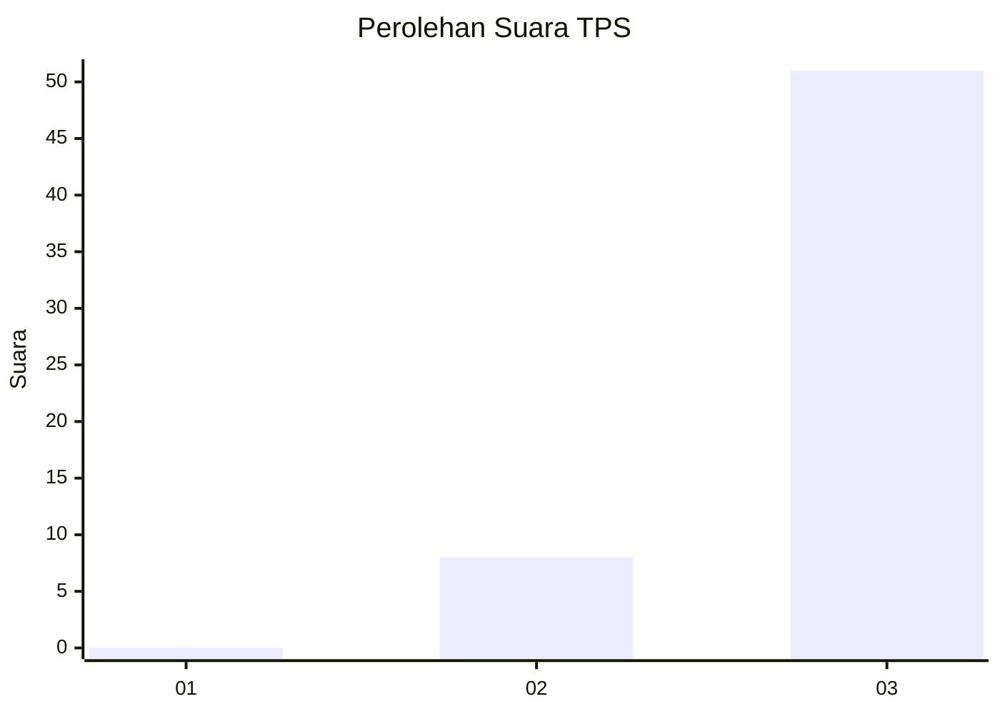
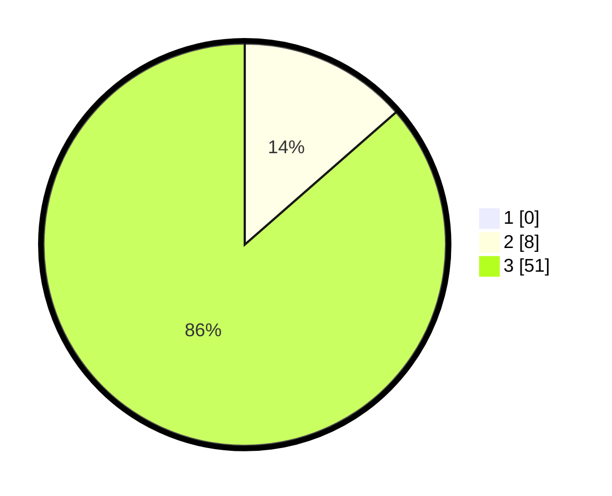

# Hasil

## Grafik

## Tabel

| No. | Nama Paslon    | Suara | Suara (raw) | Persentase |
|:--- |:-------------- | -----:| -----------:| ----------:|
| 1   | ANIES MUHAIMIN | 0     | [0][p-1]    | 0,00       |
| 2   | PRABOWO GIBRAN | 8     | [8][p-2]    | 13,56      |
| 3   | GANJAR MAHFUD  | 51    | [51][p-3]   | 86,44      |

[p-1]: https://github.com/gigit-pemilu/pemilu-2024-51-bali/blob/main/pilpres/hitung-suara/sub/51-bali/sub/06-bangli/sub/04-kintamani/sub/2016-bayung-gede/sub/007-tps/sub/paslon-1.txt
[p-2]: https://github.com/gigit-pemilu/pemilu-2024-51-bali/blob/main/pilpres/hitung-suara/sub/51-bali/sub/06-bangli/sub/04-kintamani/sub/2016-bayung-gede/sub/007-tps/sub/paslon-2.txt
[p-3]: https://github.com/gigit-pemilu/pemilu-2024-51-bali/blob/main/pilpres/hitung-suara/sub/51-bali/sub/06-bangli/sub/04-kintamani/sub/2016-bayung-gede/sub/007-tps/sub/paslon-3.txt

## Foto C Plano

https://sirekap-obj-formc.kpu.go.id/31b7/pemilu/ppwp/51/06/04/20/16/5106042016007-20240216-142617--caa2a772-6468-41c7-893e-7800ff958e47.jpg

https://sirekap-obj-formc.kpu.go.id/31b7/pemilu/ppwp/51/06/04/20/16/5106042016007-20240216-142618--d4089394-551d-4fd1-b59d-25ce4ae81a90.jpg

https://sirekap-obj-formc.kpu.go.id/31b7/pemilu/ppwp/51/06/04/20/16/5106042016007-20240216-142617--a8f7dd27-eea2-4a5a-a5ed-2354dd45db75.jpg

## Metadata

| Key        | Value               |
| ---------- | ------------------- |
| Time Stamp | 2024-02-21 16:00:00 |

## DATA PEMILIH TETAP

Jumlah pemilih dalam DPT: **62**.
 * L: **32**.
 * P: **30**.

## DATA PENGGUNA HAK PILIH

Jumlah pengguna hak pilih dalam DPT: **59**.
 * L: **31**.
 * P: **28**.

Jumlah pengguna hak pilih dalam DPTb: **0**.
 * L: **0**.
 * P: **0**.

Jumlah pengguna hak pilih dalam DPK: **1**.
 * L: **0**.
 * P: **1**.

Jumlah pengguna hak pilih: **60**.
 * L: **31**.
 * P: **29**.

## JUMLAH SUARA SAH DAN TIDAK SAH

JUMLAH SELURUH SUARA SAH: **59**.

JUMLAH SUARA TIDAK SAH: **1**.

JUMLAH SELURUH SUARA SAH DAN SUARA TIDAK SAH: **60**.

