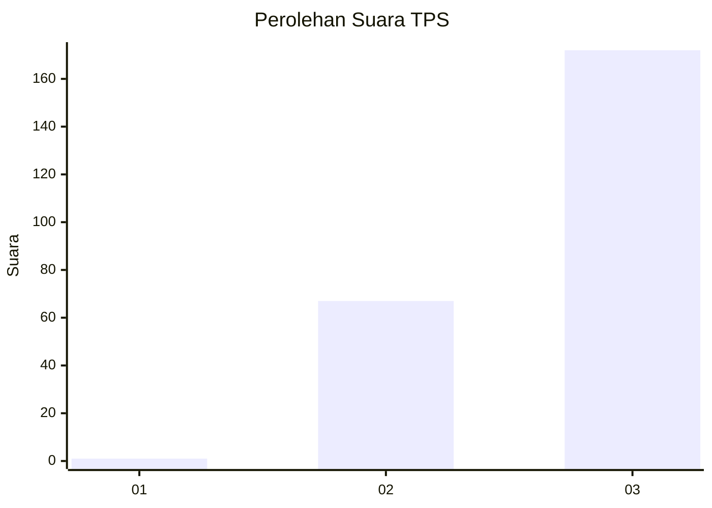
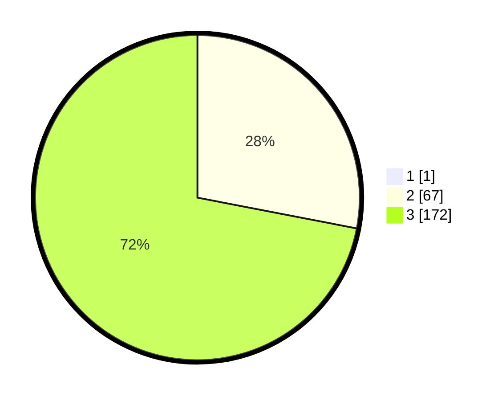

# Hasil

## Grafik

## Tabel

| No. | Nama Paslon    | Suara | Suara (raw) | Persentase |
|:--- |:-------------- | -----:| -----------:| ----------:|
| 1   | ANIES MUHAIMIN | 1     | [1][p-1]    | 0,42       |
| 2   | PRABOWO GIBRAN | 67    | [67][p-2]   | 27,92      |
| 3   | GANJAR MAHFUD  | 172   | [172][p-3]  | 71,67      |

[p-1]: https://github.com/gigit-pemilu/pemilu-2024-51-bali/blob/main/pilpres/hitung-suara/sub/51-bali/sub/06-bangli/sub/04-kintamani/sub/2017-sekardadi/sub/002-tps/sub/paslon-1.txt
[p-2]: https://github.com/gigit-pemilu/pemilu-2024-51-bali/blob/main/pilpres/hitung-suara/sub/51-bali/sub/06-bangli/sub/04-kintamani/sub/2017-sekardadi/sub/002-tps/sub/paslon-2.txt
[p-3]: https://github.com/gigit-pemilu/pemilu-2024-51-bali/blob/main/pilpres/hitung-suara/sub/51-bali/sub/06-bangli/sub/04-kintamani/sub/2017-sekardadi/sub/002-tps/sub/paslon-3.txt

## Foto C Plano

https://sirekap-obj-formc.kpu.go.id/9ee5/pemilu/ppwp/51/06/04/20/17/5106042017002-20240214-211649--88423fa7-2870-4dbd-b4fa-b11886ce97f4.jpg

https://sirekap-obj-formc.kpu.go.id/9ee5/pemilu/ppwp/51/06/04/20/17/5106042017002-20240214-211921--2537ddf0-1044-4c7c-b6d8-6f90590b7df7.jpg

https://sirekap-obj-formc.kpu.go.id/9ee5/pemilu/ppwp/51/06/04/20/17/5106042017002-20240214-212124--84945d9a-df10-486d-bdee-f58a4131d5a9.jpg

## Metadata

| Key        | Value               |
| ---------- | ------------------- |
| Time Stamp | 2024-02-24 22:31:28 |

