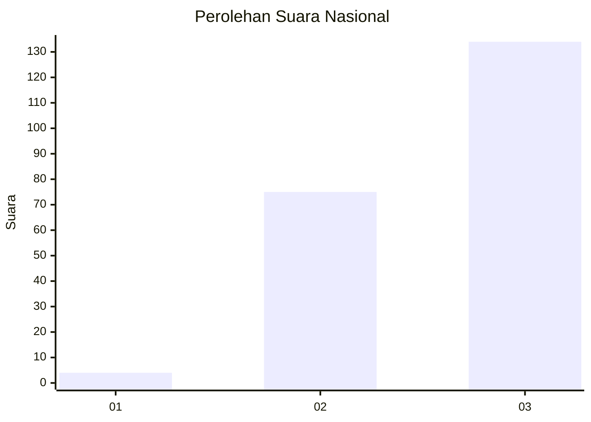
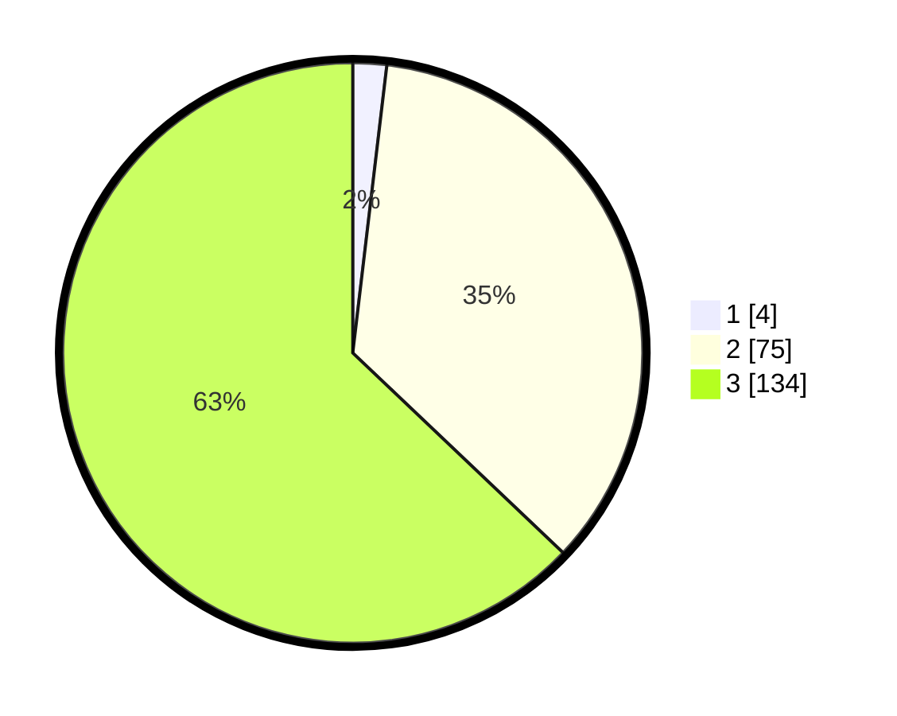

# Hasil

## Grafik

## Tabel

| No. | Nama Paslon    | Suara | Suara (raw) | Persentase |
|:--- |:-------------- | -----:| -----------:| ----------:|
| 1   | ANIES MUHAIMIN | 4     | [4][p-1]    | 1,88       |
| 2   | PRABOWO GIBRAN | 75    | [75][p-2]   | 35,21      |
| 3   | GANJAR MAHFUD  | 134   | [134][p-3]  | 62,91      |

[p-1]: https://github.com/gigit-pemilu/pemilu-2024/blob/main/pilpres/hitung-suara/sub/51-bali/sub/06-bangli/sub/04-kintamani/sub/2017-sekardadi/sub/003-tps/sub/paslon-1.txt
[p-2]: https://github.com/gigit-pemilu/pemilu-2024/blob/main/pilpres/hitung-suara/sub/51-bali/sub/06-bangli/sub/04-kintamani/sub/2017-sekardadi/sub/003-tps/sub/paslon-2.txt
[p-3]: https://github.com/gigit-pemilu/pemilu-2024/blob/main/pilpres/hitung-suara/sub/51-bali/sub/06-bangli/sub/04-kintamani/sub/2017-sekardadi/sub/003-tps/sub/paslon-3.txt

## Foto C Plano

https://sirekap-obj-formc.kpu.go.id/14a1/pemilu/ppwp/51/06/04/20/17/5106042017003-20240214-211652--49c6c8ad-3868-4676-ac33-a062cac5c242.jpg

https://sirekap-obj-formc.kpu.go.id/14a1/pemilu/ppwp/51/06/04/20/17/5106042017003-20240214-211840--f7a03a6a-efdf-42ff-92ad-a48c073e9806.jpg

https://sirekap-obj-formc.kpu.go.id/14a1/pemilu/ppwp/51/06/04/20/17/5106042017003-20240214-212001--30e73388-930e-4bf9-8651-7d83b57927bb.jpg

## Metadata

| Key        | Value               |
| ---------- | ------------------- |
| Time Stamp | 2024-02-24 22:31:28 |

