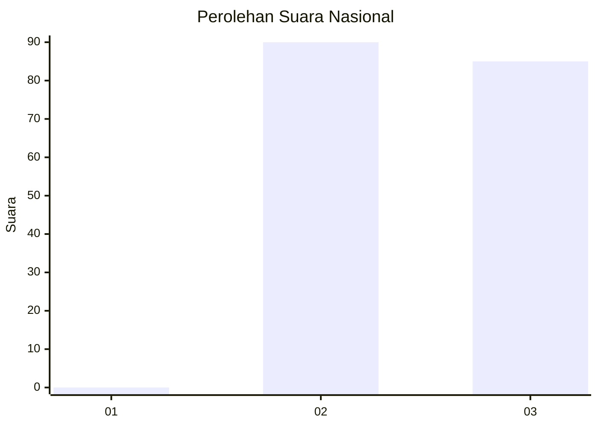
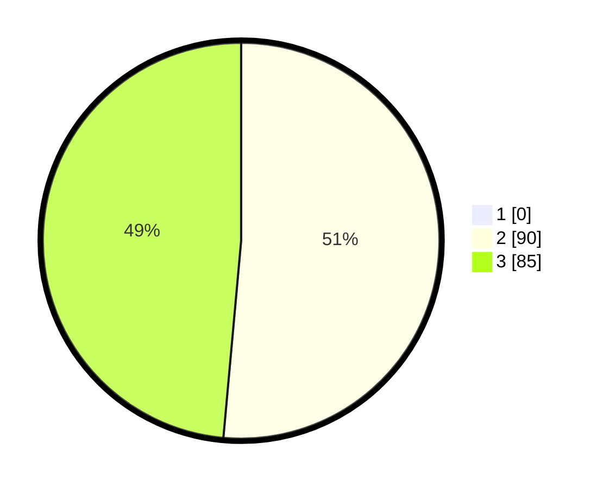

# Hasil

## Grafik

## Tabel

| No. | Nama Paslon    | Suara | Suara (raw) | Persentase |
|:--- |:-------------- | -----:| -----------:| ----------:|
| 1   | ANIES MUHAIMIN | 0     | [0][p-1]    | 0,00       |
| 2   | PRABOWO GIBRAN | 90    | [90][p-2]   | 51,43      |
| 3   | GANJAR MAHFUD  | 85    | [85][p-3]   | 48,57      |

[p-1]: https://github.com/gigit-pemilu/pemilu-2024/blob/main/pilpres/hitung-suara/sub/51-bali/sub/06-bangli/sub/04-kintamani/sub/2019-buahan/sub/001-tps/sub/paslon-1.txt
[p-2]: https://github.com/gigit-pemilu/pemilu-2024/blob/main/pilpres/hitung-suara/sub/51-bali/sub/06-bangli/sub/04-kintamani/sub/2019-buahan/sub/001-tps/sub/paslon-2.txt
[p-3]: https://github.com/gigit-pemilu/pemilu-2024/blob/main/pilpres/hitung-suara/sub/51-bali/sub/06-bangli/sub/04-kintamani/sub/2019-buahan/sub/001-tps/sub/paslon-3.txt

## Foto C Plano

https://sirekap-obj-formc.kpu.go.id/17ff/pemilu/ppwp/51/06/04/20/19/5106042019001-20240214-195635--f1af80d1-cceb-4c54-a5f1-b4dc8b5a7387.jpg

https://sirekap-obj-formc.kpu.go.id/17ff/pemilu/ppwp/51/06/04/20/19/5106042019001-20240214-212500--54ca9c95-7f58-4b68-9f44-b860ad6bd943.jpg

https://sirekap-obj-formc.kpu.go.id/17ff/pemilu/ppwp/51/06/04/20/19/5106042019001-20240214-210038--6c7d922a-172b-4cae-922e-d94d66c24d8b.jpg

## Metadata

| Key        | Value               |
| ---------- | ------------------- |
| Time Stamp | 2024-02-25 09:00:00 |

## DATA PEMILIH TETAP

Jumlah pemilih dalam DPT: **221**.
 * L: **113**.
 * P: **108**.

## DATA PENGGUNA HAK PILIH

Jumlah pengguna hak pilih dalam DPT: **182**.
 * L: **88**.
 * P: **94**.

Jumlah pengguna hak pilih dalam DPTb: **0**.
 * L: **0**.
 * P: **0**.

Jumlah pengguna hak pilih dalam DPK: **0**.
 * L: **0**.
 * P: **0**.

Jumlah pengguna hak pilih: **182**.
 * L: **88**.
 * P: **94**.

## JUMLAH SUARA SAH DAN TIDAK SAH

JUMLAH SELURUH SUARA SAH: **175**.

JUMLAH SUARA TIDAK SAH: **7**.

JUMLAH SELURUH SUARA SAH DAN SUARA TIDAK SAH: **182**.

