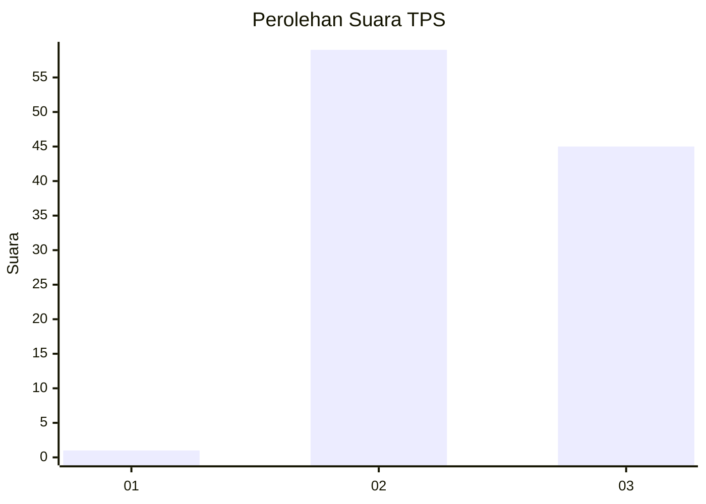
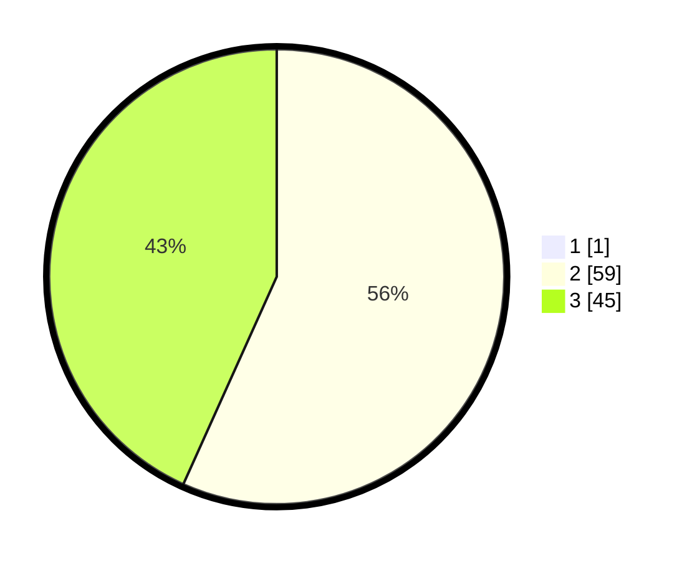

# Hasil

## Grafik

## Tabel

| No. | Nama Paslon    | Suara | Suara (raw) | Persentase |
|:--- |:-------------- | -----:| -----------:| ----------:|
| 1   | ANIES MUHAIMIN | 1     | [1][p-1]    | 0,95       |
| 2   | PRABOWO GIBRAN | 59    | [59][p-2]   | 56,19      |
| 3   | GANJAR MAHFUD  | 45    | [45][p-3]   | 42,86      |

[p-1]: https://github.com/gigit-pemilu/pemilu-2024-51-bali/blob/main/pilpres/hitung-suara/sub/51-bali/sub/06-bangli/sub/04-kintamani/sub/2020-abangsongan/sub/002-tps/sub/paslon-1.txt
[p-2]: https://github.com/gigit-pemilu/pemilu-2024-51-bali/blob/main/pilpres/hitung-suara/sub/51-bali/sub/06-bangli/sub/04-kintamani/sub/2020-abangsongan/sub/002-tps/sub/paslon-2.txt
[p-3]: https://github.com/gigit-pemilu/pemilu-2024-51-bali/blob/main/pilpres/hitung-suara/sub/51-bali/sub/06-bangli/sub/04-kintamani/sub/2020-abangsongan/sub/002-tps/sub/paslon-3.txt

## Foto C Plano

https://sirekap-obj-formc.kpu.go.id/f7a3/pemilu/ppwp/51/06/04/20/20/5106042020002-20240214-201801--5344d42a-913e-499b-8cdc-ec5e3b575602.jpg

https://sirekap-obj-formc.kpu.go.id/f7a3/pemilu/ppwp/51/06/04/20/20/5106042020002-20240214-201811--f2e26a13-e7b6-4fb1-a7e6-0251ab9765e5.jpg

https://sirekap-obj-formc.kpu.go.id/f7a3/pemilu/ppwp/51/06/04/20/20/5106042020002-20240214-201818--c39de86d-144a-4216-a645-b4536db7ed90.jpg

## Metadata

| Key        | Value               |
| ---------- | ------------------- |
| Time Stamp | 2024-02-14 21:46:01 |

## DATA PEMILIH TETAP

Jumlah pemilih dalam DPT: **121**.
 * L: **57**.
 * P: **64**.

## DATA PENGGUNA HAK PILIH

Jumlah pengguna hak pilih dalam DPT: **105**.
 * L: **53**.
 * P: **52**.

Jumlah pengguna hak pilih dalam DPTb: **0**.
 * L: **0**.
 * P: **0**.

Jumlah pengguna hak pilih dalam DPK: **0**.
 * L: **0**.
 * P: **0**.

Jumlah pengguna hak pilih: **105**.
 * L: **53**.
 * P: **52**.

## JUMLAH SUARA SAH DAN TIDAK SAH

JUMLAH SELURUH SUARA SAH: **105**.

JUMLAH SUARA TIDAK SAH: **0**.

JUMLAH SELURUH SUARA SAH DAN SUARA TIDAK SAH: **105**.

