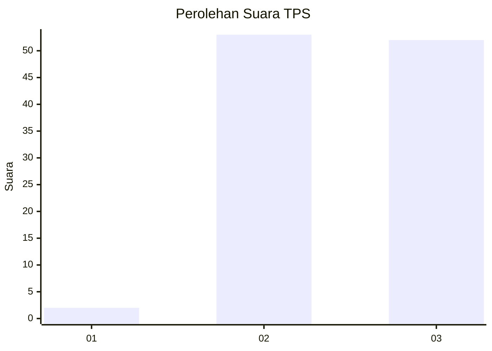
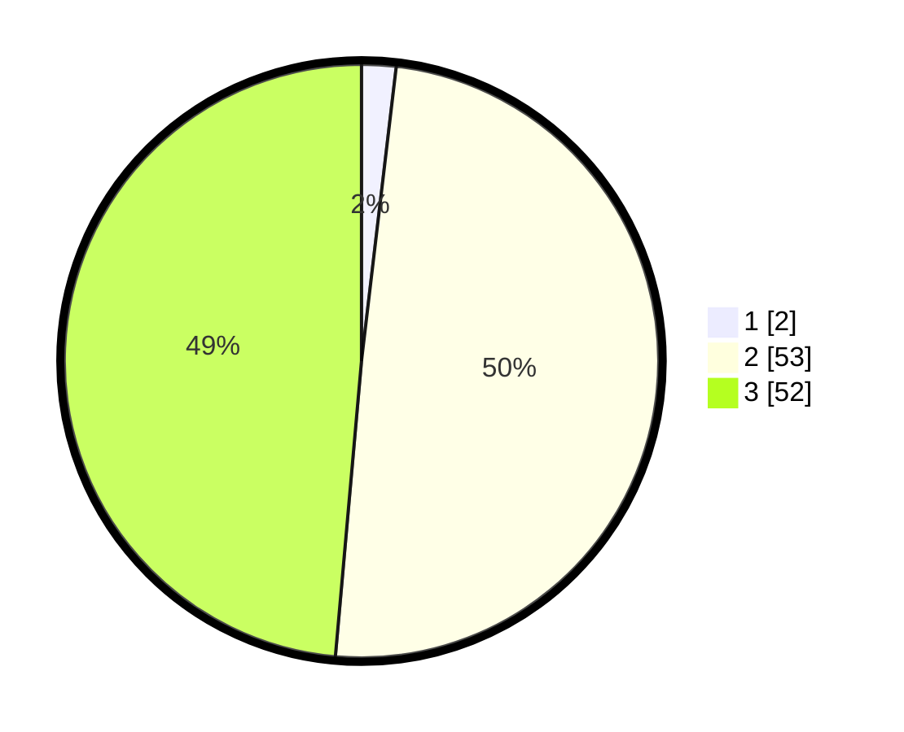

# Hasil

## Grafik

## Tabel

| No. | Nama Paslon    | Suara | Suara (raw) | Persentase |
|:--- |:-------------- | -----:| -----------:| ----------:|
| 1   | ANIES MUHAIMIN | 2     | [2][p-1]    | 1,87       |
| 2   | PRABOWO GIBRAN | 53    | [53][p-2]   | 49,53      |
| 3   | GANJAR MAHFUD  | 52    | [52][p-3]   | 48,60      |

[p-1]: https://github.com/gigit-pemilu/pemilu-2024-51-bali/blob/main/pilpres/hitung-suara/sub/51-bali/sub/06-bangli/sub/04-kintamani/sub/2020-abangsongan/sub/005-tps/sub/paslon-1.txt
[p-2]: https://github.com/gigit-pemilu/pemilu-2024-51-bali/blob/main/pilpres/hitung-suara/sub/51-bali/sub/06-bangli/sub/04-kintamani/sub/2020-abangsongan/sub/005-tps/sub/paslon-2.txt
[p-3]: https://github.com/gigit-pemilu/pemilu-2024-51-bali/blob/main/pilpres/hitung-suara/sub/51-bali/sub/06-bangli/sub/04-kintamani/sub/2020-abangsongan/sub/005-tps/sub/paslon-3.txt

## Foto C Plano

https://sirekap-obj-formc.kpu.go.id/e43e/pemilu/ppwp/51/06/04/20/20/5106042020005-20240214-131424--08bda230-a7fd-4b01-b70f-293e1d805822.jpg

https://sirekap-obj-formc.kpu.go.id/e43e/pemilu/ppwp/51/06/04/20/20/5106042020005-20240214-131343--a046f113-0ae0-4ae3-921b-ffd3b13d1538.jpg

https://sirekap-obj-formc.kpu.go.id/e43e/pemilu/ppwp/51/06/04/20/20/5106042020005-20240214-131310--c4a083a2-1e72-4c53-be6b-e7e9ab595237.jpg

## Metadata

| Key        | Value               |
| ---------- | ------------------- |
| Time Stamp | 2024-02-14 21:46:01 |

## DATA PEMILIH TETAP

Jumlah pemilih dalam DPT: **122**.
 * L: **56**.
 * P: **66**.

## DATA PENGGUNA HAK PILIH

Jumlah pengguna hak pilih dalam DPT: **107**.
 * L: **51**.
 * P: **56**.

Jumlah pengguna hak pilih dalam DPTb: **0**.
 * L: **0**.
 * P: **0**.

Jumlah pengguna hak pilih dalam DPK: **0**.
 * L: **0**.
 * P: **0**.

Jumlah pengguna hak pilih: **107**.
 * L: **51**.
 * P: **56**.

## JUMLAH SUARA SAH DAN TIDAK SAH

JUMLAH SELURUH SUARA SAH: **107**.

JUMLAH SUARA TIDAK SAH: **0**.

JUMLAH SELURUH SUARA SAH DAN SUARA TIDAK SAH: **107**.

