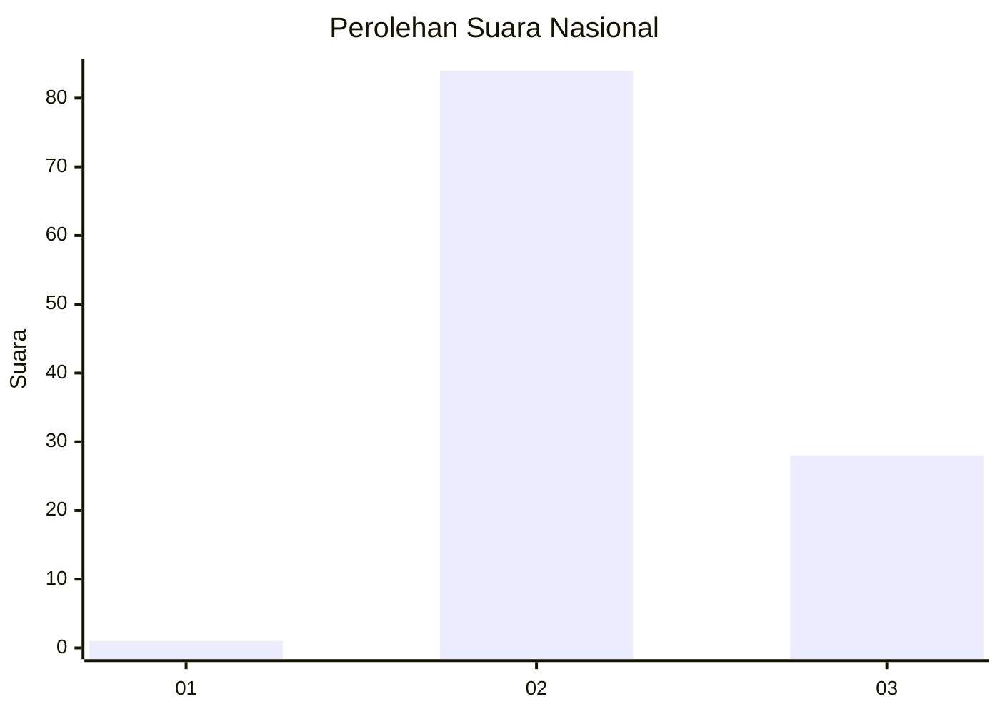
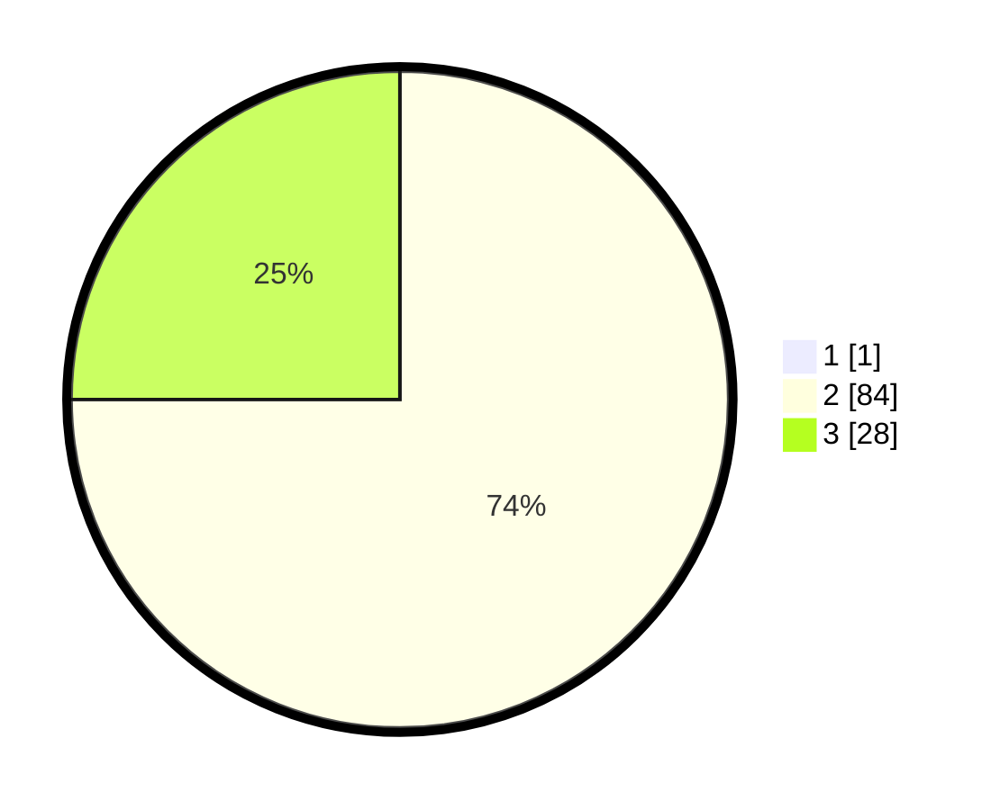

# Hasil

## Grafik

## Tabel

| No. | Nama Paslon    | Suara | Suara (raw) | Persentase |
|:--- |:-------------- | -----:| -----------:| ----------:|
| 1   | ANIES MUHAIMIN | 1     | [1][p-1]    | 0,88       |
| 2   | PRABOWO GIBRAN | 84    | [84][p-2]   | 74,34      |
| 3   | GANJAR MAHFUD  | 28    | [28][p-3]   | 24,78      |

[p-1]: https://github.com/gigit-pemilu/pemilu-2024/blob/main/pilpres/hitung-suara/sub/51-bali/sub/06-bangli/sub/04-kintamani/sub/2021-suter/sub/001-tps/sub/paslon-1.txt
[p-2]: https://github.com/gigit-pemilu/pemilu-2024/blob/main/pilpres/hitung-suara/sub/51-bali/sub/06-bangli/sub/04-kintamani/sub/2021-suter/sub/001-tps/sub/paslon-2.txt
[p-3]: https://github.com/gigit-pemilu/pemilu-2024/blob/main/pilpres/hitung-suara/sub/51-bali/sub/06-bangli/sub/04-kintamani/sub/2021-suter/sub/001-tps/sub/paslon-3.txt

## Foto C Plano

https://sirekap-obj-formc.kpu.go.id/4e2d/pemilu/ppwp/51/06/04/20/21/5106042021001-20240214-155245--e6f8e565-c871-4bbb-8e98-978609e9df13.jpg

https://sirekap-obj-formc.kpu.go.id/4e2d/pemilu/ppwp/51/06/04/20/21/5106042021001-20240214-192821--290daeab-f91f-4a72-9f2f-dbbb004122ad.jpg

https://sirekap-obj-formc.kpu.go.id/4e2d/pemilu/ppwp/51/06/04/20/21/5106042021001-20240214-193022--94e24cf3-6902-43d2-be49-5c579e574965.jpg

## Metadata

| Key        | Value               |
| ---------- | ------------------- |
| Time Stamp | 2024-02-14 21:46:01 |

## DATA PEMILIH TETAP

Jumlah pemilih dalam DPT: **138**.
 * L: **74**.
 * P: **64**.

## DATA PENGGUNA HAK PILIH

Jumlah pengguna hak pilih dalam DPT: **116**.
 * L: **60**.
 * P: **56**.

Jumlah pengguna hak pilih dalam DPTb: **0**.
 * L: **0**.
 * P: **0**.

Jumlah pengguna hak pilih dalam DPK: **0**.
 * L: **0**.
 * P: **0**.

Jumlah pengguna hak pilih: **116**.
 * L: **60**.
 * P: **56**.

## JUMLAH SUARA SAH DAN TIDAK SAH

JUMLAH SELURUH SUARA SAH: **113**.

JUMLAH SUARA TIDAK SAH: **3**.

JUMLAH SELURUH SUARA SAH DAN SUARA TIDAK SAH: **116**.

